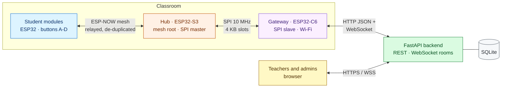
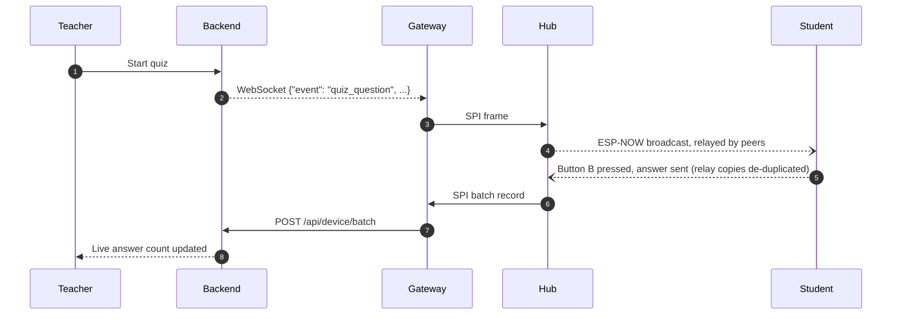

<div align="center">

<h1>imPress</h1>

<p><strong>Classroom response system on ESP32 hardware</strong><br/>
Live quizzes and polls with one-tap answers, delivered over an ESP-NOW mesh, with no Wi-Fi on student devices.</p>

<p>
<a href="https://github.com/Kush-Kelaiya22/imPress/actions/workflows/ci.yml"></a>

<a href="docs/README.md"></a>

</p>
<p>


</p>

<p>
<a href="#overview">Overview</a> &nbsp;|&nbsp;
<a href="#architecture">Architecture</a> &nbsp;|&nbsp;
<a href="#quick-start">Quick start</a> &nbsp;|&nbsp;
<a href="#testing">Testing</a> &nbsp;|&nbsp;
<a href="#documentation">Documentation</a> &nbsp;|&nbsp;
<a href="#project-status">Project status</a>
</p>

</div>

> [!NOTE]
> You are reading the **`v2`** branch: `main` plus every fix from the October 2026 audit (issues #1–#25), a full test suite, CI and documentation. `main` is unchanged. See the [v2 changelog](docs/reference/changelog-v2.md).

---

## Overview

Every student holds a small ESP32 module with four answer buttons. When a teacher starts a question or a poll in the browser, it appears on every module, and each button press is counted live on the teacher's dashboard.

Student modules never join Wi-Fi. They form an **ESP-NOW mesh** and relay each other's messages to a hub in the room. Only one gateway per classroom needs network access, so the system works with school networks that limit clients or credentials.

| Capability | Details |
|---|---|
| Live participation | Quizzes (planned or impromptu, per-question timing) and polls (live or planned) with per-option results |
| Mesh networking | Multi-hop ESP-NOW relaying (TTL 5) with de-duplication at the student, hub and server layers: one press is one answer |
| Classroom management | Courses, classes with timetable clash warnings, CSV import of students and staff, enrollment, attendance, co-faculty |
| Access control | `super_admin` > `admin` > `teacher`; server-side sessions with idle and absolute expiry; one class-access rule everywhere |
| Device fleet | Live presence per class (gateway, hub, modules), an inventory of the student modules each gateway has seen, telemetry, and staged over-the-air updates for the hub and gateway with automatic rollback |

## Architecture



| Component | Location | Responsibility |
|---|---|---|
| Backend | [`backend/`](backend/) | REST API, per-class WebSocket rooms, authentication and RBAC, persistence, presence tracking, firmware store, teacher web app |
| Gateway firmware | [`firmware/class_c6/`](firmware/class_c6/) | Bridges the classroom to the backend: batched HTTP uploads, WebSocket commands |
| Hub firmware | [`firmware/class_s3/`](firmware/class_s3/) | ESP-NOW mesh root, de-duplication, SPI master, over-the-air updates |
| Student firmware | [`firmware/student/`](firmware/student/) | Buttons and optional OLED, mesh node and relay, enrollment-number identity |
| Shared protocol | [`firmware/protocol/`](firmware/protocol/) | The single implementation of every on-wire format, used by all boards |
| Web UI (dev) | [`frontend/`](frontend/) | Optional React + Vite dashboard |

<details>
<summary><strong>How a single answer travels through the system</strong></summary>



</details>

Further reading: [system overview](docs/architecture/overview.md), [data flows](docs/architecture/data-flows.md), [wire protocols](docs/design/protocols.md), [mesh design](docs/design/mesh.md).

## Quick start

### Prerequisites

| Tool | Version | Needed for |
|---|---|---|
| Python | 3.12 or newer | backend and tests |
| C compiler (`cc`) | any recent clang or gcc | firmware host tests |
| ESP-IDF or Docker | IDF v6.1 / any Docker | building and flashing firmware |
| Node.js | 20 | optional React UI |

### 1. Run the backend and teacher web app

```bash
git clone https://github.com/Kush-Kelaiya22/imPress.git
cd imPress
scripts/install.sh                                      # venv, dependencies, backend/.env with generated secrets
IMPRESS_INITIAL_ADMIN_PASSWORD=dev-admin scripts/start.sh
```

On Windows, or to run it by hand, use `cd backend`, `python -m venv .venv`, `pip install -r requirements.txt`, `cp .env.example .env`, then `IMPRESS_DEBUG=true uvicorn app.main:app --reload`.

Open <http://localhost:8000> and sign in as `admin` / `dev-admin`. Interactive API documentation is served at <http://localhost:8000/docs>.

> [!IMPORTANT]
> The server **refuses to start** with the published default secrets. `scripts/install.sh` generates `IMPRESS_JWT_SECRET` and `IMPRESS_DEVICE_API_KEY`; the device key must also be set on every gateway. `IMPRESS_DEBUG=true` (which allows the defaults) is for local development only. See the [deployment guide](docs/guides/deployment.md).

### 2. Build the firmware

```bash
# No ESP-IDF installation required:
docker run --rm -v "$PWD/firmware":/project -w /project/class_c6 espressif/idf:v6.1 idf.py build

# With a native ESP-IDF v6.1 installation:
cd firmware/class_c6 && idf.py menuconfig && idf.py -p <PORT> flash monitor
```

> [!TIP]
> Repeat for `class_s3` and `student`. Wiring, pins and per-device settings are in the [hardware reference](docs/reference/hardware.md) and the [configuration guide](docs/guides/configuration.md).

## Testing

One command runs every suite and prints a consolidated report with status, counts and duration per suite, the slowest tests, and details for anything that failed:

```bash
python3 -m venv .venv && . .venv/bin/activate
pip install -r backend/requirements-dev.txt
python run_tests.py                       # all default suites (~35 s)
python run_tests.py --list                # list suites
python run_tests.py -s backend -s host    # selected suites
python run_tests.py --with-idf --with-frontend --json report.json
```

| Suite | Scope | Tests |
|---|---|---|
| `backend` | Every router and service: auth and sessions, RBAC, classes, students, quizzes and polls, device API, presence, utilities | 198 |
| `firmware-static` | Structural guards on firmware sources: task ownership, WebSocket lifecycle, OTA safety, configuration order | 14 |
| `repo` | CI workflow (incl. actionlint), repository hygiene, documentation consistency, the test runner itself | 89 |
| `host:*` | Real firmware C compiled on the host with AddressSanitizer and UBSan: protocol, mesh de-dup, SPI slave, WebSocket commands, device config, student identity | 6 suites, 25 cases |
| `idf:*` (optional) | ESP-IDF v6.1 builds of all three firmware projects | 3 builds |
| `frontend` (optional) | React production build | 1 build |

> [!TIP]
> Long suites show a live status line (elapsed time and the latest build or test output), and Ctrl-C stops cleanly with a report. If the interpreter is missing a backend package, the runner says which one and prints the exact `pip install` command. See [running the tests](docs/guides/testing.md#running-run_testspy).

> [!NOTE]
> GitHub Actions runs the same suites through `run_tests.py`, plus the firmware builds (with size reports and downloadable images), behind a single **CI result** check. See the [testing guide](docs/guides/testing.md).

## Documentation

| Area | Pages |
|---|---|
| **Architecture** | [System overview](docs/architecture/overview.md) · [Backend](docs/architecture/backend.md) · [Firmware](docs/architecture/firmware.md) · [Data flows](docs/architecture/data-flows.md) |
| **Design** | [Wire protocols](docs/design/protocols.md) · [Mesh](docs/design/mesh.md) · [Security model](docs/design/security-model.md) · [Design decisions](docs/design/decisions.md) |
| **API** | [REST](docs/api/rest-api.md) · [WebSocket](docs/api/websocket-api.md) · [Device and gateway](docs/api/device-api.md) |
| **Guides** | [Development setup](docs/guides/development-setup.md) · [Configuration](docs/guides/configuration.md) · [Deployment](docs/guides/deployment.md) · [OTA updates](docs/guides/ota-updates.md) · [Testing](docs/guides/testing.md) · [Troubleshooting](docs/guides/troubleshooting.md) |
| **Reference** | [Data model](docs/reference/data-model.md) · [Hardware and wiring](docs/reference/hardware.md) · [Known issues](docs/reference/known-issues.md) · [Changelog v2](docs/reference/changelog-v2.md) |

The [documentation index](docs/README.md) describes when to read each page.

## Repository layout

```text
imPress/
├── backend/                FastAPI application, tests, requirements, .env.example
├── firmware/
│   ├── protocol/           shared C protocol library and host tests
│   ├── class_c6/           gateway firmware and host tests
│   ├── class_s3/           hub firmware
│   ├── student/            student module firmware and host tests
│   ├── contract/           backend-to-gateway WebSocket contract fixture
│   ├── test_support/       shared host-test fakes (in-memory NVS)
│   ├── tests/              structural firmware checks
│   └── run_host_tests.sh   runs every host C suite
├── frontend/               React and Vite development UI
├── docs/                   architecture, design, API, guides, reference
├── tests/                  repository, CI and documentation checks
├── run_tests.py            unified test runner
└── .github/workflows/      continuous integration
```

## Project status

| Area | Status |
|---|---|
| Audit findings (#1–#25) | All fixed on individual `fix/*` branches and merged into `v2` |
| Automated verification | Backend, firmware host and structural tests, repository checks, firmware builds, frontend build in CI |
| Hardware verification | Pending: a classroom soak test on real boards ([procedure](docs/guides/troubleshooting.md)) |
| Hardening options | OTA image signing, TLS for device traffic, per-device keys ([security model](docs/design/security-model.md)) |

> [!WARNING]
> Databases containing user and session data were committed to git history before `v2`. Purge them and rotate the affected passwords before publishing the repository. See the [deployment checklist](docs/guides/deployment.md#4-go-live-checklist).

Upgrading from `main`: read the [upgrade notes](docs/reference/changelog-v2.md#upgrading-from-main). Firmware for the gateway, hub and student modules must be flashed together.

## Contributing

1. Branch from `v2` using `fix/<issue>-<summary>` or `feat/<summary>`.
2. Add or update tests next to the code you change, then run `python run_tests.py`.
3. Keep on-wire formats in `firmware/protocol` and the device contract fixture in sync ([decision D5](docs/design/decisions.md#d5-the-backend--firmware-json-contract-is-a-committed-fixture)).
4. Update the relevant page in [`docs/`](docs/README.md). Repository checks fail on broken links, undocumented routes or undocumented settings.
5. Open a pull request; the **CI result** check must pass.
