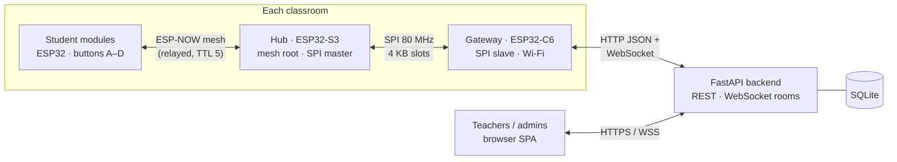
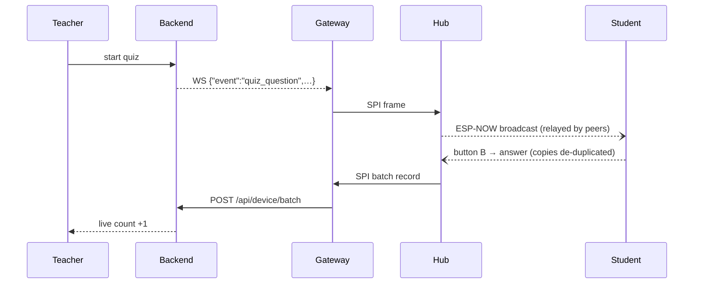

<div align="center">

# imPress

**A classroom response system on ESP32 hardware: live quizzes and polls with one-tap answers, carried by an ESP-NOW mesh, with no student Wi-Fi.**

[](https://github.com/Kush-Kelaiya22/imPress/actions/workflows/ci.yml)


[](docs/README.md)

[Quick start](#-quick-start) · [Architecture](#-architecture) · [Documentation](#-documentation) · [Testing](#-testing) · [What's new in v2](#-whats-new-in-v2)

</div>

---

## ✨ Features

- **One-tap participation:** students answer A–D on a small ESP32 module; the teacher's dashboard updates live.
- **No student Wi-Fi:** modules talk over **ESP-NOW** and relay for each other (multi-hop, de-duplicated). Only one gateway per room joins the network.
- **Quizzes and polls:** planned or impromptu quizzes, per-question timing, live and planned polls, per-option results.
- **Classroom management:** courses, classes with timetables (clash warnings), CSV import of students and staff, enrollment, attendance.
- **Roles:** super admin → admin → teacher, with server-side sessions (idle and hard expiry).
- **Live presence:** see which gateways, hubs and modules are online, per class.
- **OTA for the classroom hub:** upload, push and auto-install, with **automatic rollback** if the new image fails to boot.

## 🏗 Architecture



| Component | Path | Role |
|---|---|---|
| Backend | [`backend/`](backend/) | REST API, per-class WebSocket rooms, auth/RBAC, persistence, presence, firmware store, the SPA |
| Gateway firmware | [`firmware/class_c6/`](firmware/class_c6/) | Bridges the room to the backend (HTTP batches + WebSocket commands) |
| Hub firmware | [`firmware/class_s3/`](firmware/class_s3/) | ESP-NOW mesh root, de-duplication, SPI master, OTA |
| Student firmware | [`firmware/student/`](firmware/student/) | Buttons, optional OLED, mesh node + relay, enrollment-number identity |
| Shared protocol | [`firmware/protocol/`](firmware/protocol/) | One implementation of every byte format, used by all boards |
| React dev UI | [`frontend/`](frontend/) | Optional Vite dashboard |

### What happens when a student answers



More: [system overview](docs/architecture/overview.md) · [data flows](docs/architecture/data-flows.md) · [wire protocols](docs/design/protocols.md).

## 🚀 Quick start

**Backend + teacher UI on your laptop** (Python 3.12+):

```bash
git clone https://github.com/Kush-Kelaiya22/imPress.git && cd imPress/backend
python -m venv .venv && source .venv/bin/activate      # Windows: .venv\Scripts\activate
pip install -r requirements.txt
export IMPRESS_DEBUG=true IMPRESS_INITIAL_ADMIN_PASSWORD=dev-admin
uvicorn app.main:app --reload --host 0.0.0.0 --port 8000
```

Open **http://localhost:8000** and sign in as `admin` / `dev-admin`. The API explorer is at **/docs**.

> Production refuses to start with the published default secrets. Set `IMPRESS_JWT_SECRET` and `IMPRESS_DEVICE_API_KEY` (see [`backend/.env.example`](backend/.env.example)) instead of `IMPRESS_DEBUG=true`.

**Firmware** (ESP-IDF v6.1, or no install via Docker):

```bash
docker run --rm -v "$PWD/firmware":/project -w /project/class_c6 espressif/idf:v6.1 idf.py build
# flash natively:  cd firmware/class_c6 && idf.py menuconfig && idf.py -p <PORT> flash monitor
```

Next steps: [development setup](docs/guides/development-setup.md) · [deploying to a classroom](docs/guides/deployment.md) · [configuration](docs/guides/configuration.md)

## 📚 Documentation

| | |
|---|---|
| **Architecture** | [System overview](docs/architecture/overview.md) · [Backend](docs/architecture/backend.md) · [Firmware](docs/architecture/firmware.md) · [Data flows](docs/architecture/data-flows.md) |
| **Design** | [Wire protocols](docs/design/protocols.md) · [Mesh](docs/design/mesh.md) · [Security model](docs/design/security-model.md) · [Design decisions](docs/design/decisions.md) |
| **API** | [REST](docs/api/rest-api.md) · [WebSocket](docs/api/websocket-api.md) · [Device (gateway)](docs/api/device-api.md) |
| **Guides** | [Development setup](docs/guides/development-setup.md) · [Configuration](docs/guides/configuration.md) · [Deployment](docs/guides/deployment.md) · [OTA updates](docs/guides/ota-updates.md) · [Testing](docs/guides/testing.md) · [Troubleshooting](docs/guides/troubleshooting.md) |
| **Reference** | [Data model](docs/reference/data-model.md) · [Hardware & wiring](docs/reference/hardware.md) · [Known issues](docs/reference/known-issues.md) · [Changelog v2](docs/reference/changelog-v2.md) |

Start at the **[documentation index](docs/README.md)**.

## 🗂 Repository layout

```
backend/            FastAPI app (app/), tests (tests/), requirements, .env.example
firmware/
  protocol/         shared C protocol + host tests
  class_c6/         gateway firmware + host tests (SPI slave, WS commands, config)
  class_s3/         hub firmware
  student/          student module firmware + host tests (identity store)
  contract/         backend↔gateway WebSocket contract fixture
  test_support/     shared fakes for host tests (in-memory NVS)
  tests/            structural guards (pytest)
  run_host_tests.sh runs every host C suite
frontend/           React + Vite development UI
docs/               architecture, design, API, guides, reference
.github/workflows/  CI
```

## 🧪 Testing

```bash
pip install -r backend/requirements-dev.txt
python -m pytest -q backend/tests firmware/tests   # 194 tests
firmware/run_host_tests.sh                         # 6 C suites, ASan + UBSan, no ESP-IDF needed
```

| Layer | What runs | Covers |
|---|---|---|
| Backend (180) | in-process FastAPI + fresh SQLite per test | every router and service: auth/sessions, RBAC, classes, students, quizzes/polls, device API, presence, utilities |
| Firmware structural (14) | source analysis | ownership/threading rules, WS lifecycle, OTA safety, config order |
| Firmware host C (25 cases) | real firmware sources + fake IDF APIs | protocol codec, SPI records, mesh de-dup (relay-storm simulation), SPI slave lifetime, WS command translation, C6 config, student identity |
| CI | GitHub Actions | all of the above + ESP-IDF v6.1 builds of all 3 boards + frontend build |

The backend ↔ firmware WebSocket contract is pinned by a shared fixture (`firmware/contract/device_ws_frames.json`), so a change on either side fails CI. Details in the [testing guide](docs/guides/testing.md).

## 🆕 What's new in v2

`v2` is `main` plus every fix from the October 2026 audit (GitHub issues **#1–#18**), each on its own `fix/*` branch. Highlights:

- **ESP32-C6 resets fixed:** the SPI slave ISR wrote through a dead stack descriptor (#1); a shared cJSON tree was mutated by two tasks (#4); the WS client was destroyed from its own task (#5).
- **Student answers reach the backend again:** the S3→C6 framing mismatch dropped them (#2), and the command contract was broken (#3).
- **One press = one answer:** mesh de-duplication by message id, validated batch ingestion (#6).
- **Security:** session-token WebSocket auth (#8), authenticated votes (#9), no role escalation (#10), secure defaults (#11), hash-only session storage and untracked databases (#12).
- **Classrooms keep their gateway:** a hub's OTA hop no longer steals the class link (#17); empty device config values no longer wipe defaults (#18).
- **OTA:** rollback protection, no needless reboots, gated downloads (#13); upload fixed (#16).
- **Tests, CI and docs** for the whole system (#14).

Full list, upgrade notes and open items: [changelog v2](docs/reference/changelog-v2.md) · [known issues](docs/reference/known-issues.md).

## 🤝 Contributing

1. Branch from `v2` (`fix/<issue>-<slug>` or `feat/<slug>`).
2. Add or adjust tests next to the code you change; run `pytest` and `firmware/run_host_tests.sh`.
3. Keep wire formats in `firmware/protocol` and update the [docs](docs/README.md) when contracts change.
4. Open a PR; CI must be green.
