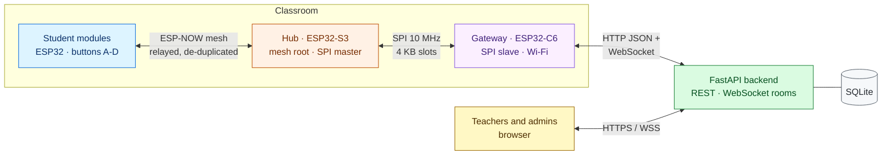
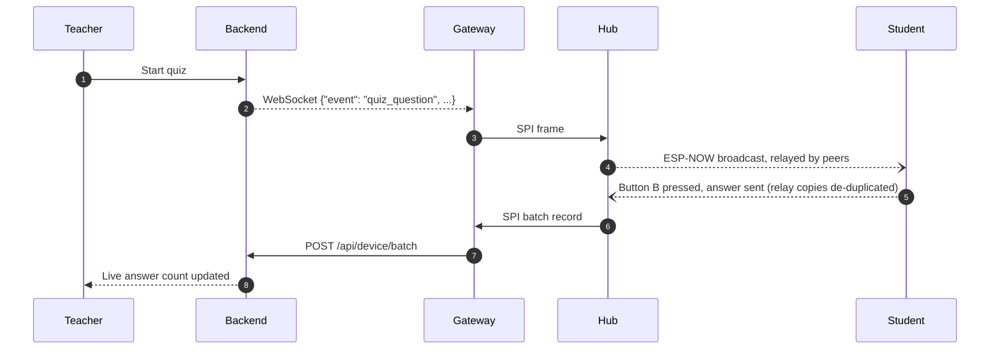

<div align="center">

<h1>imPress</h1>

<p><strong>Classroom response system on ESP32 hardware</strong><br/>
Live quizzes and polls with one-tap answers, delivered over an ESP-NOW mesh, with no Wi-Fi on student devices.</p>

<p>
<a href="https://github.com/Kush-Kelaiya22/imPress/actions/workflows/ci.yml?query=branch%3Avarun%2Fv2.1"></a>
<a href="https://github.com/Kush-Kelaiya22/imPress/commits/varun/v2.1"></a>
<a href="https://github.com/Kush-Kelaiya22/imPress/issues"></a>
</p>
<p>


</p>

<p>
<a href="#overview">Overview</a> &nbsp;|&nbsp;
<a href="#architecture">Architecture</a> &nbsp;|&nbsp;
<a href="#quick-start">Quick start</a> &nbsp;|&nbsp;
<a href="#using-impress">Using imPress</a> &nbsp;|&nbsp;
<a href="#testing">Testing</a> &nbsp;|&nbsp;
<a href="#documentation">Documentation</a>
</p>

</div>

> [!NOTE]
> This is **v2.1** (`VERSION` 2.1.0), developed on the `varun/v2.1` integration branch from `v2`. It adds CSV imports, a firmware registry with staged OTA deployments and rollback, an OTA client for the gateway, device diagnostics, a student module inventory, versioned database migrations and a tested install path. See the [v2.1 changelog](docs/reference/changelog-v2.1.md). The CI badge shows the `varun/v2.1` branch.

---

## Overview

Every student holds a small ESP32 module with four answer buttons. When a teacher starts a question or a poll in the browser, it appears on every module, and each button press is counted live on the teacher's dashboard.

Student modules never join Wi-Fi. They form an **ESP-NOW mesh** and relay each other's messages to a hub in the room. Only one gateway per classroom needs network access, so the system works with school networks that limit clients or credentials.

### Key capabilities

| Capability | Details |
|---|---|
| Live participation | Quizzes (planned or impromptu, per-question timing) and polls (live or planned) with per-option results |
| Mesh networking | Multi-hop ESP-NOW relaying (TTL 5) with de-duplication at the student, hub and server layers: one press is one answer |
| Classroom management | Courses and sections, timetable clash warnings, CSV import of students, staff, **questions, courses and sections**, enrollment, attendance, co-faculty |
| Access control | `super_admin` > `admin` > `teacher`; server-side sessions with idle and absolute expiry; one class-access rule everywhere |
| Device security | **per-device keys** issued at registration (reset and revoke one device without touching the others); **signed firmware** verified on the device and at upload; **HTTPS/WSS** for device traffic. Signing and TLS are opt-in site settings: see [OTA updates](docs/guides/ota-updates.md#signing-images) and [TLS for devices](docs/guides/deployment.md#tls-for-devices) |
| Device fleet | Live presence per class, **health states with diagnostics**, an **inventory of student modules** each gateway has seen |
| Firmware | A validated, immutable **firmware registry**; approval before use; **staged OTA deployments** (canary, batches, retries, timeouts) to hubs and gateways; **automatic rollback** on devices; operator rollback |

## Architecture



| Component | Location | Responsibility |
|---|---|---|
| Backend | [`backend/`](backend/) | REST API, per-class WebSocket rooms, authentication and RBAC, persistence, presence tracking, firmware store, teacher web app |
| Gateway firmware | [`firmware/class_c6/`](firmware/class_c6/) | Bridges the classroom to the backend: batched HTTP uploads, WebSocket commands, its own OTA client, health diagnostics |
| Hub firmware | [`firmware/class_s3/`](firmware/class_s3/) | ESP-NOW mesh root, de-duplication, SPI master, over-the-air updates |
| Student firmware | [`firmware/student/`](firmware/student/) | Buttons and optional OLED, mesh node and relay, enrollment-number identity |
| Shared protocol | [`firmware/protocol/`](firmware/protocol/) | The single implementation of every on-wire format, used by all boards |
| Web UI (dev) | [`frontend/`](frontend/) | Optional React + Vite dashboard |

<details>
<summary><strong>How a single answer travels through the system</strong></summary>



</details>

Further reading: [system overview](docs/architecture/overview.md), [data flows](docs/architecture/data-flows.md), [wire protocols](docs/design/protocols.md), [mesh design](docs/design/mesh.md).

## Supported hardware

| Role | Chip | Minimum (shipped images) | Notes |
|---|---|---|---|
| Gateway | ESP32-C6 | 8 MB flash | Wi-Fi to the backend; updates over the air |
| Hub | ESP32-S3 | 32 MB **octal** flash; PSRAM optional | 8 MB quad-flash modules need the [reduced-flash profile](docs/hardware/CLASSROOM_NODE_REQUIREMENTS.md#reduced-flash-hub-profile-built-not-booted) (built, not yet booted) |
| Student module | ESP32 (classic) | 4 MB flash, four buttons | updated over serial |

Up to 300 student modules per room. Measured footprints, configurations and what an OTA update can change: [classroom node requirements](docs/hardware/CLASSROOM_NODE_REQUIREMENTS.md), [device compatibility](docs/hardware/DEVICE_COMPATIBILITY.md). Wiring and pins: [hardware reference](docs/reference/hardware.md).

## Minimum requirements

| Component | Requirement |
|---|---|
| Server | Linux, macOS or Windows; Python 3.12 or newer; one process (single uvicorn worker); SQLite (bundled) |
| Network | The gateway reaches the server over HTTP and WebSocket on the room's 2.4 GHz Wi-Fi |
| Browser | a current Chrome, Edge, Firefox or Safari |
| Per room | one gateway, one hub, one student module per student |

## Quick start

### Prerequisites

| Tool | Version | Needed for |
|---|---|---|
| Python | 3.12 or newer | backend and tests |
| C compiler (`cc`) | any recent clang or gcc | firmware host tests |
| ESP-IDF or Docker | IDF v6.1 / any Docker | building and flashing firmware |
| Node.js | 20 | optional React UI |

### Installation

```bash
git clone https://github.com/Kush-Kelaiya22/imPress.git
cd imPress
scripts/install.sh
```

`install.sh` creates `backend/.venv`, installs the dependencies (hash-locked on Linux x86_64), and writes `backend/.env` with randomly generated secrets. It never writes the published defaults, and re-running it keeps your values. On Windows, install by hand as in the [deployment guide](docs/guides/deployment.md#1-server).

### Configuration

Settings are environment variables with the `IMPRESS_` prefix, read from `backend/.env`:

| Setting | Purpose |
|---|---|
| `IMPRESS_JWT_SECRET`, `IMPRESS_DEVICE_API_KEY` | required secrets (generated by `install.sh`). The device key must also be set on every gateway |
| `IMPRESS_INITIAL_ADMIN_PASSWORD` | the first super admin's password; if empty, a random one is printed once in the log |
| `IMPRESS_DATABASE_URL`, `IMPRESS_FIRMWARE_DIR` | where data and firmware images live |

All settings and the device-side Kconfig and NVS keys: [configuration guide](docs/guides/configuration.md).

### Application startup

```bash
IMPRESS_INITIAL_ADMIN_PASSWORD=change-me scripts/start.sh     # http://127.0.0.1:8000
scripts/smoke_test.py --password change-me                    # optional: check the running server
```

Sign in as `admin`. The API reference is served at `/docs`, and `GET /health` reports the version and database schema. Production setup (systemd, nginx, TLS): [deployment guide](docs/guides/deployment.md).

### Build and flash the firmware

```bash
# No ESP-IDF installation required:
docker run --rm -v "$PWD/firmware":/project -w /project/class_c6 espressif/idf:v6.1 idf.py build

# With a native ESP-IDF v6.1 installation:
cd firmware/class_c6 && idf.py menuconfig && idf.py -p <PORT> flash monitor
```

Repeat for `class_s3` and `student`. The first v2.1 flash of each gateway and hub must be over serial; after that they update over the air.

## Using imPress

### Classroom management

Admins create courses and sections (classes), assign faculty and enroll students; teachers run quizzes and polls in their classes. A gateway registering with a section's room code links itself to that class. See the [REST API](docs/api/rest-api.md#classes).

### CSV imports

| Import | Where | Behaviour |
|---|---|---|
| Quiz questions | Create-quiz page, or `POST /api/quizzes/{id}/questions/import` | preview first; invalid rows explained; all-or-nothing; duplicates skipped |
| Courses and sections | Classrooms page | dry run by default; never silently overwrites; export round-trips |
| Students and staff | Students and Users pages | row-level validation |

File formats and templates: [CSV imports guide](docs/guides/csv-imports.md).

### Device management

The Modules page lists every gateway and hub with its **health** (online, degraded, error, updating, offline, unknown, with the reasons) and a read-only **diagnostics** panel: uptime, last reset reason, boot count, lowest free heap, Wi-Fi signal, S3 link. Below it, the **student module inventory** lists every module a gateway has seen, filterable by class, state and device ID. Rules: [health states](docs/api/device-api.md#health-states).

### Firmware management

Upload the app `.bin` from a firmware build on the Firmware page. The backend reads the target, chip and version from the image itself, checks its integrity, and refuses anything that isn't a valid imPress image. Images are immutable. Approve an image before it can be deployed, and deprecate it to stop new deployments. Versioning rules: [firmware versioning](docs/firmware/FIRMWARE_VERSIONING.md).

### OTA deployment

Deploy an approved image to chosen devices, a class, a type or every compatible device. A deployment starts with a canary and continues in batches, with a concurrency limit, retries, timeouts, and a pause on failure. Every device reports each step, from precheck to health check. Supported over the air: **hubs and gateways**. Student modules update over serial. Guide: [OTA updates](docs/guides/ota-updates.md); design: [OTA architecture](docs/firmware/OTA_ARCHITECTURE.md).

### Firmware rollback

- **Automatic:** a new image must pass its health check after the reboot, or the bootloader reverts to the previous image and the device reports `rolled_back`.
- **Operator:** deploy an older approved image with the explicit downgrade confirmation.
- **Manual recovery:** for a device that can't update at all, see the [recovery procedure](docs/firmware/RECOVERY_PROCEDURE.md).

## Development workflow

1. Branch from `varun/v2.1` (`feat/…`, `fix/…`, `docs/…`), one branch per issue.
2. Change the code and its tests together; run `python run_tests.py`.
3. Open a pull request into `varun/v2.1`. It merges only when the **CI result** check is green.

Local setup for each part (backend with reload, React UI, firmware): [development setup](docs/guides/development-setup.md).

## Testing

One command runs every suite and prints a consolidated report:

```bash
python3 -m venv .venv && . .venv/bin/activate
pip install -r backend/requirements-dev.txt
python run_tests.py                       # default suites
python run_tests.py --list                # list suites
python run_tests.py -s backend -s host    # selected suites
python run_tests.py --with-ui --with-idf --with-frontend
```

| Suite | Scope |
|---|---|
| `backend` | every router and service, migrations, end-to-end flows through a simulated gateway, fault injection |
| `firmware-static` | structural rules in firmware sources (OTA safety, task ownership) and firmware ↔ backend agreement |
| `host:*` | firmware C compiled on the host with AddressSanitizer and UBSan |
| `repo` | CI workflow, repository hygiene, documentation consistency, install scripts, the runner itself |
| `ui` (optional) | Playwright browser checks with screenshots |
| `idf:*`, `frontend` (optional) | ESP-IDF v6.1 builds of the three firmware projects; the React build |

CI runs every suite, the three firmware builds and a clean install on a fresh runner, behind one **CI result** check. GitHub's badges are per workflow, not per job, so the jobs are listed here:

| CI job | Covers |
|---|---|
| Repository and CI checks | `repo` suite, actionlint, ruff |
| Dependency audit | pip-audit, npm audit |
| Backend tests | `backend` suite with coverage (report uploaded as an artifact; no coverage service is connected, so there is no coverage badge) |
| Firmware structural / host tests | `firmware-static`, `host:*` |
| ESP-IDF v6.1 build | three firmware images with size reports |
| Frontend build | `npm ci` + Vite build |
| Browser UI checks | Playwright |
| Clean install + smoke test | `scripts/install.sh`, `start.sh`, `smoke_test.py` |

What is tested where, and what still needs a bench: [test strategy](docs/testing/TEST_STRATEGY.md), [hardware validation](docs/testing/HARDWARE_VALIDATION.md).

## Troubleshooting

| Symptom | First check |
|---|---|
| Server refuses to start: default secrets | run `scripts/install.sh`, or set `IMPRESS_JWT_SECRET` and `IMPRESS_DEVICE_API_KEY` |
| Server stops at a migration | the log names the step and what to fix; a backup was written next to the database |
| Gateway never shows online | device key, backend address and Wi-Fi in its NVS; `GET /health` from the room's network |
| Gateway shows *degraded* | the reasons on the Modules page: S3 link, weak Wi-Fi, low memory |
| A deployment paused | the failed device's error on the Firmware page; resume to accept it, or cancel |

More: [troubleshooting guide](docs/guides/troubleshooting.md), [known issues](docs/reference/known-issues.md).

## Documentation

| Area | Pages |
|---|---|
| **Architecture** | [System overview](docs/architecture/overview.md) · [Backend](docs/architecture/backend.md) · [Firmware](docs/architecture/firmware.md) · [Data flows](docs/architecture/data-flows.md) |
| **Design** | [Wire protocols](docs/design/protocols.md) · [Mesh](docs/design/mesh.md) · [Security model](docs/design/security-model.md) · [Design decisions](docs/design/decisions.md) |
| **API** | [REST](docs/api/rest-api.md) · [WebSocket](docs/api/websocket-api.md) · [Device and gateway](docs/api/device-api.md) |
| **Guides** | [Development setup](docs/guides/development-setup.md) · [Configuration](docs/guides/configuration.md) · [Deployment](docs/guides/deployment.md) · [CSV imports](docs/guides/csv-imports.md) · [OTA updates](docs/guides/ota-updates.md) · [Testing](docs/guides/testing.md) · [Troubleshooting](docs/guides/troubleshooting.md) |
| **Firmware** | [OTA architecture](docs/firmware/OTA_ARCHITECTURE.md) · [Versioning](docs/firmware/FIRMWARE_VERSIONING.md) · [Recovery procedure](docs/firmware/RECOVERY_PROCEDURE.md) |
| **Hardware** | [Classroom node requirements](docs/hardware/CLASSROOM_NODE_REQUIREMENTS.md) · [Device compatibility](docs/hardware/DEVICE_COMPATIBILITY.md) |
| **Testing** | [Test strategy](docs/testing/TEST_STRATEGY.md) · [Hardware validation](docs/testing/HARDWARE_VALIDATION.md) |
| **Engineering** | [System audit](docs/engineering/SYSTEM_AUDIT.md) · [v2 / v3 comparison](docs/engineering/V2_V3_COMPARISON.md) · [Database migrations](docs/engineering/DATABASE_MIGRATIONS.md) |
| **Reference** | [Data model](docs/reference/data-model.md) · [Hardware and wiring](docs/reference/hardware.md) · [Known issues](docs/reference/known-issues.md) |

The [documentation index](docs/README.md) describes when to read each page.

## Repository layout

```text
imPress/
├── backend/                FastAPI application, tests, requirements, .env.example
├── firmware/
│   ├── protocol/           shared C protocol library and host tests
│   ├── class_c6/           gateway firmware and host tests
│   ├── class_s3/           hub firmware
│   ├── student/            student module firmware and host tests
│   ├── contract/           backend-to-gateway WebSocket contract fixture
│   ├── test_support/       shared host-test fakes (in-memory NVS)
│   ├── tests/              structural firmware checks
│   └── run_host_tests.sh   runs every host C suite
├── frontend/               React and Vite development UI
├── docs/                   architecture, design, API, guides, reference, engineering, hardware, firmware, testing
├── scripts/                install.sh, start.sh, init_env.py, smoke_test.py
├── tests/                  repository, CI and documentation checks
├── ui_tests/               Playwright browser checks
├── VERSION                 release version (2.1.0)
├── run_tests.py            unified test runner
└── .github/workflows/      continuous integration
```

## Release history

| Version | Branch | Summary |
|---|---|---|
| 2.1.0 | `varun/v2.1` | CSV imports, firmware registry and staged OTA with rollback, gateway OTA client, diagnostics, module inventory, migrations, install path: [changelog](docs/reference/changelog-v2.1.md) |
| 2.0 | `v2` | the October 2026 audit fixes (#1–#25), test suite, CI and documentation: [changelog](docs/reference/changelog-v2.md) |
| 1.x | `main` | the original system |

No GitHub release or tag has been published yet, so there is no release badge. The version is in the [`VERSION`](VERSION) file and reported by `GET /health`.

**Hardware status:** every v2.1 feature is verified by automated tests and builds. None has been verified on real boards yet; the bench checks and their status are in [hardware validation](docs/testing/HARDWARE_VALIDATION.md).

> [!WARNING]
> Databases containing user and session data were committed to git history before `v2`. Purge them and rotate the affected passwords before publishing the repository. See the [deployment checklist](docs/guides/deployment.md#4-go-live-checklist).

## Contributing

1. Open or pick an issue, then branch from `varun/v2.1` as `feat/<issue>-<summary>`, `fix/…` or `docs/…`.
2. Add or update tests next to the code you change, then run `python run_tests.py`.
3. Keep on-wire formats in `firmware/protocol` and the device contract fixture in sync ([decision D5](docs/design/decisions.md#d5-the-backend--firmware-json-contract-is-a-committed-fixture)).
4. Update the relevant page in [`docs/`](docs/README.md). Repository checks fail on broken links, undocumented routes or undocumented settings.
5. Use conventional commit messages. Open a pull request into `varun/v2.1`; the **CI result** check must pass.

## License

The repository has no license file, so no license has been granted: all rights are reserved by the authors. Adding one (for example MIT or Apache-2.0) is the owners' decision.
