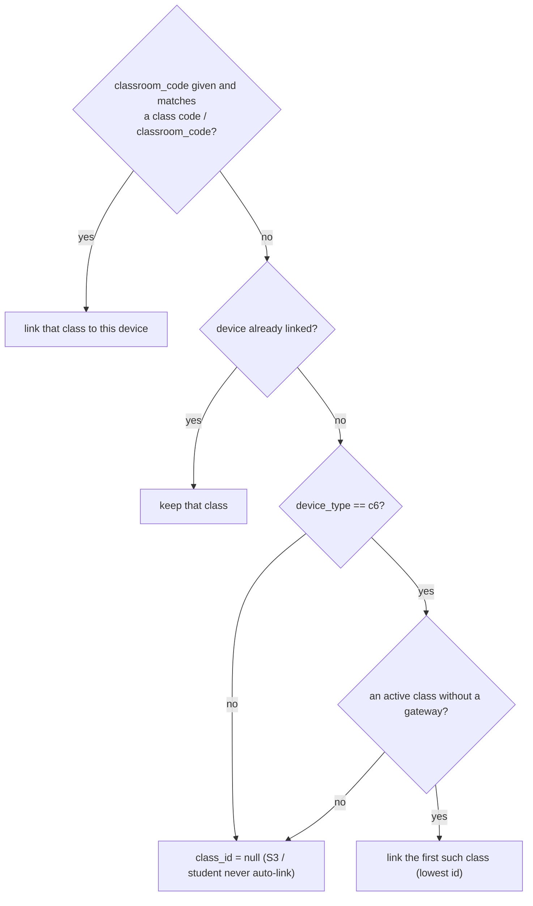

# Device API (gateway ↔ backend)

These endpoints are called by firmware: the C6 gateway (`firmware/class_c6/main/wifi_client.c`) and the S3 during its OTA hop (`firmware/class_s3/main/ota.c`). Treat request and response shapes as a **firmware contract**: firmware in the field can't be changed as easily as a browser.

## Authentication

Every request carries the shared device key:
```
X-API-Key: <IMPRESS_DEVICE_API_KEY>
```
A missing header → `422`; a wrong key → `403`. The key is compared in constant time. On the device side it comes from Kconfig `DEVICE_API_KEY`, overridable via NVS `api_key`.

## Endpoint summary

| Method & path | Caller | Purpose |
|---|---|---|
| `POST /api/device/register` | C6 at boot and on Wi-Fi reconnect; S3 on OTA hop | create/update the device, mark it online, link the gateway to a class |
| `POST /api/device/heartbeat` | C6 every 15 s; S3 on OTA hop | liveness + telemetry |
| `POST /api/device/ping` | C6 every 120 s | classroom status update (activity log) |
| `POST /api/device/batch` | C6, batched (≤ 20 msgs or 500 ms) | student mesh events: joins, leaves, answers, votes, heartbeats |
| `POST /api/device/attendance` | (available) | explicit attendance check-in |
| `POST /api/device/firmware/check` | S3 on OTA hop | is an update pending? |
| `GET /api/device/firmware/download` | S3 on OTA hop | fetch the pending image |
| `POST /api/device/firmware/applied` | (available) | report an applied update |
| `POST /api/polls/{id}/vote`, `POST /api/quizzes/{id}/answer` | direct device submissions (not used by current firmware) | see [below](#direct-voteanswer-endpoints) |
| `WS /ws/class/{id}?role=device` | C6 | backend → device commands. See the [WebSocket API](websocket-api.md). |

---

## Register

`POST /api/device/register`
```json
{"mac_address": "48:F6:EE:FF:FE:C7", "device_type": "c6", "device_name": "imPress C6",
 "firmware_version": "1.0.0", "classroom_code": ""}
```
```json
{"device_id": 12, "status": "registered", "class_id": 3}
```

Behaviour:
- **Upsert by `mac_address`**: name and type are updated; the device is marked online (`esp_device.online` logged only on an offline → online transition).
- **Class linking** (`class_id` in the response; the C6 adopts it and persists it to NVS):



## Heartbeat

`POST /api/device/heartbeat`
```json
{"mac_address": "48:F6:EE:FF:FE:C7", "battery_pct": 100, "rssi": -61, "firmware_version": "1.0.0",
 "student_count": 27, "free_heap": 180000, "total_flash": 8388608}
```
→ `{"status":"ok","server_time":"2026-10-07T21:35:16.319+05:30"}` · unknown MAC → `404`.

It updates `last_seen`, battery, RSSI and firmware version, plus non-zero `student_count` / `free_heap` / `total_flash`, then pushes presence to teachers.

## Status ping

`POST /api/device/ping`
```json
{"mac_address": "48:F6:EE:FF:FE:C7", "class_id": 3, "student_count": 27, "uptime_s": 3600, "rssi": -55, "free_heap": 175000}
```
→ `{"status":"ok","server_time":…}` and an `ActivityLog` row `class.status_update` (`entity_id = class_id` when > 0). Unknown MAC → `404`.

## Batch

`POST /api/device/batch`
```json
{"device_type": "c6", "messages": [
  {"type": "heartbeat", "device_mac": "48:F6:EE:FF:FE:C7", "battery_pct": 100},
  {"type": "student_join", "enrollment_number": "ABCDE12345", "device_mac": "48:F6:EE:FF:FE:C7", "class_code": "", "device_id": 3577735345},
  {"type": "quiz_answer", "quiz_id": 4, "question_order": 0, "enrollment_number": "ABCDE12345",
   "selected_option": 1, "response_time_ms": 0, "device_id": 3577735345},
  {"type": "poll_vote", "poll_id": 2, "enrollment_number": "ABCDE12345", "selected_option": 2, "device_id": 3577735345},
  {"type": "student_leave", "enrollment_number": "ABCDE12345", "device_mac": "48:F6:EE:FF:FE:C7", "device_id": 3577735345, "reason": 0}
]}
```
→ `{"status": "ok", "processed": <stored/applied>, "skipped": <rejected answers/votes>}`

| `type` | Processing |
|---|---|
| `heartbeat` | the device with `device_mac` → `last_seen`, battery, RSSI, mark online |
| `student_join` | known enrollment → `ActivityLog student.connect`; if `class_code` matches a class → create a `StudentEnrollment` if missing; unknown enrollment → ignored |
| `student_leave` | known enrollment → `ActivityLog student.disconnect` |
| `quiz_answer` | **stored only if** the student is known, the quiz exists and is `active`, the question exists, `0 ≤ selected_option < len(options)`, all ints, and no answer yet for (quiz, question, student). Otherwise `skipped += 1` |
| `poll_vote` | stored only if the student is known, the poll is active, the option is in range, and no vote yet for (poll, student) |

Each stored answer or vote broadcasts the live count to the class room (`quiz_answer` with `total_answers`, `poll_vote` with `total_votes`). Duplicates within one batch are caught too, because the session autoflushes before each duplicate check.

## Attendance

`POST /api/device/attendance`: `{"enrollment_number": "ABCDE12345", "class_code": "BIO1", "mac_address": ""}`

| Condition | Result |
|---|---|
| unknown class code | 404 |
| class inactive | 400 |
| unknown enrollment number | 404 |
| student not enrolled in the class (and no device fallback) | 400 |
| ok | 200 `{"status":"checked_in","class_name":"Bio"}`; upsert, so repeated check-ins keep one row |

## Firmware check, download, applied

```
POST /api/device/firmware/check   {"mac_address": "…", "current_version": "1.0.0"}
→ {"update_available": true, "version": "1.2.0", "ota_status": "downloading", "current_version": "1.0.0"}

GET  /api/device/firmware/download?mac_address=…&version=1.2.0   → application/octet-stream
POST /api/device/firmware/applied {"mac_address": "…", "version": "1.2.0"}
→ {"status": "ok", "firmware_version": "1.2.0"}
```
- `update_available` = `pending_version` set and different from the reported version.
- **Download** is only allowed for the device's `pending_version`: no pending update, or a different version → `403`. The version must be semver, and the file `<device_type>-<version>.bin` must exist (else `404`).
- **Applied** sets `firmware_version`, clears `pending_version`, and sets `ota_status = applied`.

## Direct vote/answer endpoints

`POST /api/polls/{id}/vote` and `POST /api/quizzes/{id}/answer`, body `{"device_id": <EspDevice.id>, "selected_option": n}`:
- require `X-API-Key`;
- `device_id` must be a **registered** device (`404` otherwise);
- the option must be in range for the poll or the **current** question (`422`);
- the poll/quiz must be active (`400`);
- one submission per device (`400`).

## Presence snapshot

Returned by `GET /api/classes/{id}/presence` and pushed as the WS `presence` event:
```json
{"class_id": 3, "server_time": "…", "server_time_ms": 1791382516000, "online_count": 2, "total_count": 3,
 "devices": [{"id": 12, "mac_address": "…", "device_name": "imPress C6", "device_type": "c6",
              "student_name": "", "is_connected": true, "online": true, "last_seen": "…",
              "last_seen_ms": 1791382514000, "last_seen_ago_s": 2, "rssi": -61, "battery_pct": 100,
              "student_count": 27, "firmware_version": "1.0.0", "gateway_id": null}]}
```
`devices[0]` is the class gateway; the rest are its relay tree (BFS over `gateway_id`). `online` = `is_connected` and seen within 30 s.

## Changing this contract

1. Keep fields additive. Old firmware ignores unknown response fields but may send old field names.
2. Update the firmware JSON builders (`msg_to_json` in `class_c6/main/main.c`, `wifi_client.c`, `ota.c`) **and** the backend schema in the same PR.
3. For WS command changes, regenerate `firmware/contract/device_ws_frames.json` and update `ws_command.c` (see [decision D5](../design/decisions.md#d5-the-backend--firmware-json-contract-is-a-committed-fixture)).
