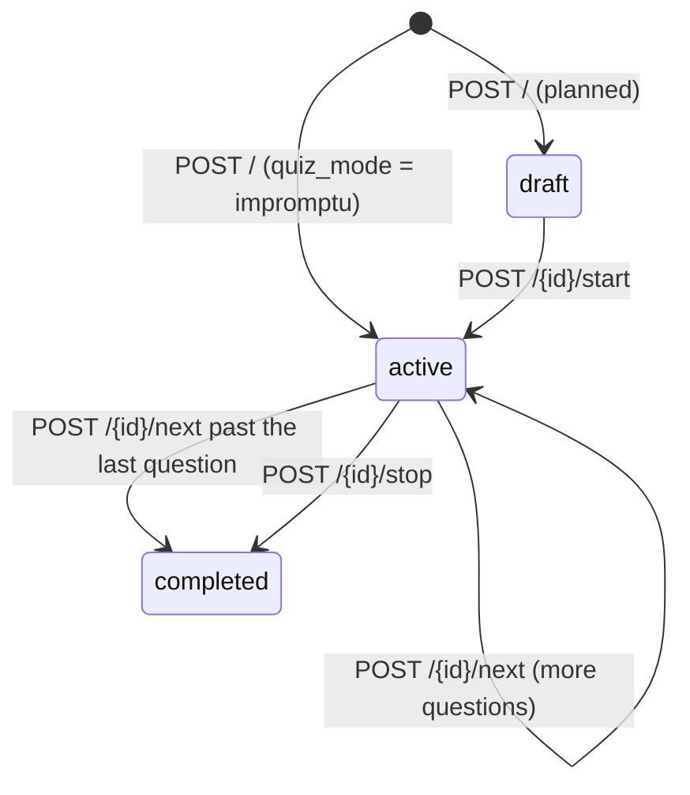

# REST API

Base URL: `http(s)://<host>:<port>`. All bodies are JSON unless marked *multipart*. The interactive OpenAPI UI is at **`/docs`** (Swagger) and **`/redoc`** on a running backend; it is generated from the same code this page describes.

> Device/gateway endpoints (`/api/device/*`, and `/vote` / `/answer`) are in the [Device API](device-api.md). Live events are in the [WebSocket API](websocket-api.md).

## Conventions

| Topic | Rule |
|---|---|
| Auth header | `Authorization: Bearer <access_token>` (an opaque `impress_…` token from `/api/auth/login`) |
| Guards | **public** · **session** (any logged-in user) · **teacher+** (teacher, admin, super_admin) · **class access** (teacher+ *and* primary teacher / co-faculty of that class, or admin) · **admin** (admin, super_admin) · **super_admin** |
| Class access | One rule everywhere (classes, quizzes, polls, results): the **primary teacher**, any **co-faculty** member, or an **admin**. Anyone else gets 403. Primary-only actions: deleting the class. |
| Timestamps | ISO-8601, naive **IST** (e.g. `2026-10-07T21:35:16.319308`) unless the field says otherwise |
| Validation errors | `422` with FastAPI's `{"detail":[{"loc":[…],"msg":…,"type":…}]}` |
| Other errors | `{"detail": "<message>"}` with the status below |

### Error status codes

| Status | Meaning in imPress |
|---|---|
| 400 | Business rule violated (duplicate code/username, wrong state such as "Quiz is already active", self-deactivation) |
| 401 | Missing/invalid token, or an expired session: `detail: "SESSION_EXPIRED"` + header `X-Session-Code: idle|hard` |
| 403 | Authenticated but not allowed (role, class ownership, disabled account at login, wrong device key) |
| 404 | Entity not found |
| 409 | Conflict: quiz without a current question; a section that already exists for the course; a lost race on an enrollment |
| 422 | Request body/params failed validation |

---

## Auth: `/api/auth`

### `POST /api/auth/login`: public
```json
// request
{"username": "admin", "password": "…"}
// 200
{"access_token": "impress_Q3h…", "token_type": "bearer",
 "expires_at": "2026-10-08T03:35:16", "created_at": "2026-10-07T21:35:16",
 "idle_timeout_s": 3600, "hard_timeout_s": 21600, "server_time": "2026-10-07T21:35:16"}
```
Errors: `401` wrong username/password · `403` account disabled. Each login creates an independent session.

### `GET /api/auth/me`: session
Returns `UserResponse`: `{id, username, email, full_name, role, is_active, created_at}`.

### `PUT /api/auth/me`: session
`{"full_name": "Dr. Rao"}`. The name is trimmed; blank after trimming → `400`; empty string → `422`.

### `POST /api/auth/change-password`: session
`{"current_password": "…", "new_password": "≥6 chars"}`. A wrong current password → `400`.

### `POST /api/auth/logout`: session
Revokes the current session: `{"status":"ok"}`.

### `GET /api/auth/session`: bearer token, no activity refresh
`{user_id, username, role, created_at, last_activity_at, expires_at, idle_timeout_s, hard_timeout_s, server_time, idle_remaining_s, hard_remaining_s}`

### `GET /api/auth/session-status`: bearer token, no activity refresh
`{idle_seconds_remaining, hard_seconds_remaining, warning_active, last_activity_at, expires_at, server_time}`. `warning_active` is true within `SESSION_WARNING_MINUTES` (5) of the hard limit. An expired or invalid token → `401 SESSION_EXPIRED` with `X-Session-Code`.

### `POST /api/auth/activity`: session
An explicit "user is active" ping. Refreshes the idle timer: `{status, last_activity_at, hard_remaining_s, server_time}`. It can't revive an already-expired session (401).

---

## Users (admin): `/api/admin/users`

| Method & path | Guard | Body / params | Notes |
|---|---|---|---|
| `POST /api/admin/users` | admin | `{username (3-64), email, password (≥6), full_name, role}` | `role ∈ teacher|admin|super_admin`; granting `admin`/`super_admin` needs **super_admin**; duplicate username/email → 400 |
| `GET /api/admin/users` | admin | `?role=` | list `UserResponse` |
| `PUT /api/admin/users/{id}` | admin | `{full_name?, email?, is_active?, role?}` | super-admin targets need super_admin; changing your own role → 403; granting or demoting admin-level needs super_admin; unknown role → 422 |
| `POST /api/admin/users/{id}/deactivate` | admin | – | yourself → 400; super admin by an admin → 403; their sessions stop working immediately |
| `POST /api/admin/users/{id}/reset-password` | admin | `{new_password (≥6)}` | super admin's by an admin → 403 |
| `DELETE /api/admin/users/{id}` | admin | – | soft delete (deactivates); yourself → 400 |
| `POST /api/admin/users/import` | admin | *multipart* `file` (CSV) | columns `username,email,password,full_name,role` (all required); per-row errors returned; `admin` rows need super_admin |

CSV import response (used by both user and student imports):
```json
{"inserted": 1, "total_rows": 4,
 "skipped": [{"row": 3, "roll_number": "bob", "error": "password must be at least 6 characters"}]}
```

---

## Courses: `/api/courses`

| Method & path | Guard | Notes |
|---|---|---|
| `POST /api/courses/` | admin | `{code (1-16, unique), name, description, credits, department, exam_date?, exam_start_time?, exam_end_time?}`; duplicate code → 400 |
| `GET /api/courses/` | teacher+ | list `CourseResponse` |
| `GET /api/courses/{id}` | teacher+ | 404 if missing |
| `PUT /api/courses/{id}` | admin | partial update; taking another course's code → 400 |
| `DELETE /api/courses/{id}` | admin | |

---

## Classes

### Admin routes: `/api/admin/classes`

| Method & path | Guard | Notes |
|---|---|---|
| `POST /api/admin/classes` | admin | `ClassCreate` (below). The primary teacher = `teacher_ids[0]` or `teacher_id` or the caller. Returns `ClassResponse` with schedule **warnings**. Created **inactive**. **409** if `(course_id, course_section)` is already taken (also on `PUT`). |
| `GET /api/admin/classes` | admin | all classes |
| `PUT /api/admin/classes/{id}` | admin | `ClassUpdate` (partial) |
| `DELETE /api/admin/classes/{id}` | admin | |
| `POST /api/admin/classes/{id}/assign-teacher` | admin | `{teacher_id}` |
| `PUT /api/admin/classes/{id}/faculty` | admin | `{teacher_ids: [...]}`; the first becomes primary |
| `POST /api/admin/classes/{id}/import-students` | admin | *multipart* CSV (see students) |
| `GET /api/admin/classes/{id}/devices` | admin | gateways/hubs for a class |

`ClassCreate`:
```json
{"name": "Physics", "code": "PHY101", "subject": "", "course_id": null, "course_section": "A",
 "term": "Monsoon", "year": 2026, "start_date": "2026-07-15", "end_date": "2026-11-15",
 "exam_start_date": "2026-11-20", "exam_end_date": "2026-11-28",
 "meeting_schedule": [{"day": "Mon", "start": "09:00", "end": "10:00"}],
 "location": "RM-1", "capacity": 60, "teacher_id": 2, "teacher_ids": [2, 5], "classroom_code": "RM-201"}
```
- `term ∈ {"", Monsoon, Winter, Summer}`; `code` unique (1-32); `classroom_code` unique.
- `warnings`: `[{"type":"teacher"|"room","message","class_id","class_name","day","start","end"}]`. A clash is reported only if the windows overlap: same term+year, else overlapping date ranges, else unknown → flagged. Back-to-back slots don't clash; overnight slots are clamped to 23:59.

### Teacher routes: `/api/classes`

| Method & path | Guard | Notes |
|---|---|---|
| `GET /api/classes/` | teacher+ | teacher: own and co-taught; admin: all |
| `POST /api/classes/` | teacher+ | `ClassCreate`; default teacher = the caller |
| `GET /api/classes/{id}` | teacher+ | 403 if not your class |
| `GET /api/classes/{id}/presence` | teacher+ | live device snapshot ([device API](device-api.md#presence-snapshot)) |
| `POST /api/classes/{id}/activate` · `POST /api/classes/{id}/deactivate` | teacher+ | toggles `is_active` (gateways auto-link only to active classes) |
| `POST /api/classes/join` | teacher+ | `{code}`; the caller becomes **co-faculty** (idempotent) and the primary teacher is never replaced (#19); unknown → 404, inactive → 400 |
| `DELETE /api/classes/{id}` | teacher+ | primary teacher or admin; deletes the class with its quizzes, polls, answers, votes, attendance and enrollments (same as the admin delete) |
| `GET /api/devices/live` · `/api/devices/tree` | teacher+ | device presence across the caller's classes |

`ClassResponse` adds `teacher_name, is_active, course_code, course_name, exam_date, exam_start_time, exam_end_time, reading_week_start, teacher_ids, faculty_names, student_count, quiz_count, poll_count, warnings`.

---

## Students: `/api/students` and enrollment

| Method & path | Guard | Notes |
|---|---|---|
| `POST /api/students/` | teacher+ | `{roll_number, student_name, email, phone, program, enrollment_year, graduation_year, device_mac}`; `roll_number` = exactly 10 alphanumerics, stored **upper-case**; duplicate → 400 |
| `POST /api/students/bulk` | teacher+ | `{students: [StudentCreate…], class_session_id?}`; optionally enrolls into the class |
| `GET /api/students/` | teacher+ | `?search=` matches roll number or name (case-insensitive substring) |
| `GET /api/students/{id}` · `PUT` | teacher+ | partial update (`StudentUpdate`) |
| `DELETE /api/students/{id}` | teacher+ | **soft** delete (`is_active=false`) |
| `DELETE /api/students/{id}/hard-delete` | admin only (403 for teachers) | permanently removes the student, their enrollments and attendance rows; their quiz answers and poll votes are kept **anonymised** so results keep their totals |
| `GET /api/students/{id}/classes` | teacher+ | `[{enrollment_id, class_id, course_code, course_name, subject, course_section, term, year, meeting_schedule, location, teacher_name, is_active}]` |
| `POST /api/students/import` | teacher+ | *multipart* CSV, below |
| `POST /api/students/classes/{id}/import-students` | teacher+ | same CSV, plus enroll into the class |
| `POST /api/admin/students` · `POST /api/admin/students/bulk` | teacher+ | admin-path equivalents |
| `POST /api/admin/classes/{id}/enroll` | teacher+ | `{student_id}` |
| `POST /api/admin/classes/{id}/enroll-bulk` | teacher+ | `{student_ids: [...]}` |
| `DELETE /api/admin/classes/{id}/unenroll/{student_id}` | teacher+ | |
| `GET /api/admin/students/class/{id}` | teacher+ | roster |
| `GET /api/admin/students/{id}/participation` | teacher+ | `{student, quizzes_answered, total_quiz_answers, polls_voted, total_poll_votes, attendance_count, total_classes, quiz_details, poll_details}` |

**Student CSV:** exactly these 7 columns, all required:
`roll_number, student_name, email, phone, program, enrollment_year, graduation_year`.

Per-row rules:
- `roll_number` is 10 alphanumerics, unique in the file and in the DB;
- name and program ≤ 128;
- valid email; phone of 7–15 characters (digits, spaces, `+ - ( )`);
- both years in 2000–2099, with graduation ≥ enrollment.

Valid rows are inserted and invalid rows are returned in `skipped`. Missing or extra columns → 400; a non-`.csv` file → 400.

---

## Quizzes: `/api/quizzes`



| Method & path | Guard | Notes |
|---|---|---|
| `POST /api/quizzes/` | class access | `{class_session_id, title, questions: [{question_text, options (2-6), correct_option}], quiz_mode: planned|impromptu, timing_mode: per_question|total|manual, question_time_limit, total_time_limit}`; ≥ 1 question; `correct_option` must be `< len(options)` (422, #22) |
| `GET /api/quizzes/class/{class_id}` | class access | newest first |
| `GET /api/quizzes/{id}` | class access (#20) | `QuizResponse {id, class_session_id, title, status, quiz_mode, timing_mode, question_time_limit, total_time_limit, current_question, is_live, question_count, created_at, started_at}` |
| `POST /api/quizzes/{id}/start` | class access | already active → 400; broadcasts `quiz_question` (q 0) |
| `POST /api/quizzes/{id}/next` | class access | not active → 400; broadcasts the next `quiz_question`, or completes |
| `POST /api/quizzes/{id}/stop` | class access | → completed; broadcasts `quiz_end` |
| `GET /api/quizzes/{id}/results` | class access (#20) | below |

```json
{"quiz_id": 1, "title": "Q", "status": "active", "quiz_mode": "impromptu", "timing_mode": "manual",
 "results": [{"question_num": 0, "question_text": "2+2?", "options": ["3","4","5"], "correct_option": 1,
              "total_answers": 3, "option_counts": [0, 2, 1]}]}
```

## Polls: `/api/polls`

| Method & path | Guard | Notes |
|---|---|---|
| `POST /api/polls/` | class access | `{class_session_id, title (1-256), options (2-6), poll_mode: live|planned}`; `live` → active immediately + `poll_start` broadcast |
| `GET /api/polls/class/{class_id}` | class access | |
| `GET /api/polls/{id}` | class access (#20) | `PollResponse {id, class_session_id, title, options, poll_mode, status, is_live, total_votes, created_at}` |
| `POST /api/polls/{id}/start` | class access | draft → active; already active → 400; broadcasts `poll_start` |
| `POST /api/polls/{id}/end` | class access | → closed; broadcasts `poll_end` with `option_counts` |
| `GET /api/polls/{id}/results` | class access (#20) | `{poll_id, title, options, poll_mode, status, total_votes, option_counts}` |

---

## Modules and firmware (admin): `/api/admin`

| Method & path | Guard | Notes |
|---|---|---|
| `GET /api/admin/modules` · `GET /api/admin/modules/{id}` | admin | `DeviceResponse` (identity, presence, telemetry, OTA state, linked class) |
| `POST /api/admin/modules/{id}/access` | admin | `{is_active}` enable/disable a module |
| `POST /api/admin/modules/{id}/verify` | admin | stamps `verified_at` |
| `POST /api/admin/modules/{node_id}/link-device` · `POST /api/admin/modules/{id}/unlink` | admin | set/clear `gateway_id` relations |
| `POST /api/admin/firmware/upload` | admin | *multipart* `device_type ∈ c6|s3|student`, `version` (semver, optional `v`), `file` → stored as `<type>-<version>.bin` |
| `POST /api/admin/modules/{id}/ota` | admin | `{version}` → `pending_version`; for an S3 with a gateway, sends `device_command ota_update` to the gateway's class room |
| `GET /api/admin/activity` | admin | activity log |

## Misc

| Method & path | Guard | Notes |
|---|---|---|
| `GET /health` | public | `{"status":"healthy","schema_version":3}` (applied database migration) |
| `GET /{any other path}` | public | the SPA (`templates/index.html`) |
| `GET /static/*` | public | SPA assets |
