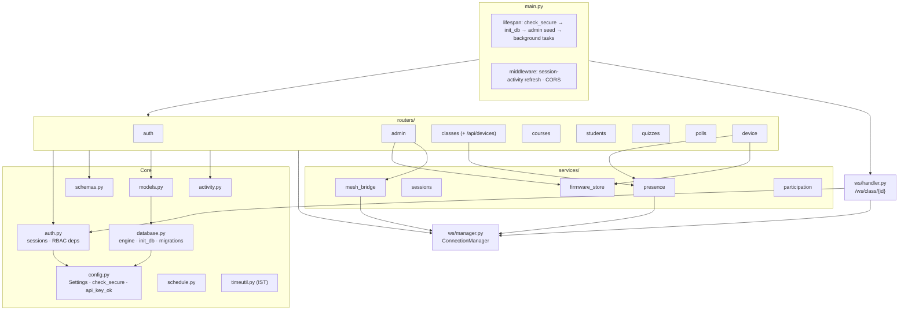
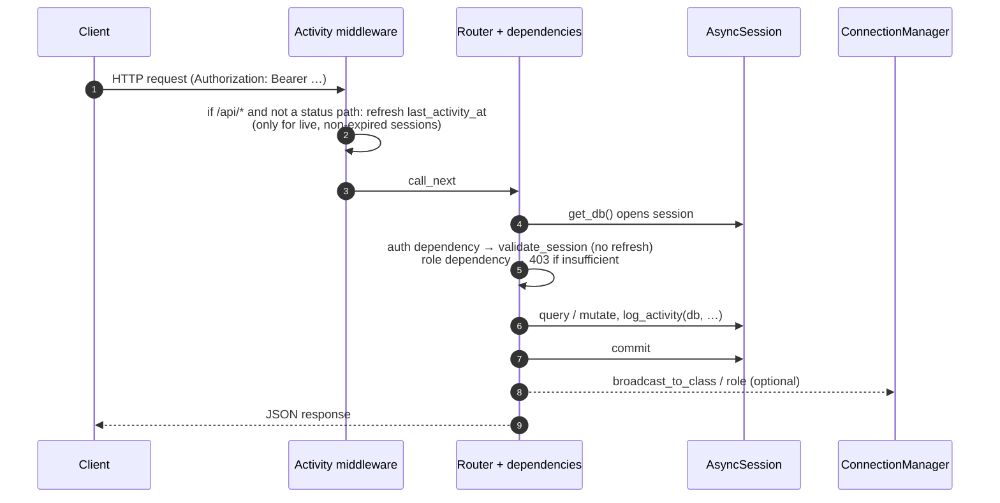
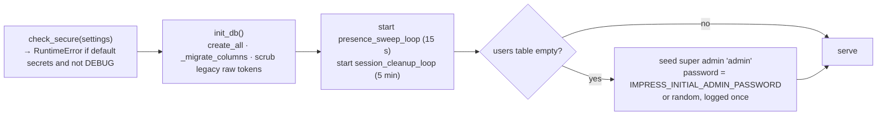

# Backend architecture

The backend is one FastAPI application (`backend/app/main.py`) running under uvicorn. It stores everything in SQLite through SQLAlchemy's async engine, serves the teacher SPA, and keeps one in-memory WebSocket room per class.

## Module map

| File | Responsibility |
|---|---|
| `main.py` | App construction, lifespan (secure-config check, table creation, column migrations, legacy-token scrub, first super-admin seed, background tasks), session-activity middleware, CORS, router registration, `/health`, SPA catch-all. |
| `config.py` | `Settings` (pydantic-settings, `IMPRESS_` prefix, `.env`); `check_secure()` refuses public default secrets outside DEBUG; `api_key_ok()` constant-time device-key comparison. |
| `database.py` | Async engine, `async_session` factory, `get_db` dependency, `_migrate_columns()` (additive ALTERs for SQLite), `_scrub_raw_session_tokens()`, `init_db()`. |
| `models.py` | SQLAlchemy ORM. See [data model](../reference/data-model.md). |
| `schemas.py` | Pydantic request/response models, including `Role` and enrollment-number validation. |
| `auth.py` | Password hashing (bcrypt), opaque session creation/validation (hash-only storage), `get_current_user[_light]`, `require_admin` / `require_super_admin` / `require_teacher_or_admin`. |
| `routers/*.py` | HTTP endpoints. See [REST API](../api/rest-api.md) and [device API](../api/device-api.md). |
| `ws/handler.py` | `/ws/class/{id}`: authenticates teacher (session token) or device (API key), registers the socket with its role, handles `ping`, `broadcast_command`, `device_data`, and refreshes device presence on any device message. |
| `ws/manager.py` | `ConnectionManager`: `class_id → {socket: role}`, `broadcast_to_class`, `broadcast_to_role`, dead-socket pruning. |
| `services/presence.py` | Online/offline transitions (logged once per transition), 15 s offline sweep, presence snapshot (gateway tree BFS), teacher push. The sweep also marks student modules silent for 90 s as *seen* (#40). |
| `services/student_modules.py` | Student module inventory (#40): upserts from batch join/leave/heartbeat, keyed on the firmware `device_id`; no history. |
| `services/health.py` | Device health states (#39): `UNKNOWN` / `OFFLINE` / `UPDATING` / `ERROR` / `DEGRADED` / `ONLINE` from the latest heartbeat diagnostics; rules in [device API](../api/device-api.md#health-states). |
| `services/sessions.py` | 5-minute cleanup of hard-expired, idle-expired and revoked sessions. |
| `services/firmware_store.py`, `firmware_image.py`, `firmware_signing.py` | The firmware registry: images are parsed and validated (#35), signatures verified (#66), and stored as `<sha256>.bin` (content-addressed, immutable). |
| `services/deployments.py` | The OTA deployment engine (#38): per-device state machine, stages, retries, timeouts; `deployments_loop` every 5 s. |
| `device_auth.py` | Device authentication (#66): the shared provisioning key and per-device keys. |
| `services/mesh_bridge.py` | Helpers that broadcast device commands (`device_command`, e.g. `ota_update`) and data to class rooms. |
| `services/participation.py` | Helpers for broadcasting a question and aggregating results (used by legacy paths). |
| `schedule.py` | Timetable clash detection, returned as *warnings*, never hard errors. |
| `timeutil.py` | IST helpers: naive-IST storage, epoch conversion independent of the host timezone. |
| `activity.py` | `log_activity()`: adds an `ActivityLog` row to the caller's session; the caller commits. |

## Request lifecycle

Points worth knowing:

1. **Session activity is refreshed exactly once per request, in middleware**, and never by the status endpoints (`/api/auth/session`, `/session-status`, `/activity` handles its own). Polling therefore can't keep an idle session alive.
2. **Auth dependencies don't refresh activity.** `get_current_user` and `get_current_user_light` validate only.
3. **Writes are explicit:** routers call `await db.commit()`. `log_activity` only adds to the session, so the log row commits atomically with the change it describes.
4. **Broadcasts happen after commit**, so a WebSocket listener that re-reads the API sees the new state.

## Startup (lifespan)

On shutdown both loops are cancelled and awaited.

## Background tasks

| Task | Interval | What it does |
|---|---|---|
| `presence_sweep_loop` | 15 s (`SWEEP_INTERVAL_S`) | Devices with `is_connected` and `last_seen` older than 30 s (`OFFLINE_AFTER_S`) are marked offline (`esp_device.offline` logged once), and a presence push is scheduled. |
| `session_cleanup_loop` | 300 s (`CLEANUP_INTERVAL_S`) | Deletes sessions that are hard-expired, idle-expired or revoked. |
| `_push_after_commit(device_id)` | on demand (fire-and-forget) | Opens its own DB session, resolves the device's class by walking `gateway_id` up to the class gateway, and pushes a presence snapshot to **teacher** sockets. Best-effort; never raises. |
| `_touch_device_on_message` | on each device WS message | Refreshes `last_seen`, battery and RSSI for the gateway that spoke, then schedules a presence push. |

## Real-time layer

`ConnectionManager` keeps `active_connections: {class_id: set[WebSocket]}` and `connection_roles: {class_id: {WebSocket: role}}`.

- `broadcast_to_class(class_id, data)` reaches teachers **and** devices. It is used for quiz/poll events, which both the C6 and the UIs consume.
- `broadcast_to_role(class_id, data, "teacher")` is used for presence snapshots.
- A socket whose send fails is pruned on the spot, and empty rooms are freed on disconnect.

Every frame carries `type` (read by the vanilla UI); device-relevant frames also carry `event` (read by the C6 and the React UI). The exact device contract is pinned by a fixture. See [WebSocket API](../api/websocket-api.md).

## Persistence and migrations

- **SQLite via aiosqlite**, file path from `IMPRESS_DATABASE_URL`, relative to the working directory.
- Versioned, transactional migrations (`migrations.py`, recorded in `schema_migrations`, a backup before the first pending step). See [database migrations](../engineering/DATABASE_MIGRATIONS.md). Foreign keys are enforced on every connection.
- All `DateTime` columns store **naive IST** (`timeutil.istnow()`). `ist_epoch_ms()` converts without depending on the host's timezone.

## Scaling and limits

| Aspect | Current behaviour | Implication |
|---|---|---|
| Processes | WebSocket rooms live in one process's memory. | Run **one** uvicorn worker. Multiple workers would split rooms; that needs a pub/sub layer (e.g. Redis) first. |
| Database | SQLite, one writer at a time. | Fine for a campus of classrooms posting batches every ~0.5 s. Move to PostgreSQL (and add Alembic) for heavier loads. |
| Batching | The C6 POSTs up to 20 messages or every 500 ms. | Backend write rate ≈ rooms × 2/s, not students × presses. |
| Fire-and-forget tasks | Presence pushes are `asyncio.create_task` without tracking. | Pending pushes are dropped on shutdown (harmless; the next heartbeat re-pushes). |

## Related

- [REST API](../api/rest-api.md) · [WebSocket API](../api/websocket-api.md) · [Device API](../api/device-api.md)
- [Security model](../design/security-model.md) · [Data model](../reference/data-model.md) · [Configuration](../guides/configuration.md)
