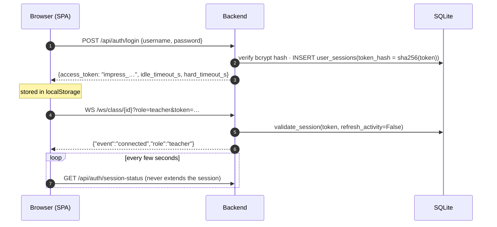
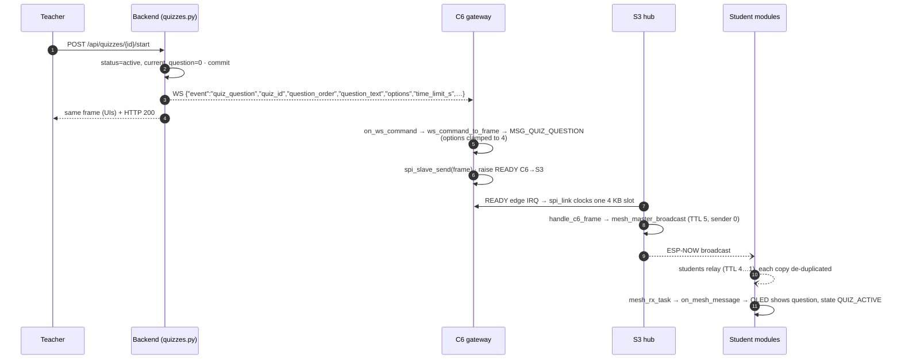
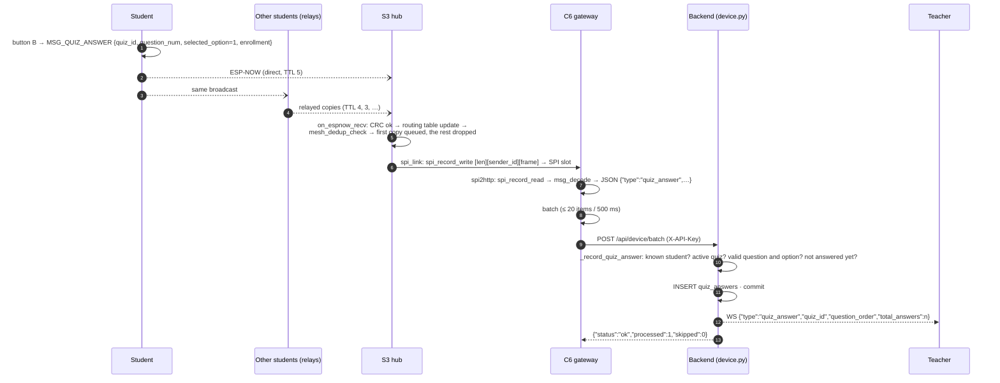
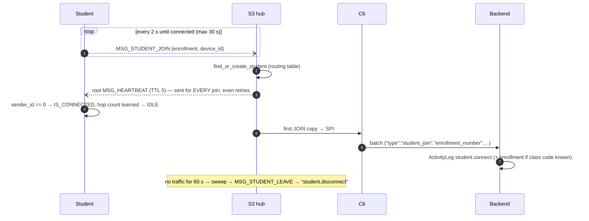
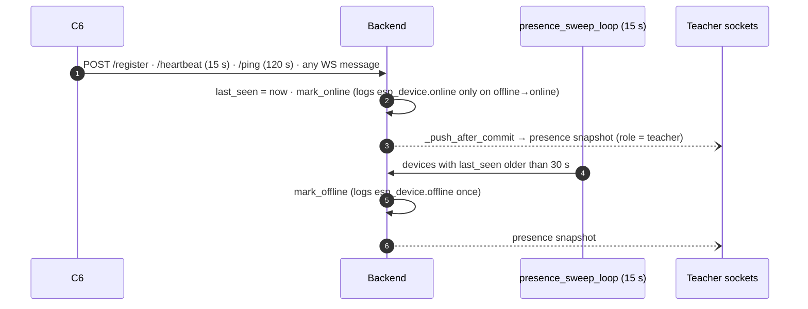
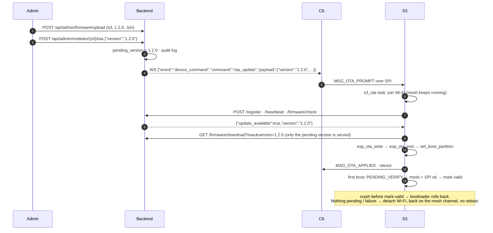

# Data flows

Each section follows one user-visible action through every hop. Function names are given so you can jump straight into the code.

## 1. Teacher signs in and opens the live dashboard

## 2. Teacher starts a quiz question → it appears on every module

`POST /next` repeats steps 1–9 with the next `question_order`. Stopping, or calling `next` past the last question, sends `quiz_end`, which students turn into `MSG_QUIZ_END` and go back to `IDLE`. Polls use the same path with `poll_start` / `poll_end`.

## 3. A student answers → the teacher's count goes up

Answers that fail a check are counted in `skipped` and never stored: unknown enrollment, inactive quiz, unknown question, option out of range, or a duplicate.

## 4. A student module joins the mesh

## 5. Device presence (online/offline)

The snapshot is the class gateway plus its relay tree (BFS over `gateway_id`), each device with `online = is_connected and last_seen ≤ 30 s`.

## 6. Firmware update of a hub (OTA)

## 7. Class assignment of a gateway

| Situation | Result |
|---|---|
| `register` with a `classroom_code` matching a class's `code` or `classroom_code` | that class's gateway := this device |
| `register` without a code, device already linked | keeps its class |
| `register` without a code, `device_type = c6`, not linked | first **active** class **without a gateway** |
| any other device type without a code (S3 OTA hop, student) | never links (issue #17) |
| WS `connected` / `connect_to_class` with a new class id | C6 saves it to NVS; the `app_main` loop restarts the WS on its own task (#5) |
