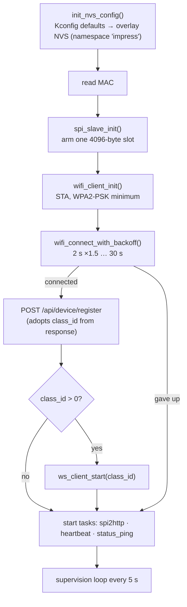
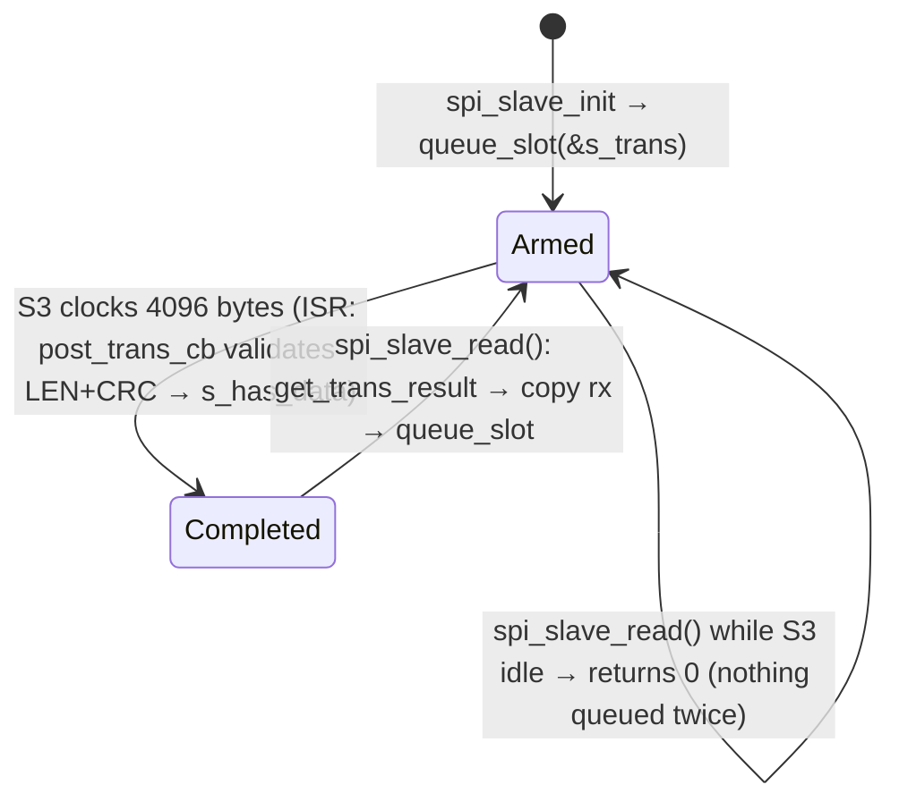
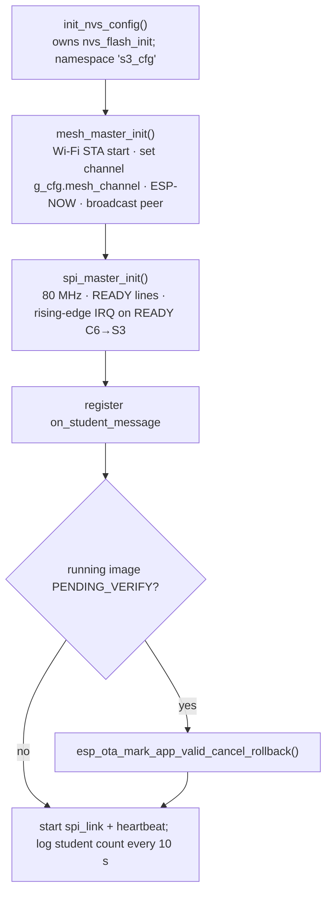
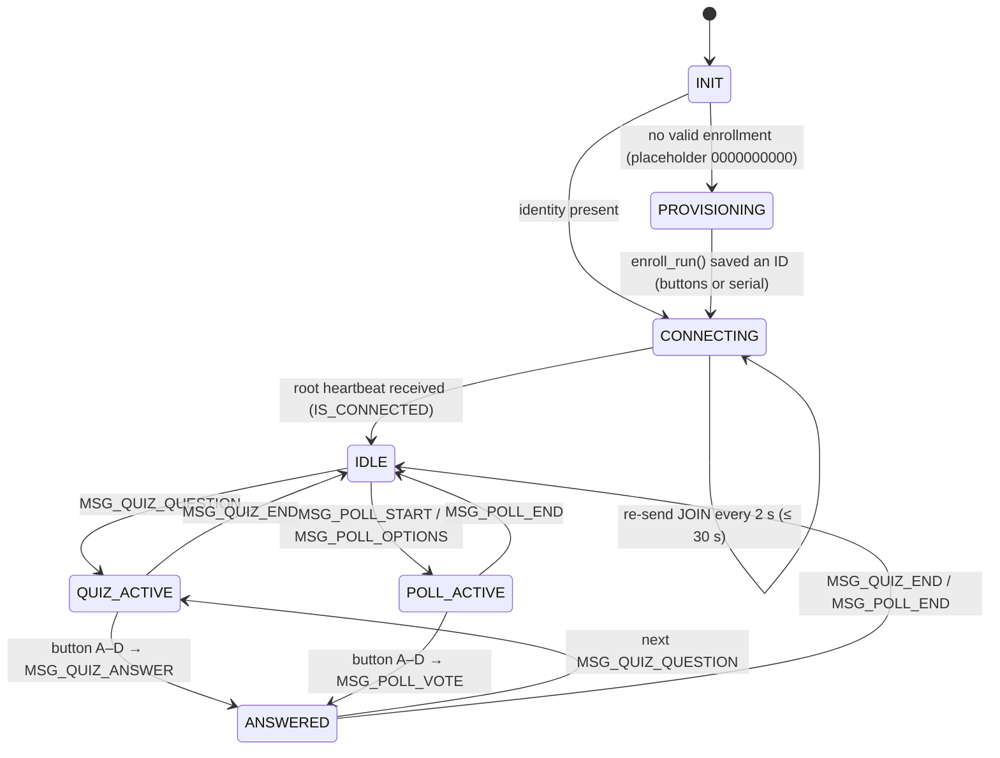

# Firmware architecture

All three projects are ESP-IDF **v6.1** applications in C on FreeRTOS. They share `firmware/protocol` (frame codec, SPI batch records, mesh de-dup) through `EXTRA_COMPONENT_DIRS`.

| Project | Target | Role | Key files |
|---|---|---|---|
| `class_c6` | ESP32-C6 (single-core RISC-V, 160 MHz) | Gateway: SPI slave + Wi-Fi/HTTP/WebSocket | `main.c`, `spi_slave.c`, `wifi_client.c`, `ws_client.c`, `ws_command.c`, `config.c` |
| `class_s3` | ESP32-S3 (dual-core Xtensa) | Hub: ESP-NOW mesh root + SPI master + OTA | `main.c`, `mesh_master.c`, `spi_master.c`, `ota.c`, `config.c` |
| `student` | ESP32 (classic) | Student module: buttons, optional OLED, mesh node | `main.c`, `mesh_espnow.c`, `input.c`, `display.c`, `enroll.c`, `config.c` |

---

## C6 gateway (`firmware/class_c6`)

### Boot sequence (`app_main`)

### Tasks

| Task | Stack | Prio | Period | Responsibility |
|---|---|---|---|---|
| `spi2http` | 12 KB | 5 | 50 ms | When Wi-Fi is up: `spi_slave_read()` (reap the completed slot, copy, re-arm) → `process_spi_payload()` (records → `msg_decode` → JSON) → batch. Appends the C6's own heartbeat item when flagged. Flushes the batch at 20 items or 500 ms idle → `POST /api/device/batch`. **Sole owner of the cJSON batch.** |
| `heartbeat` | 6 KB | 3 | `HEARTBEAT_INTERVAL_S` (15 s) | `POST /api/device/heartbeat` (RSSI, heap, flash, battery); sets `s_hb_item_pending` for `spi2http`. |
| `status_ping` | 6 KB | 2 | `STATUS_PING_INTERVAL_S` (120 s) | `POST /api/device/ping` with class id, student count, uptime. |
| websocket client | component | component | event-driven | `ws_event_handler` → `on_ws_command()`: quiz/poll start/end → `ws_command_to_frame()` → `spi_slave_send()`; `device_command` (incl. `ota_update` → `MSG_OTA_PROMPT`); class assignment only **sets a flag**. |
| `app_main` loop | main | 1 | 5 s | Wi-Fi reconnect (2 s → 60 s backoff, re-register on reconnect); deferred WS restart on class reassignment; WS reconnect (5 s → 120 s backoff). |

### SPI slave model

- Exactly **one** transaction is in flight. The descriptor `s_trans` is `static`, because the IDF driver keeps the pointer and writes `trans_len` back from the ISR (issue #1).
- `spi_slave_send()` writes the C6's outgoing frame into `s_slot_tx` and raises **READY C6→S3**. The ISR clears the slot and drops the line once that exact post has been clocked out (generation counter).

### Memory notes
- Two static 4 KB DMA slots (`s_slot_rx`, `s_slot_tx`).
- `spi2http` keeps a 4 KB read buffer on its stack, and `http_send_batch` a 4 KB body buffer, hence its 12 KB stack. The boot log prints its real high-water mark (`spi2http HWM`).

---

## S3 hub (`firmware/class_s3`)

### Boot sequence

### Tasks and contexts

| Task / context | Stack | Prio | Trigger | Responsibility |
|---|---|---|---|---|
| ESP-NOW recv callback | Wi-Fi task | – | each packet | Decode + CRC; refresh the routing table (enrollment, last seen, hops, RSSI); **de-duplicate** relay copies (`mesh_dedup_check`, 10 s); queue `[sender_id][frame]` (64-entry ring) for SPI; on `STUDENT_JOIN`, reply with a root heartbeat (TTL 5). |
| `spi_link` | 4 KB | 5 | link semaphore or `SPI_POLL_INTERVAL_MS` (50 ms) | Flush the mesh queue into one slot payload of `spi_record`s → `spi_master_send()`; exactly one full-duplex exchange if the S3 has TX pending **or** READY C6→S3 is high; dispatch the C6 frame: quiz/poll → `mesh_master_broadcast`, `MSG_OTA_PROMPT` → `ota_start`. |
| `heartbeat` | 2 KB | 3 | `HEARTBEAT_INTERVAL_MS` (5 s) | `mesh_master_sweep_timeouts(STUDENT_TIMEOUT_MS = 60 s)`, which emits `STUDENT_LEAVE` per timed-out student; then sends an S3 heartbeat record to the C6. |
| `s3_ota` | 8 KB | 5 | `MSG_OTA_PROMPT` | Temporary Wi-Fi hop: register → heartbeat → `/firmware/check` → download into the inactive slot → reboot. If there's nothing to do or it fails: **detach** (unregister handlers, disconnect, restore the mesh channel), no reboot. See [OTA guide](../guides/ota-updates.md). |

### Data structures
- `s_students[300]`: routing table (`enrollment`, `device_id`, `mac`, `hops`, `rssi`, `last_seen_ms`, `is_active`), mutex-protected.
- `s_msg_queue[64]`: ring of `[sender_id:4][frame]` entries for the C6, mutex-protected.
- `s_seen`: `mesh_dedup_t` (64 ids, 10 s window), touched only from the Wi-Fi task.

---

## Student module (`firmware/student`)

### State machine (`main.c`)

- Holding **CONFIRM + C for 2 s at boot** clears the stored identity and re-enters provisioning.
- While `PROVISIONING`, mesh traffic is received but ignored. An unprovisioned module never joins or answers.

### Tasks and contexts

| Task / context | Stack | Prio | Responsibility |
|---|---|---|---|
| ESP-NOW recv callback | Wi-Fi task | – | **Only** bounds-checks and copies the packet into a 16-deep queue (non-blocking). |
| `mesh_rx` | 4 KB | 4 | De-dup by `mesh_msg_id`; root traffic (`sender_id == 0`) → learn connection/hops and deliver to `on_mesh_message` (display); relay if TTL > 1 after a 10–60 ms random delay. |
| `input_task` | 2 KB | 5 | GPIO ISR queue → 50 ms debounce → `on_button_press`. |
| `heartbeat` | 2 KB | 3 | `MSG_HEARTBEAT` every 30 s once connected. |
| `enroll_serial` | 3 KB | 2 | Only during provisioning: read a 10-character ID from the USB console. |

### Identity store (`config.c`)
NVS namespace `impress`: `enroll`, `s_name`, `s_program`, `s_email`, `init_done`.

| Rule | Detail |
|---|---|
| Format | exactly 10 `[A-Za-z0-9]` characters, the same rule as the backend |
| Unprovisioned | `0000000000` |
| Set-once | `student_set_enrollment()` refuses a different valid ID while one is set |
| Clear | `student_clear_enrollment()` is the only way to re-provision |

These rules are covered by `firmware/student/test_host/test_student_config.c`.

---

## Cross-cutting rules

| Rule | Why | Enforced by |
|---|---|---|
| Never do blocking work in the ESP-NOW receive callback (it runs in the Wi-Fi task). | Blocking starves the radio stack. | student `mesh_espnow.c` queue design |
| Anything handed to a driver by pointer must outlive the operation. | The SPI slave ISR used a dead stack frame (#1). | `test_spi_slave.c` (ASan use-after-return) |
| A cJSON tree has one owner task. | cJSON isn't thread-safe (#4). | `firmware/tests/test_c6_batch_ownership.py` |
| Never stop/destroy the WS client from its own handler. | Use-after-free (#5). | `firmware/tests/test_c6_ws_no_self_destroy.py` |
| `ESP_ERROR_CHECK` only for errors that must reset the chip. | `ESP_ERROR_CHECK(esp_wifi_set_channel)` boot-looped the student 536 times. | `firmware/tests/test_s3_config_before_mesh.py` |
| Every wire format is encoded and decoded by **one** shared function. | The S3/C6 framing drifted (#2). | `firmware/protocol/test_host` |
