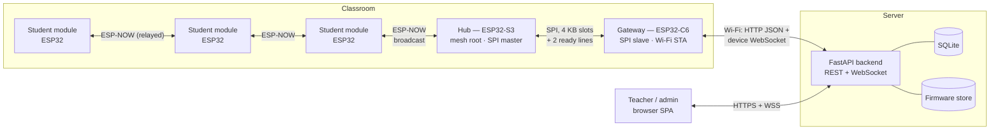
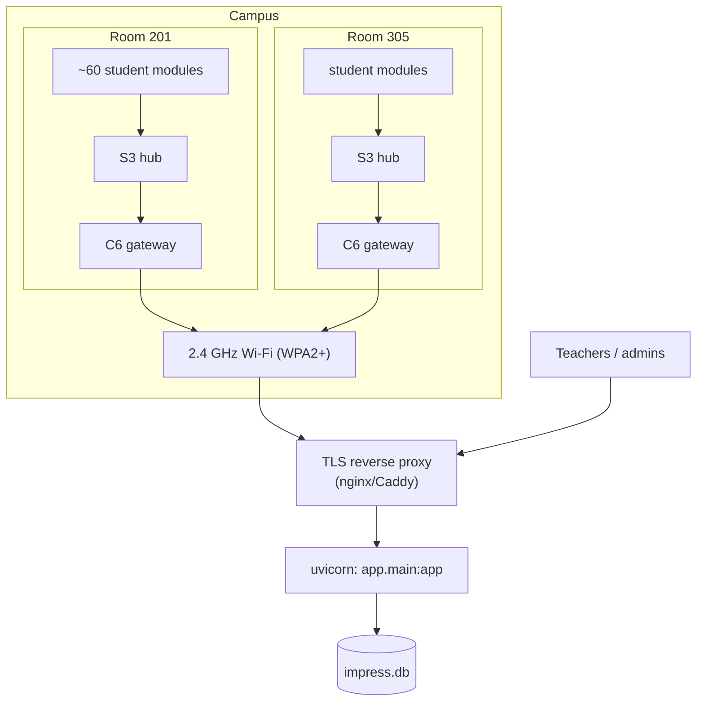

# System overview

imPress is a classroom response system. Every student holds a small ESP32 module with four answer buttons (A–D) and a confirm button. When a teacher starts a quiz question or a poll in the browser, it appears on every module. A button press travels back as an answer or vote and is counted live on the teacher's dashboard.

The interesting part is the path in between: classrooms rarely have Wi-Fi that can take 60+ cheap devices, so student modules never touch Wi-Fi at all. They form a radio **mesh** using ESP-NOW, which needs no access point. Only two devices per room need the network.

## Components

| Component | Code | Runs on | Job |
|---|---|---|---|
| Student module | `firmware/student` | ESP32 | Shows questions (optional OLED), reads buttons, sends answers/votes, joins the mesh, **relays** packets for students further away. Identity = enrollment number in NVS. |
| Hub / mesh root | `firmware/class_s3` | ESP32-S3 | Root of the ESP-NOW mesh (sender id 0). Keeps a routing table of students, de-duplicates relayed copies, batches student messages into SPI slots for the gateway, broadcasts commands from the gateway to the mesh, sweeps timed-out students, performs OTA by briefly joining Wi-Fi. |
| Gateway | `firmware/class_c6` | ESP32-C6 | SPI slave to the hub. Converts student frames to JSON and POSTs them to the backend in batches; holds a WebSocket to the backend and turns its commands into mesh frames; sends heartbeats and 2-minute status pings. |
| Shared protocol | `firmware/protocol` | all three boards | Frame codec, SPI batch records, mesh de-duplication: one implementation used by every board. |
| Backend | `backend/app` | Python 3.12+ | REST API, per-class WebSocket rooms, auth/sessions/RBAC, SQLite persistence, presence tracking, firmware store for OTA, and the admin/teacher single-page app. |
| Teacher UI | `backend/app/static`, `templates` | browser | The production SPA served by the backend at `/`. |
| React UI | `frontend/` | browser | A development dashboard (Vite). Optional. |

## Why the system is split this way

| Constraint | Consequence in the design |
|---|---|
| Dozens of student devices; school Wi-Fi is unreliable and often limits clients. | Students use **ESP-NOW** (connectionless 802.11 vendor frames, no AP, no association). |
| ESP-NOW has limited range and no routing. | Students **relay** each other's packets (TTL 5), forming a flooding mesh. See [mesh design](../design/mesh.md). |
| ESP-NOW and an AP connection fight over the radio channel: the radio must sit on the AP's channel to stay associated. | The **root** (S3) stays on the mesh channel full time; a **separate radio** (C6) does Wi-Fi. They talk over **SPI**. |
| The hub must forward bursts (everyone answers within seconds). | Standard SPI (10 MHz default) with a fixed **4096-byte slot** carries up to 136 answer records per exchange, about 2,700 answers/s at the 50 ms poll. |
| The backend must know a single place per room. | The C6 registers as the class **gateway**; the backend links one gateway per class. |
| Firmware in the field must be updatable. | The S3 has dual OTA slots and **app rollback**; the backend hosts images and prompts updates through the gateway. |

## Deployment topology

- One **S3 + C6 pair per room**; any number of student modules.
- Each gateway is linked to exactly one class session, either via its `classroom_code` or by auto-link to a free active class ([device API](../api/device-api.md#register)).
- The backend is a single process (SQLite, in-memory WebSocket rooms). See [scaling notes](backend.md#scaling-and-limits).

## Identities

| Thing | Identity | Where it comes from |
|---|---|---|
| Student | enrollment number (10 alphanumerics) | provisioned on the module (buttons/serial/NVS) and registered in the backend as `students.roll_number` |
| Student module (routing only) | 32-bit `device_id` from the MAC | `student/main/main.c`; never used as a student identity |
| Gateway / hub | MAC address | `esp_devices.mac_address`; device type `c6` / `s3` |
| User | username + opaque session token | `users`, `user_sessions` |
| Class | numeric id; short join `code`; optional physical `classroom_code` | `class_sessions` |

## Where to go next

- How a question and an answer actually travel: [data flows](data-flows.md)
- What's inside each board: [firmware architecture](firmware.md)
- What's inside the server: [backend architecture](backend.md)
