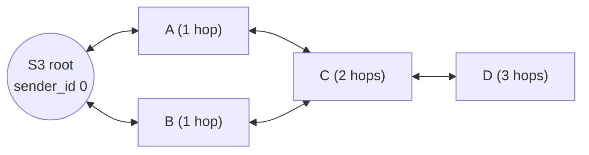
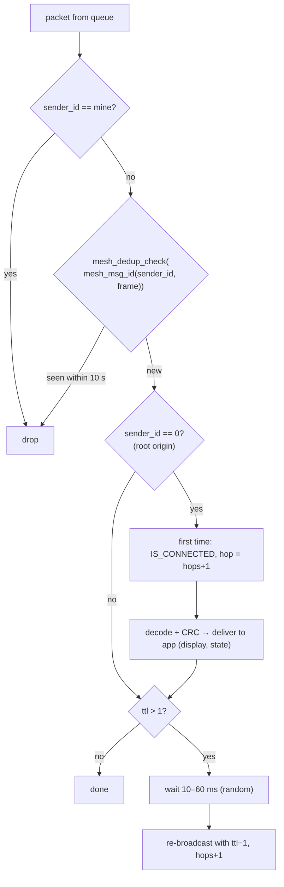

# Mesh design (ESP-NOW)

The classroom mesh connects every student module to the S3 root without any access point. It is a **flooding mesh with TTL and de-duplication**: there are no routing tables on students, every node relays everything once, and the root sits at a known logical address (sender id 0).

## Why flooding

| Option | Why not |
|---|---|
| Star (everyone talks to the root directly) | Range: modules at the back of a hall can't reach the hub. |
| ESP-WIFI-MESH (tree with parent selection) | Needs Wi-Fi association per node, heavier stack, slower join; overkill for ≤ 300 tiny messages per question. |
| Routing tables on students | State that must stay correct while students move or switch off. |
| **Controlled flooding** | Stateless on students, robust to churn, bounded by TTL; cost is redundant transmissions, which de-duplication caps. |

## Topology and roles

- **Downstream** (root → everyone): commands (quiz/poll start and end) and join replies (heartbeats). Every student delivers frames whose **origin** `sender_id == 0`, whether received directly or via relays.
- **Upstream** (student → root): joins, answers, votes, heartbeats. Students forward them; the root consumes them.
- Every node broadcasts to `FF:FF:FF:FF:FF:FF` with an explicitly registered broadcast peer (`esp_now_send(NULL, …)` misreports on this IDF).

## Relay algorithm (student, `mesh_rx_task`)

- **De-dup before anything else:** every relay copy of a message is the same `(origin sender_id, frame)`, so a node handles and relays each message **once**, no matter how many neighbours echo it.
- The **random 10–60 ms delay** desynchronises neighbours to reduce collisions. It runs in `mesh_rx_task`, never in the Wi-Fi task.
- The receive callback (Wi-Fi task) only copies into a 16-deep queue with a non-blocking send; when the queue is full, packets are dropped rather than stalling the radio.

## Root behaviour (S3, `on_espnow_recv`)

1. Decode + CRC. Invalid frames still refresh the routing table (the node is alive) but are never forwarded.
2. Update the routing table: match by enrollment, else `sender_id`, else add (≤ 300 students). Store last seen, hops and RSSI.
3. `mesh_dedup_check`: only the **first** copy is queued for the C6.
4. `STUDENT_JOIN` → reply with a root heartbeat (TTL 5) **every time**, including retries, because a student only retries when it missed the reply.
5. `heartbeat_task` sweeps students silent for `STUDENT_TIMEOUT_MS` (60 s) → `STUDENT_LEAVE` to the C6.

## Cost model

For one press in a room where all N students hear each other (measured by `firmware/protocol/test_host/test_mesh_dedup.c`):

| Students | Legacy rule (hash included TTL/hops) | Current rule |
|---|---|---|
| 3 | 9 transmissions, 9 copies to the C6 | 3 transmissions, **1** copy |
| 12 | 45 / 45 | 12 / **1** |
| 21 | 81 / 81 | 21 / **1** |
| 30 | 117 / 117 | 30 / **1** |

The current cost is **N transmissions per message** (the origin plus one relay per other node), and exactly one delivery upstream. A full class answering one question costs N² airtime frames in the worst case (all in range). At 30 students that's ~900 short frames spread over the answer window, comfortably within ESP-NOW capacity at 1 Mbps.

## De-dup cache (`mesh_dedup_t`)

| Property | Value | Reasoning |
|---|---|---|
| Key | FNV-1a(origin sender_id ‖ frame) | identical across relay copies; different per student, question and option |
| Slots | 64 (ring, oldest evicted) | ≥ the number of distinct messages in flight in a burst |
| Window | 10 s | relay copies arrive within ms; a deliberate identical retry after 10 s counts as new |
| Clock | `xTaskGetTickCount() × portTICK_PERIOD_MS` (wrap-safe unsigned subtraction) | tested across the 2³² wrap |

The backend de-duplicates again by `(quiz, question, student)` / `(poll, student)`, so even a copy that slips through (cache eviction under extreme load) is never counted twice.

## Channel rules

- All nodes must be on the same 2.4 GHz channel: `MESH_WIFI_CHANNEL` (student `config.h`) = `CONFIG_MESH_WIFI_CHANNEL` (S3 Kconfig), default **1**.
- The S3 loads its config **before** the mesh starts (#7) and logs `Mesh master initialized, channel=N`. `esp_wifi_set_channel` errors are logged, not fatal.
- During an OTA hop, the S3 associates with the AP, which moves the radio to the AP's channel. Afterwards it **restores the mesh channel** (#13).

## Timing summary

| Constant | Value | Where |
|---|---|---|
| TTL | 5 | `MESH_RELAY_TTL` (student `config.h`, S3 `config.h`) |
| Relay jitter | 10–60 ms | `mesh_espnow.c` |
| JOIN retry | every 2 s, give up after 30 s | student `main.c` |
| Student heartbeat | 30 s | `HEARTBEAT_INTERVAL_MS` |
| Root sweep / timeout | 5 s / 60 s | `CONFIG_HEARTBEAT_INTERVAL_MS` / `CONFIG_STUDENT_TIMEOUT_MS` |
| De-dup window | 10 s | `MESH_DEDUP_WINDOW_MS` |
