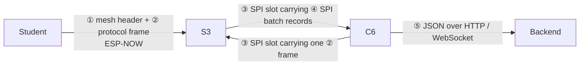

# Wire protocols

imPress has five layers on the wire. Every byte format below is **implemented once** in `firmware/protocol/protocol.{h,c}` (or `ws_command.c` for JSON → frame) and covered by host tests, so the two ends can't drift apart.



All multi-byte **payload struct fields are little-endian** (the packed C structs as the ESP32 lays them out). Header **length** and **CRC** fields are **big-endian**, as noted per field.

---

## ② Protocol frame (every hop)

```
 0      1      2      3      4 … 4+N-1        4+N    5+N
┌──────┬──────┬──────┬──────┬───────────────┬──────┬──────┐
│ 0xAA │ TYPE │ LEN (BE, 2) │ PAYLOAD (N)   │ CRC16 (BE,2) │
└──────┴──────┴──────┴──────┴───────────────┴──────┴──────┘
```

| Field | Size | Notes |
|---|---|---|
| start | 1 | always `0xAA` (`MSG_START_BYTE`) |
| type | 1 | `msg_type_t`, below |
| length | 2, BE | payload bytes, `N ≤ 240` (`MSG_MAX_PAYLOAD`) |
| payload | N | a packed struct (LE fields) |
| crc | 2, BE | CRC-16/CCITT-FALSE: poly `0x1021`, init `0xFFFF`, no reflection, no xorout, computed over **TYPE + LEN + PAYLOAD** |

The maximum frame is **246 bytes** (`MSG_MAX_SIZE`). On the mesh a frame travels behind the 6-byte mesh header. The largest frame actually sent over ESP-NOW is `QUIZ_QUESTION` (214 + 6 = 220 bytes), well inside ESP-NOW v1's 250-byte limit. A frame with a full 240-byte payload would need 252 bytes, which only fits ESP-NOW v2. Keep mesh payloads ≤ 238 bytes (see [known issues](../reference/known-issues.md)).

**API:**
- `msg_encode(type, payload, len, out, size)` returns the bytes written, or `-1` (payload > 240 or buffer too small).
- `msg_decode(buf, len, &msg)` returns the bytes consumed, `0` (incomplete) or `-1` (bad start byte or length > 240). The CRC is checked separately with `msg_verify_crc(&msg)`.

**Worked example** (from the real encoder):
```
MSG_ACK, empty payload:  AA 30 00 00 09 39
MSG_POLL_VOTE {poll_id=3, option=1, "ABCDE12345", device_id=0xD53FC8B1}:
AA 22 00 12 | 03 00 | 01 | 41 42 43 44 45 31 32 33 34 35 00 | B1 C8 3F D5 | 68 9D
 hdr  len=18  poll_id  opt   enrollment (11, NUL-terminated)     device_id LE   CRC
```

### Message types and payloads

| Code | Name | Direction | Payload struct (packed) | Size |
|---|---|---|---|---|
| `0x01` | `HEARTBEAT` | student → root, root → students, S3 → C6 | `device_id u32 · battery_pct u8 · rssi i8 · uptime_s u32` | 10 |
| `0x02` | `STUDENT_JOIN` | student → root | `enrollment char[11] · device_id u32 · student_id u16 · name char[32]` | 49 |
| `0x03` | `STUDENT_LEAVE` | S3 → C6 (sweep) | `enrollment char[11] · device_id u32 · reason u8` (0 timeout, 1 leave, 2 shutdown) | 16 |
| `0x04` | `ATTENDANCE` | – | 11-byte enrollment string | 11 |
| `0x10` | `QUIZ_START` | reserved | – | – |
| `0x11` | `QUIZ_QUESTION` | backend → students | `quiz_id u16 · question_num u8 · num_options u8 · time_limit_s u32 · question_text char[140] · options char[4][15]` | 208 |
| `0x12` | `QUIZ_ANSWER` | student → backend | `quiz_id u16 · question_num u8 · selected_option u8 · response_time_ms u32 · enrollment char[11] · device_id u32` | 23 |
| `0x13` | `QUIZ_END` | backend → students | `payload_session_end_t { id u16 }` | 2 |
| `0x20` | `POLL_START` | backend → students | `poll_id u16 · num_options u8 · title char[64]` | 67 |
| `0x21` | `POLL_OPTIONS` | legacy alias (handled like `POLL_START`) | same | – |
| `0x22` | `POLL_VOTE` | student → backend | `poll_id u16 · selected_option u8 · enrollment char[11] · device_id u32` | 18 |
| `0x23` | `POLL_END` | backend → students | `payload_session_end_t { id u16 }` | 2 |
| `0x30` / `0x31` | `ACK` / `NACK` | diagnostics | – | 0 |
| `0x40`–`0x42` | `SPI_AGGREGATE` / `SPI_COMMAND` / `SPI_STATUS` | C6 ↔ S3 internal | `SPI_COMMAND` carries a JSON string; `SPI_STATUS` byte 0 = status | ≤ 240 |
| `0x50` | `OTA_PROMPT` | C6 → S3 | `version char[32] · token char[64]` | 96 |
| `0x51` | `OTA_APPLIED` | S3 → C6 | same struct (version filled) | 96 |

Strings are NUL-terminated and zero-padded. Writers always use `strncpy(dst, src, sizeof dst - 1)` into a zeroed struct.

---

## ① Mesh header (ESP-NOW, before the frame)

```
┌──────┬────────────────────┬──────┬─────────── protocol frame ───────────┐
│ TTL  │ SENDER_ID (u32 LE) │ HOPS │ AA TYPE LEN … CRC                      │
└──────┴────────────────────┴──────┴────────────────────────────────────────┘
```

| Field | Meaning |
|---|---|
| `ttl` | 5 at origin (`MESH_RELAY_TTL`), decremented per relay; relayed only while > 1 |
| `sender_id` | **origin**: `0` = the S3 root; students use a MAC-derived id (routing/diagnostics only) |
| `hops` | 0 at origin, +1 per relay |

Duplicates are identified by `mesh_msg_id(sender_id, frame)`, an FNV-1a hash over the origin id and the frame, **never** the header. See [mesh design](mesh.md).

---

## ③ SPI slot (S3 ↔ C6, both directions)

One full-duplex transfer of exactly **4096 bytes** (`SPI_SLOT_BYTES`):

```
┌─────────────┬───────────────────────┬────────────────┬──────────────────┐
│ LEN (BE, 2) │ PAYLOAD (LEN ≤ 4092)  │ CRC16 (BE, 2)  │ zero padding      │
└─────────────┴───────────────────────┴────────────────┴──────────────────┘
```

- **CRC-16/XMODEM-style** (poly `0x1021`, init `0xFFFF`) over the **payload only**.
- `LEN = 0` (an all-zero slot) means "nothing to send".
- **S3 → C6 payload** = a sequence of SPI batch records (④).
- **C6 → S3 payload** = exactly one protocol frame (②).

**Handshake lines** (active high, idle low):
- **READY S3→C6**: the S3 has a slot queued. Informational for the C6.
- **READY C6→S3**: the C6 has a frame queued. A rising edge interrupts the S3, which clocks one exchange. The C6 drops it after that exact post is clocked out.

The S3 also clocks whenever it has its own data to send, and polls every `SPI_POLL_INTERVAL_MS` (50 ms).

---

## ④ SPI batch record (inside an S3 → C6 slot)

```
┌──────────────────┬────────────────────┬──────────── FRAME ────────────┐
│ FRAME_LEN (BE,2) │ SENDER_ID (u32 LE) │ protocol frame (FRAME_LEN)    │
└──────────────────┴────────────────────┴───────────────────────────────┘
```

- `FRAME_LEN` counts the **frame only**, not the 4-byte sender id. Getting this wrong dropped every single-message batch (#2).
- Produced only by `spi_record_write()` and parsed only by `spi_record_read()`, which returns `0` for any truncated record and never over-reads.
- A 4092-byte payload holds **136** poll-vote records (30 bytes each: 6 header + 24 frame).

**Worked example:** the vote frame above from student `0xD53FC8B1`:
```
00 18 | B1 C8 3F D5 | AA 22 00 12 03 00 01 41 42 43 44 45 31 32 33 34 35 00 B1 C8 3F D5 68 9D
len=24  sender (LE)   frame
```

---

## ⑤ JSON (C6 ↔ backend)

| Direction | Transport | Contract |
|---|---|---|
| C6 → backend | `POST /api/device/batch` (and `/register`, `/heartbeat`, `/ping`, …) | [Device API](../api/device-api.md) |
| backend → C6 | WebSocket frames with `event` | [WebSocket API](../api/websocket-api.md); pinned by `firmware/contract/device_ws_frames.json` |

### C6 frame → JSON mapping (`process_spi_payload` → `msg_to_json`)

| Frame | JSON `type` | Fields |
|---|---|---|
| `HEARTBEAT` | `heartbeat` | `device_mac` (gateway), `device_id`, `battery_pct`, `rssi` |
| `STUDENT_JOIN` | `student_join` | `enrollment_number`, `device_mac`, `class_code` (""), `device_id` |
| `STUDENT_LEAVE` | `student_leave` | `enrollment_number`, `device_mac`, `device_id`, `reason` |
| `QUIZ_ANSWER` | `quiz_answer` | `quiz_id`, `question_order`, `enrollment_number`, `selected_option`, `response_time_ms`, `device_id` |
| `POLL_VOTE` | `poll_vote` | `poll_id`, `enrollment_number`, `selected_option`, `device_id` |
| `ATTENDANCE` | `attendance` | `enrollment_number` |
| `SPI_STATUS` | `device_status` | `device_id`, `status` |

### Backend event → frame mapping (`ws_command_to_frame`)

| `event` | Frame | Rules |
|---|---|---|
| `quiz_question` | `QUIZ_QUESTION` | requires `quiz_id`, `question_text`, `options[]`; `question_order` (or legacy `question_num`); `time_limit_s` (or legacy `time_limit`); max 4 options; text truncated to 139, options to 14 characters |
| `poll_start` | `POLL_START` | requires `poll_id`, `options[]`; `title` optional (63 characters) |
| `quiz_end` / `poll_end` | `QUIZ_END` / `POLL_END` | requires `quiz_id` / `poll_id` |
| other | – | returns 0; `on_ws_command` handles `device_command`, `connected`, `connect_to_class` |
