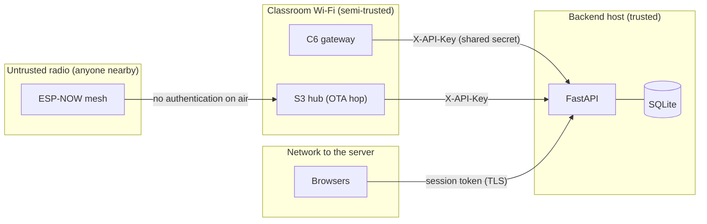

# Security model

## Assets

| Asset | Why it matters |
|---|---|
| Student PII (names, emails, phones, enrollment numbers) | privacy, regulatory exposure |
| Quiz and poll results, attendance | academic integrity |
| Admin and teacher accounts | full control of classes, users and firmware |
| Device API key | lets its holder impersonate every gateway (submit data, download firmware) |
| Firmware images | code execution on classroom hardware |

## Trust boundaries

## Authentication and authorization

| Principal | Mechanism | Details |
|---|---|---|
| Users | Opaque server-side **sessions** | `POST /api/auth/login` issues `impress_<urlsafe 64>`. Only `sha256(token)` is stored (`user_sessions.token_hash`; the legacy `session_token` column also holds the hash, #12). Validation checks revoked → hard expiry (6 h) → idle expiry (60 min) → user active. Logout revokes. |
| Roles | `teacher` < `admin` < `super_admin`, closed `Literal` set | Only a super admin can grant or remove admin-level roles; nobody changes their own role (#10). Teachers only see and operate their classes (class routes also allow secondary faculty). |
| Gateways and hubs | Shared `X-API-Key` | Constant-time comparison (`secrets.compare_digest`). WebSocket: `X-API-Key` header (the legacy `?api_key=` still accepted) (#11). |
| Teacher WebSocket | `?token=` = the login session token | Same validator as REST, no activity refresh (#8). Requires `wss://` in deployment, because browsers can't set WS headers. |
| Students | **None on air** | ESP-NOW frames are unauthenticated; identity is the enrollment number inside the payload. |

## Threats and mitigations

| # | Threat | Mitigation | Status |
|---|---|---|---|
| T1 | Default credentials (`admin`/`admin123`, published secrets) | Random first-run admin password; startup **refuses** default `JWT_SECRET` / `DEVICE_API_KEY` unless `DEBUG` (#11) | ✅ |
| T2 | Session theft from a DB copy / backup / git history | Hash-only token storage; legacy raw rows revoked at startup (#12) | ✅ (history purge pending, see the [deployment guide](../guides/deployment.md)) |
| T3 | Privilege escalation admin → super_admin | Closed role set + grant rules (#10) | ✅ |
| T4 | Ballot stuffing via anonymous endpoints | `/vote`, `/answer` require the device key and a registered device; option range checked (#9) | ✅ |
| T5 | Duplicate or forged answers via the gateway path | Backend validates active quiz/poll, question, option, known student; one row per student (#6) | ✅ |
| T6 | Cross-origin requests from malicious sites | CORS restricted to `CORS_ORIGINS` (#11); bearer tokens are not cookies, so CSRF doesn't apply | ✅ |
| T7 | Secrets in logs | SQL echo off by default; the C6 no longer logs the API key (#11) | ✅ |
| T8 | Malicious firmware via OTA | Download only of the version an admin pushed to that device (#13); app **rollback** on boot failure (#13) | ⚠️ partial: images are not **signed** and are fetched over HTTP; see residual risks |
| T9 | Radio spoofing: a rogue device sends answers with someone else's enrollment number | Answers count only for enrolled students and only once each. **No cryptographic protection on air.** | ⚠️ accepted risk |
| T10 | Radio flooding / jamming | De-dup and bounded queues keep nodes alive; jamming can't be prevented in 2.4 GHz | ⚠️ accepted risk |
| T11 | Path traversal via firmware version/type | Strict semver regex + a fixed device-type set (`firmware_store.py`), tested | ✅ |
| T12 | Teacher takes over another teacher's class with its join code | `POST /api/classes/join` reassigns the primary teacher | ❌ open ([known issues](../reference/known-issues.md)) |

## Residual risks and recommended hardening

1. **Sign OTA images.** Enable `CONFIG_SECURE_SIGNED_APPS_NO_SECURE_BOOT` (or Secure Boot v2) with an offline key. See the [OTA guide](../guides/ota-updates.md#signing-images).
2. **TLS everywhere:** a reverse proxy for the backend, plus `cert_pem` in the firmware HTTP clients.
3. **Per-device API keys** (rotation, revocation) instead of one shared key.
4. **Message authentication on the mesh** (e.g. a per-class key and HMAC over the frame) if answer spoofing becomes a concern. ESP-NOW also supports encrypted unicast peers, but not encrypted broadcast.
5. **Purge git history** of the databases committed before v2 and rotate the affected passwords.

## Data handling

- Runtime data (`*.db`, `firmware_bins/`, `.env`, logs) is git-ignored. CI fails if a database is tracked (`test_session_token_storage.py::test_no_databases_tracked_in_git`).
- Activity logs record actor, action, entity and small detail dicts. They don't contain passwords or tokens.
- The student firmware caches name/program/email in NVS but only ever **transmits** the enrollment number.
