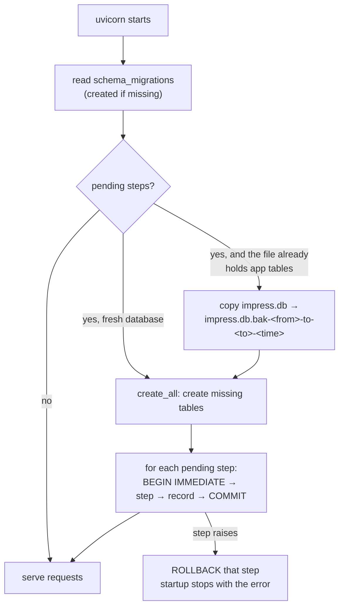

# Database migrations

Source: `backend/app/migrations.py`, called from `database.init_db()` on every start. Tests: `backend/tests/test_migrations.py`, `backend/tests/test_db_integrity.py`.

## What happens at startup



- **Fresh install:** `create_all` builds the whole schema, including the unique indexes declared on the models, and every step is a no-op. All versions are recorded and no backup is made.
- **Existing database** (any v2 or older file without `schema_migrations`): a backup is taken first, then each step runs and is recorded.
- **Every step is atomic.** Python's `sqlite3` only opens a transaction before DML, so `ALTER TABLE` and `CREATE INDEX` would otherwise autocommit. The runner issues `BEGIN IMMEDIATE` itself, so a step and its `schema_migrations` row commit together or not at all. `IMMEDIATE` also keeps a second process out while it runs. This is tested by a step that alters a table and then fails: the column and index are gone afterwards.
- **A failure stops the server** with the step's message. It does not continue on a half-migrated schema: the old `_migrate_columns()` swallowed every error.
- The applied version is reported by `GET /health` as `schema_version`.

## Steps

| Version | Name | What it does | On existing data |
|---|---|---|---|
| 1 | `add_v2_columns` | Adds the columns older databases lack (the former `database._ADD_COLUMNS` list) | additive |
| 2 | `repair_dangling_references` | Runs `PRAGMA foreign_key_check`. A **nullable** reference to a missing parent is set to `NULL`. A row whose **required** parent is gone is deleted (it was unreachable in the app). Repeats until clean (deleting a row can orphan its children). | Old code could leave these: a hard-deleted student's answers, attendance of deleted classes. Counts are logged. |
| 3 | `add_unique_constraints` | Creates the six unique indexes below. Before each one, it looks for existing duplicates. | Answers, votes and enrollments: **the earliest row is kept**, the same "first one wins" rule the application always applied, and counts are logged. Duplicate course sections **stop the upgrade** with the offending keys, because they need a human decision. |

### Unique indexes

| Index | Columns | Why |
|---|---|---|
| `uq_quiz_answers_quiz_question_student` | `quiz_answers(quiz_id, question_order, student_id)` | one answer per question per student (mesh path) |
| `uq_quiz_answers_quiz_question_device` | `quiz_answers(quiz_id, question_order, device_id)` | one answer per question per device (HTTP path) |
| `uq_poll_votes_poll_student` | `poll_votes(poll_id, student_id)` | one vote per student |
| `uq_poll_votes_poll_device` | `poll_votes(poll_id, device_id)` | one vote per device |
| `uq_student_enrollments_class_student` | `student_enrollments(class_session_id, student_id)` | one enrollment per class |
| `uq_class_sessions_course_section` | `class_sessions(course_id, course_section)` **where** `course_id IS NOT NULL AND course_section <> ''` | one class per section of a course; free-standing classes and unlabelled sections aren't constrained |

SQLite treats `NULL`s as distinct, so answers or votes of unknown origin (no student and no device) aren't constrained.

## Foreign keys are enforced

SQLite ignores foreign keys unless each connection runs `PRAGMA foreign_keys=ON`. A `connect` event listener in `database.py` now does that for every connection. Consequences, all covered by tests:

| Operation | Behaviour |
|---|---|
| Delete a class (teacher `DELETE /api/classes/{id}` or admin `DELETE /api/admin/classes/{id}`) | One shared routine (`services/records.delete_class_records`) deletes quizzes with their questions and answers, polls with votes, attendance, enrollments and co-faculty links. It **unlinks** student modules that pointed at those enrollments; the modules and the gateway node are kept. The teacher route previously failed with `NOT NULL constraint failed: polls.class_session_id`. |
| Hard-delete a student | `services/records.erase_student`: their answers and votes are kept but **anonymised** (`student_id = NULL`), so finished quizzes and polls keep their totals. Attendance and enrollments are deleted; linked modules are unlinked. Previously their answers and votes kept pointing at the deleted row. |
| Insert a reference to a missing row | rejected by the database (`IntegrityError`) |

## Races

The application still checks "already answered?" before inserting, because that gives the friendly error. When two identical requests arrive together, both can pass the check; the unique index then rejects the second commit. `database.commit_or_conflict()` turns that into an HTTP error instead of a 500:

| Route | Loser of the race gets |
|---|---|
| `POST /api/quizzes/{id}/answer`, `POST /api/polls/{id}/vote` | `400 Already answered this question` / `400 Already voted` (same as the normal duplicate) |
| `POST /api/device/batch` | `503 Concurrent duplicate submission; retry`. The gateway retries on 5xx (#29), and the retry skips what was stored. |

## Adding a migration

1. Append `(next_version, "short_name", step)` to `MIGRATIONS`. Never edit or renumber a released step.
2. Make the step **idempotent**: `IF NOT EXISTS`, check `PRAGMA table_info` before adding a column, and so on. It runs on fresh databases too.
3. If the change is also declared on a model (index, column), use the **same name**, so fresh and migrated databases end up identical.
4. If existing data can block the change, decide explicitly: either a deterministic repair that matches application semantics (and log counts), or `raise MigrationError("... what to do ...")`.
5. Add a test to `test_migrations.py` that builds the old shape with plain `sqlite3`, migrates, and checks the result. Also check that a second run is a no-op.

Prefer *expand → migrate data → contract* for anything that renames or removes. Add the new column, backfill it, switch the code over, and only drop the old column in a later release. A step that drops data is not reversible; the automatic backup is the way back.

## Restoring from a backup

```bash
sudo systemctl stop impress                          # or stop uvicorn
cd /opt/imPress/backend
ls impress.db.bak-*                                  # pick the one taken before the upgrade
cp impress.db impress.db.failed-upgrade              # keep the evidence
cp impress.db.bak-0-to-3-20261008101500 impress.db
# deploy the previous release's code, then start it
sudo systemctl start impress
```

A restored backup has the old `schema_migrations` state, so starting the **new** code on it simply runs the migration again. Fix the cause first (for example rename a duplicate section). Backups are git-ignored (`*.db.bak*`) because they contain user data; delete old ones once an upgrade is confirmed.
