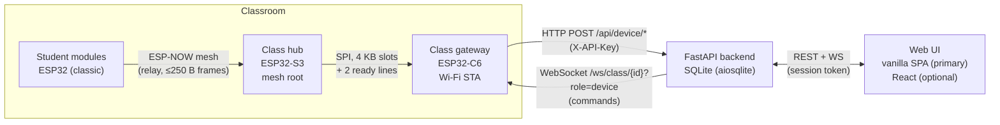

# System audit: imPress v2 → v2.1

| | |
|---|---|
| Audit date | 2026-10-08 |
| Repository | `Kush-Kelaiya22/imPress` (`git@github.com:Kush-Kelaiya22/imPress.git`) |
| Baselines | `main` `4593c67` · `v2` `4fce7f7` · `v3` `c88d3c7` |
| Integration branch | `varun/v2.1`, created from `origin/v2` at `4fce7f7` |
| Toolchain | Python 3.12 (CI) and 3.14.7 (local), Node 20, ESP-IDF v6.1 (`espressif/idf:v6.1`) |

This document records what the system is and does **as of the baseline**, and what the audit measured. Facts that were measured are marked **(measured)**. Anything not marked comes from reading the code. Nothing here was verified on physical hardware unless stated.

Related: [architecture overview](../architecture/overview.md) · [v2/v3 comparison](V2_V3_COMPARISON.md) · [known issues](../reference/known-issues.md)

---

## 1. Architecture map

| Layer | Location | Responsibility |
|---|---|---|
| Web UI (primary) | `backend/app/static/js/app.js` (3,012 lines), `api.js`, `templates/index.html` | Hash-routed SPA served at `/`. Admin pages: users, courses, classrooms, students, modules, activity. Teacher pages: classes, quiz/poll create and live, results. |
| Web UI (optional) | `frontend/` (React 18 + Vite) | Development UI: login, dashboard, classes, quiz create, poll live, device tree. Not served by the backend. |
| REST API | `backend/app/routers/*.py` (8 routers, 3,823 lines) | `auth`, `admin`, `classes`, `courses`, `students`, `quizzes`, `polls`, `device` |
| Real time | `backend/app/ws/` | Per-class rooms; teacher sockets (session token) and device sockets (`X-API-Key`) |
| Services | `backend/app/services/` | `presence` (online/offline sweep, 30 s), `firmware_store` (files on disk), `sessions`, `participation`, `mesh_bridge` |
| Persistence | `backend/app/models.py`, `database.py` | 15 tables, SQLAlchemy async on SQLite. **No migration framework**: `create_all` plus best-effort `ALTER TABLE ADD COLUMN`, with errors swallowed. |
| C6 gateway | `firmware/class_c6/main/` | Wi-Fi STA; `spi2http` task batches S3 records to `POST /api/device/batch`; WS client turns backend commands into protocol frames for the S3 |
| S3 hub | `firmware/class_s3/main/` | ESP-NOW mesh root, SPI master, student table (300), OTA client (Wi-Fi hop) with app rollback |
| Student module | `firmware/student/main/` | Buttons and OLED, enrollment identity in NVS, ESP-NOW relay with de-dup |
| Shared protocol | `firmware/protocol/` | Frame codec (CRC-16), SPI batch records, mesh de-dup, `ws_command` JSON ↔ frame |

### Trust boundaries

| Boundary | Authentication | Notes |
|---|---|---|
| Browser → backend (REST, WS) | Opaque session token (SHA-256 stored), RBAC `super_admin` / `admin` / `teacher` | Idle and hard expiry; activity refresh in middleware |
| C6/S3 → backend | One shared `X-API-Key` (constant-time compare) | No per-device credentials; plain HTTP |
| S3 ↔ C6 | Physical wiring | CRC-16 per slot |
| Student ↔ S3 (ESP-NOW) | **None** | Any radio can claim any enrollment number (documented risk T9) |
| Admin → firmware store | Admin role | Uploaded bytes are **not validated** (see §6) |

---

## 2. Hardware and device architecture

### Device compatibility matrix (from `sdkconfig`, `partitions.csv`, `idf.py size`)

| | Student module | Class hub | Class gateway |
|---|---|---|---|
| Project | `firmware/student` | `firmware/class_s3` | `firmware/class_c6` |
| Target (`CONFIG_IDF_TARGET`) | `esp32` (Xtensa LX6, 2 cores) | `esp32s3` (Xtensa LX7, 2 cores) | `esp32c6` (RISC-V, 1 core HP) |
| Image chip ID (image header) | 0 | 9 | 13 |
| CPU clock configured | 160 MHz | 160 MHz (default) | 160 MHz |
| Flash size configured | 4 MB | **32 MB** | 8 MB |
| Flash mode | DIO | QIO | QIO (`v3`: DIO) |
| PSRAM | not used | **required**: octal, `SPIRAM_IGNORE_NOTFOUND` off | not available |
| App partitions | 2 × 1.75 MB (`ota_0`/`ota_1`) | 2 × 4 MB | 2 × 3.875 MB |
| Image size **(measured)** | 809,072 B (44% of slot) | 980,672 B (23%) | 1,121,056 B (28%) |
| Static RAM **(measured)** | DRAM 39.6 KB of 180.7 KB (22%) | DIRAM 172.1 KB of 341.8 KB (50%) | DIRAM 151.7 KB of 452.1 KB (34%) |
| Radios used | ESP-NOW | ESP-NOW (+ Wi-Fi STA only during OTA) | Wi-Fi STA |
| OTA client | **none** | yes (Wi-Fi hop, prompted via C6) | **none** |
| App rollback | off | **on** | off |
| Task WDT | default | 5 s | 5 s |
| Brown-out level | default | 7 (highest) | 7 (highest) |
| Reported version | `#define FIRMWARE_VERSION "1.0.0"` | `"0.1.0"` | `"1.0.0"` |

This matrix is the `v2` baseline. For v2.1 (OTA clients, rollback, PSRAM optional, re-measured sizes) see [device compatibility](../hardware/DEVICE_COMPATIBILITY.md) and [classroom node requirements](../hardware/CLASSROOM_NODE_REQUIREMENTS.md).

Images are **not interchangeable**: each is linked for one chip. ESP-IDF stores the chip ID in the image header, and the bootloader and `esp_ota_end()` reject a mismatch on the device. The backend, however, accepts any bytes (§6).

Cost observation: the S3 image only boots on a module with **32 MB flash and octal PSRAM** (the header declares 32 MB; PSRAM init failure aborts). No code allocates from PSRAM (`grep MALLOC_CAP_SPIRAM`: no hits), and the image uses 0.98 MB. See issue *classroom node minimum specification*.

### Reset and watchdog behaviour

- C6 and S3: task WDT 5 s and brown-out level 7. The intermittent C6 resets reported before `v2` were traced to a dangling SPI slave descriptor (#1, fixed in `v2`).
- `v3`'s commit ("demo ready") changes the S3↔C6 link to standard full-duplex SPI at 10 MHz. That matches A1 (§5): the `v2` ends could not exchange slots (see the [comparison](V2_V3_COMPARISON.md)). No serial logs were available to the audit.
- No firmware reports `esp_reset_reason()` to the backend, so remote diagnosis of resets is impossible today.

---

## 3. Data model and integrity

15 tables (`users`, `courses`, `class_sessions`, `class_faculty`, `esp_devices`, `students`, `student_enrollments`, `quizzes`, `quiz_questions`, `quiz_answers`, `polls`, `poll_votes`, `attendance`, `activity_logs`, `user_sessions`). Hierarchy: **Course** (catalog: `code`, `name`) → **ClassSession** (one per section: `course_id`, `course_section`, unique `code`, optional unique `classroom_code` = physical room) → enrollments, quizzes and polls. There is no separate "section" table.

| Finding | Evidence | Risk |
|---|---|---|
| No versioned migrations; `_migrate_columns()` errors are swallowed (`except Exception: pass`) | `database.py:105` | A failed upgrade goes unnoticed; no schema version recorded |
| No DB uniqueness for one answer per (quiz, question, student), one vote per (poll, student), one enrollment per (class, student) | `models.py` | Duplicates are prevented only in application code; concurrent requests can race |
| No unique (course_id, course_section) | `models.py` | Two "section A" rows of one course are possible |
| FK cycle `class_sessions.device_id` ↔ `esp_devices` ↔ `student_enrollments` | SQLAlchemy `drop_all` warning (#25) | Ordered drops and migrations are harder |
| SQLite foreign keys not enforced (`PRAGMA foreign_keys` never enabled) | `database.py` | Dangling references are possible |
| Firmware artifacts have no table: files `<type>-<version>.bin`, overwritten on re-upload | `firmware_store.py` | No immutability, checksum, metadata or history |
| OTA state is 4 columns on `esp_devices` (`pending_version`, `ota_status`, …) | `models.py:118` | No history, timeouts or deployment grouping |

---

## 4. Test baseline

| Run | Result |
|---|---|
| `python run_tests.py --with-idf --with-frontend` on `v2` @ `4fce7f7` (macOS, Python 3.14.7) | **13 suites, 330 tests, all passed, 2m25s** (measured) |
| GitHub Actions on `v2` @ `4fce7f7`, [run 37682884833](https://github.com/Kush-Kelaiya22/imPress/actions/runs/37682884833) | success, all 9 jobs |
| GitHub Actions on `v3` @ `c88d3c7`, [run 37732615325](https://github.com/Kush-Kelaiya22/imPress/actions/runs/37732615325) | **failure**: `host:class_c6`, `../main/spi_slave.c:184:32: error: 'pdFALSE' undeclared`. All other jobs, including the three IDF builds, passed. |

### Runtime smoke test against a live server (measured)

A real `uvicorn` process on a temporary database, driven over HTTP:

| # | Workflow | Result |
|---|---|---|
| 1 | Admin login | OK |
| 2 | Create course (classroom catalog entry) | OK |
| 3 | Create section (class session with course, section, room code) | OK |
| 4 | Create quiz with a question | OK |
| 5 | Gateway registration with `classroom_code` | HTTP 200, auto-linked |
| 6 | Student join through gateway batch | processed |
| 7 | Admin "class devices" view after the join | **node shown, 0 student devices**: mesh-joined students are recorded only in the activity log, so there is no inventory |
| 8 | Firmware upload of 2 KB of random bytes as `c6` 1.2.3 | **HTTP 200, accepted** |
| 9 | OTA push of version 9.9.9, which was never uploaded | **`ota_status=downloading`**; the device then gets HTTP 404 on download |
| 10 | SPA served at `/` | HTTP 200 |

Not verifiable without hardware: radio delivery, the SPI link, OTA flashing and reboot, resets, power and thermal behaviour.

---

## 5. Known defects found by this audit

| # | Area | Defect | Evidence |
|---|---|---|---|
| A1 | firmware link | The two ends of the `v2` link use incompatible wire modes. The S3 master is configured for **quad, half-duplex** (`SPICOMMON_BUSFLAG_QUAD`, `SPI_DEVICE_HALFDUPLEX`): a 4096-byte write phase, then a 4096-byte read phase. The C6 uses the GPSPI `spi_slave` driver, which only does **standard full-duplex** (one data line each way). `v3` switches both ends to standard full-duplex SPI. | `class_s3/main/spi_master.c` (v2), v3 diff |
| A2 | firmware link | `v2` C6/S3 `*_send()` overwrite a single pending slot (latest wins): back-to-back commands (e.g. `QUIZ_START` then a question) can be lost | `spi_slave.c`, `spi_master.c` |
| A3 | firmware | C6 `spi2http` stops servicing SPI while Wi-Fi is down, so the S3 cannot clock any slot | `class_c6/main/main.c` (v2) |
| A4 | firmware | C6 `student_count` incremented once per heartbeat (never reflects the real population) | `class_c6/main/main.c` (v2) |
| A5 | firmware | S3 re-broadcasts heartbeats **double-encoded** (`msg_encode` then `mesh_master_broadcast` encodes again), so students receive a malformed heartbeat | `class_s3/main/mesh_master.c` (v2) |
| A6 | OTA | Reported firmware version is a hard-coded `#define`. After an update the S3 still reports the old string, so `pending != current` and the update is offered again forever. | `config.h`, `device.py:firmware_check` |
| A7 | OTA | S3 sends `OTA_APPLIED` **before** rebooting into the new image; with rollback, the backend can record a version that never ran | `class_s3/main/ota.c` |
| A8 | OTA | S3 ignores the HTTP status of the download and streams an error body into the OTA partition (fails safely, but silently) | `ota.c:_download_and_apply` |
| A9 | OTA | Backend accepts any bytes as firmware, silently overwrites an existing version, has no size limit, and allows pushing versions that don't exist (status shows `downloading`) | smoke steps 8–9 |
| A10 | OTA | Only the S3 has an OTA client; the C6 and student modules can only be updated over serial | `grep esp_ota_begin` |
| A11 | inventory | Mesh-joined students are not visible as connected modules. **Fixed in #40** (student module inventory). | smoke step 7 |
| A12 | DB | No versioned migrations; constraint gaps listed in §3 | §3 |
| A13 | hardware cost | S3 build requires 32 MB flash and octal PSRAM, which it doesn't use. **#30:** PSRAM is now optional; the octal-flash requirement is documented, with a reduced-flash profile (built, not booted). | §2 |
| A14 | diagnostics | Reset reason, uptime, restart count and heap are not reported (except heap on the C6). **Fixed in #39** for the C6 (health states plus diagnostics); the S3's reset reason is not yet relayed. | firmware grep |

---

## 6. Risks

- **Firmware supply chain:** any admin can upload any bytes; images are unsigned and served over HTTP. The device rejects wrong-chip and corrupt images (`esp_ota_end` verifies the image), but the backend can't tell an operator that before a deployment.
- **Single shared device key:** compromise of one gateway exposes all.
- **Hardware-dependent work can't be closed by CI:** OTA, SPI timing, radio range, power and reset behaviour need a bench with real boards. Every such item is labelled `needs:hardware`.
- **SQLite single writer:** fine for one school server; the presence sweep and batch ingestion share it.

---

## 7. Recommended implementation order

1. **CI baseline on `varun/v2.1`:** port `v3`'s link changes so the host tests compile and pass; harden the pipeline (pinned actions, dependency audit, lockfiles, coverage).
2. **`v3` recovery:** adopt the verified link fixes (A1–A5) with the regressions removed (see the comparison).
3. **Database:** versioned migrations, enforced foreign keys, uniqueness constraints (prerequisite for imports and deployments).
4. **CSV question import** and **CSV course/section import.**
5. **OTA root causes (A6–A9):** version from the app descriptor, applied-after-reboot confirmation, HTTP status checks.
6. **Firmware registry:** immutable artifacts with parsed image metadata and SHA-256, approval and deprecation states.
7. **Deployments:** per-device state machine, individual and bulk, canary then batches, timeouts, durable across restarts.
8. **C6 OTA client** (A10), with rollback enabled; student OTA designed but hardware-gated.
9. **Diagnostics and inventory** (A11, A14).
10. **Packaging, documentation, release candidate.**
