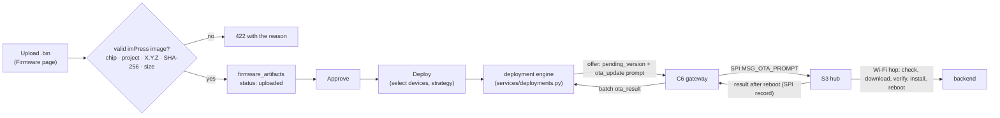
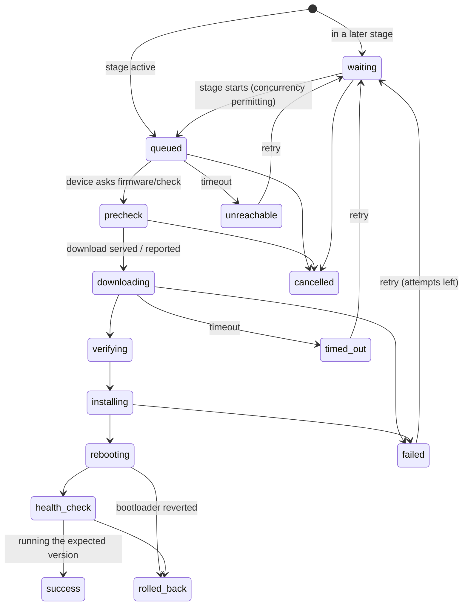
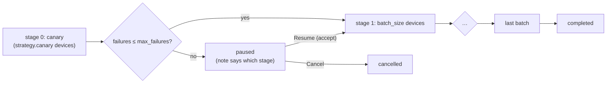
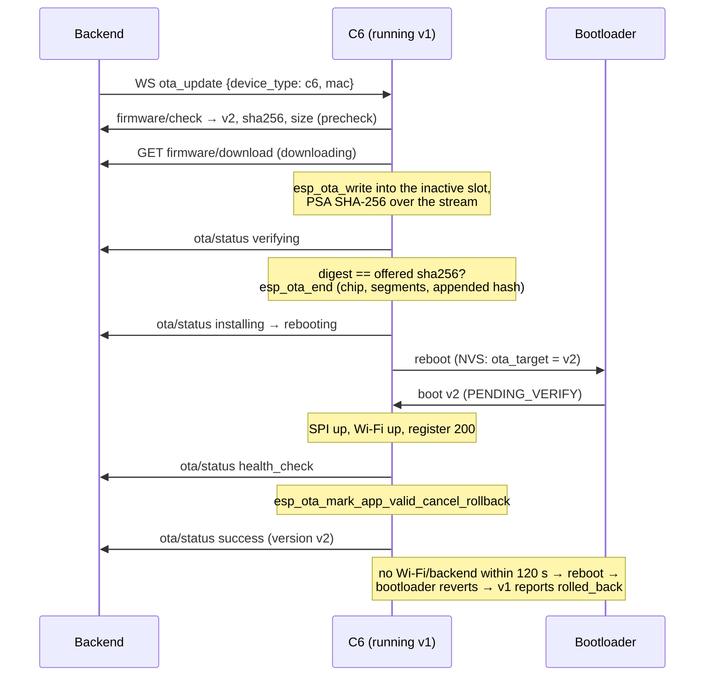

# OTA architecture

How a firmware image gets from an administrator's upload onto classroom devices, and how the system knows whether it worked. For the operator's step-by-step guide see [OTA updates](../guides/ota-updates.md); for the API see [REST](../api/rest-api.md#firmware-deployments-38) and [device API](../api/device-api.md).

## Overview

| Piece | Where | Responsibility |
|---|---|---|
| Image validation | `backend/app/services/firmware_image.py` | Read facts from the image; refuse anything that isn't a sound imPress app image (#35) |
| Registry | `firmware_artifacts`, `services/firmware_store.py`, `routers/firmware.py` | Immutable binaries (`<sha256>.bin`); uploaded → approved → deprecated; retention (#35, #36) |
| Deployment engine | `services/deployments.py`, `routers/deployments.py` | Per-device state machine, staged rollout, retries, timeouts, durability (#34, #38) |
| Device reports | `POST /api/device/ota/status`, batch `ota_result`, `firmware/check`, `firmware/download` | Move a device through the states |
| S3 client | `firmware/class_s3/main/ota.c` | Wi-Fi hop, HTTP status and size checks, `esp_ota_*`, result after reboot (#33) |
| C6 client | `firmware/class_c6/main/ota.c`, `ota_logic.c` | check, download + SHA-256, verify, install, reboot, health check, report each step (#34) |

## Per-device state machine

Rules (all enforced by `deployments.report()` and tested in `test_deployments.py`):

- **Forward only.** A device can skip states (the S3 reports only its final result) but never go back: 409. Repeating the current state is a no-op, so lost acknowledgements and relay duplicates are harmless.
- **Success needs proof.** `success` counts only when the device reports the image's version running **after** the reboot. Any other version is recorded as a failure, and the device row shows what really runs. A completed download, or a reboot, is not success.
- **Rollback is recorded as such.** `rolled_back` keeps the device on its previous version, and the pending version is cleared so the bad image isn't offered again.
- **Bounded retries.** `failed`, `timed_out` and `unreachable` are retried up to `max_attempts`. While a retry is pending, the device keeps `pending_version`.
- **Timeouts.** An attempt that hasn't finished within `timeout_s` becomes `unreachable` (never started) or `timed_out` (stalled).
- **Cancellation is safe.** Only `waiting`, `queued` and `precheck` are cancelled, because nothing has been written to flash yet. Devices further along finish and report.
- **Server-observed progress.** `firmware/check` moves `queued → precheck` and returns the image's SHA-256 and size. Serving the download moves it to `downloading`.

## Staged rollout

| Strategy field | Default | Meaning |
|---|---|---|
| `canary` | 1 | devices in stage 0 |
| `batch_size` | 5 | devices per later stage |
| `max_concurrent` | 5 | devices updating at the same time (network load) |
| `max_failures` | 0 | failures a finished stage may have before the rollout pauses |
| `max_attempts` | 2 | tries per device |
| `timeout_s` | 900 | per attempt |

- **Selection:** specific devices, every device of the image's type, devices running a given version, or a classroom's devices (its gateway and the hub it relays). The filters can be combined.
- **Exclusions:** a device is excluded, with its reason shown in the preview, if it is:
  - a different type;
  - a student module (no over-the-air path yet);
  - disabled;
  - already on the version;
  - busy in another deployment;
  - due for a downgrade that wasn't explicitly allowed (`allow_downgrade`, which makes a `rollback` deployment).
- **Idempotency:** the same `idempotency_key` returns the deployment it created before, so a double submit or retry doesn't start two rollouts.
- **Durability:** everything is stored in `firmware_deployments` and `deployment_targets`. The scheduler (`deployments_loop`, every 5 s) is idempotent, so after a backend restart running deployments continue where they were. This is tested by dropping every database connection mid-rollout.
- **Per-device push:** *Push OTA* on the Modules page, and `POST /api/admin/modules/{id}/ota`, is a one-device deployment with the same guarantees.

## How each device type is reached

| Device | Prompt | Download | Result | Status |
|---|---|---|---|---|
| S3 hub | WS `device_command ota_update` → its C6 → SPI `MSG_OTA_PROMPT` | Wi-Fi hop, `firmware/download` | after reboot, `MSG_OTA_APPLIED` record → C6 → batch `ota_result` | implemented (#33) |
| C6 gateway | WS `ota_update` with its own MAC (and a check at every boot, for prompts missed while offline) | `firmware/download`, hashed while streaming | `POST /api/device/ota/status` for every step; after the reboot `health_check` → `success`, or `rolled_back` | implemented (#34): `firmware/class_c6/main/ota.c` |
| Student module | – | – | – | **no OTA transport**: ESP-NOW frames are ≤ 250 bytes and there is no Wi-Fi provisioning; deployments exclude them. Update over serial. |

## The C6 gateway's update

Rules the code keeps, each with a structural test (`firmware/tests/test_c6_ota.py`) and host tests of the pure parts (`test_ota_logic.c`):
- **An offer that can't be verified is ignored:** a missing or short SHA-256, a non-semver version, or a zero size.
- **Nothing is written to flash on an HTTP error:** the status code and length are checked before `esp_ota_begin`.
- **The order is fixed:** the image is checked against the backend's SHA-256, then `esp_ota_end`'s own checks; only then is it made bootable.
- **Success comes from the new image:** after its health check.
- **Watchdog:** an image that can't reach the network within 120 s is rebooted into the previous one, which reports `rolled_back`.

## What is and isn't verified

- **Verified by automated tests:** image validation against real build output; the whole state machine and rollout logic against simulated devices (`test_deployments.py`, `ui_tests/test_deployments.py`); the S3 client's structure (`firmware/tests/test_ota_versioning.py`); IDF builds.
- **Not yet verified on hardware:** an actual S3 or C6 update, a rollback after a crashing image, power loss mid-download, the C6 health watchdog. The procedures are in [hardware validation](../testing/HARDWARE_VALIDATION.md) (H7–H11) and are tracked in [#88](https://github.com/Kush-Kelaiya22/imPress/issues/88) (gateway) and [#89](https://github.com/Kush-Kelaiya22/imPress/issues/89) (hub and staged rollout).

See also: [firmware versioning](FIRMWARE_VERSIONING.md), [recovery procedure](RECOVERY_PROCEDURE.md).
