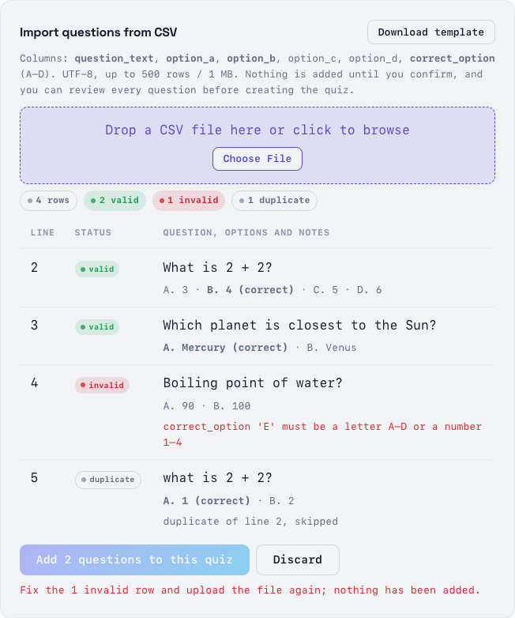
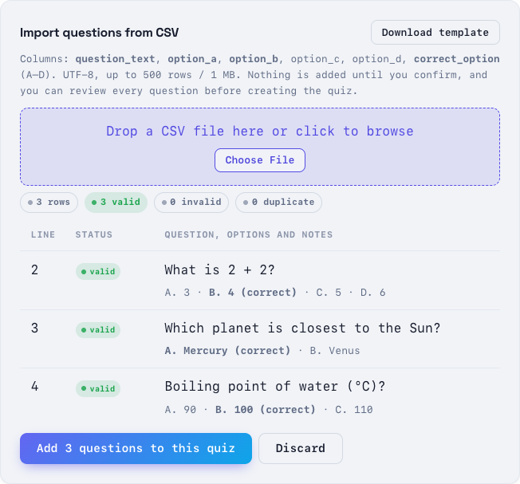
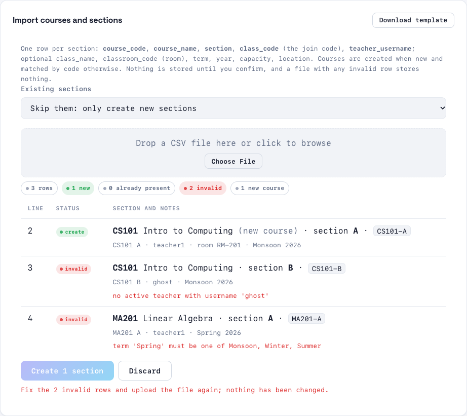
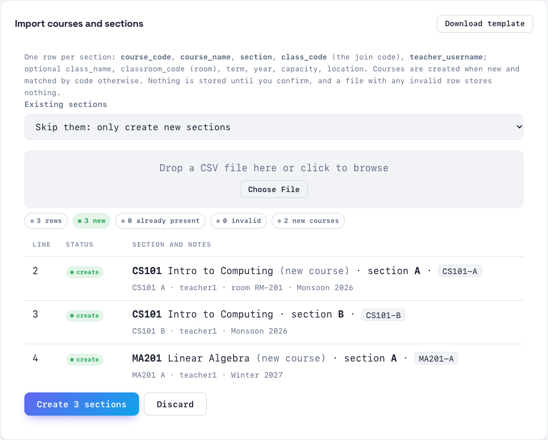

# CSV imports

Bulk-create content from a spreadsheet instead of typing it into forms. Every import is checked on the server first and shows a preview. **Nothing is stored until you confirm, and a file with any invalid row stores nothing at all.**

| Import | Where | Who |
|---|---|---|
| [Quiz questions](#quiz-questions) | Create Quiz page → *Import questions from CSV* | teachers (for their classes) and admins |
| [Courses and sections](#courses-and-sections) | Admin → Classrooms → **Import CSV** / **Export CSV** | admins |

Common rules for every import:
- **UTF-8.** In Excel use *Save As → CSV UTF-8 (Comma delimited)*. A byte-order mark is fine; other encodings are refused with that hint.
- **The first row is the header.** Column names are case-insensitive and may be in any order. **Unknown columns are refused**, so a column you expect to be imported is never silently ignored.
- **At most 1 MB and 500 rows** per file.
- Quoted values may contain commas, quotes (`""`) and line breaks.
- Re-uploading the same file is safe: rows that already exist are reported as duplicates and skipped.

## Quiz questions

1. Open a class → **New Quiz**.
2. In *Import questions from CSV*, click **Download template** to get an example, or drop your file on the box.
3. Read the preview. Each row is **valid**, **invalid** (with the reason), or **duplicate** (of an earlier line, or of a question already in the quiz). A note warns when text is longer than a student module can display (it will be cut off on the device).
4. If every row is valid, click **Add N questions to this quiz**. They appear in the form below, where you can still edit or delete them. Then click **Create Quiz**.



| Column | Required | What to put in it |
|---|---|---|
| `question_text` | yes | the question, up to 1000 characters |
| `option_a`, `option_b` | yes | the first two answers, up to 200 characters each |
| `option_c`, `option_d` | no | more answers; leave the rest empty (no gaps: D needs C) |
| `correct_option` | yes | `A`–`D` (or `1`–`4`) |

Student modules have four buttons, so a question has **2–4 options**. They show about 139 bytes of a question and 14 bytes of an option (non-Latin scripts use 2–3 bytes per letter). Longer text is accepted with a warning.

```csv
question_text,option_a,option_b,option_c,option_d,correct_option
"What is 2 + 2?",3,4,5,6,B
"Which planet is closest to the Sun?",Mercury,Venus,,,A
```



To add questions to an **existing draft quiz** from a script, use `POST /api/quizzes/{id}/questions/import` ([REST API](../api/rest-api.md#importing-questions-from-csv-31)).

## Courses and sections

1. **Admin → Classrooms → Import CSV.** Download the template if you need an example.
2. Choose what happens to sections that **already exist**:
   - **Skip them** (default): only new sections are created. Re-uploading the same file changes nothing.
   - **Update them**: empty cells keep the current value, and the preview lists exactly which fields change. A new teacher becomes the primary teacher; other co-faculty stay.
3. Drop the file and read the plan. Each row is **create**, **duplicate** / **unchanged**, **update**, or **invalid** with the reason. Courses that will be created are marked *(new course)*.
4. Click **Create N sections** (or **Create N, update M**). The list refreshes. Imported classrooms start **inactive**, like classrooms created in the form.



| Column | Required | What to put in it |
|---|---|---|
| `course_code`, `course_name` | yes | the course (e.g. `CS101`, `Introduction to Computing`); an existing code must keep its exact name |
| `section` | yes | section label within the course (`A`, `01`, …) |
| `class_code` | yes | the class's join code; unique |
| `teacher_username` | yes | an existing, active teacher account |
| `class_name`, `classroom_code` (room), `term`, `year`, `capacity`, `location` | no | as in the classroom form |

```csv
course_code,course_name,section,class_code,teacher_username,classroom_code,term,year
CS101,Introduction to Computing,A,CS101-A-2026,teacher1,RM-201,Monsoon,2026
CS101,Introduction to Computing,B,CS101-B-2026,teacher2,,Monsoon,2026
```

**Export CSV** downloads every course section in the same layout. Edit it in a spreadsheet and re-import it in *Update* mode. Classrooms that aren't linked to a course are left out (the toast says how many), because they couldn't be re-imported.



API: [REST reference](../api/rest-api.md#importing-and-exporting-courses-and-sections-32).
