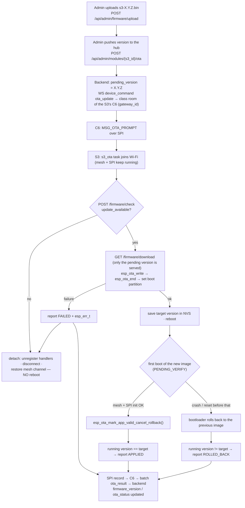

# OTA updates

Over-the-air updates are implemented for the **S3 hub**. The C6 and student modules have dual OTA partitions but no OTA client yet, so update them over serial.

## How it works



## Step by step

1. **Build** with the version bumped in **`firmware/class_s3/version.txt`** (all three projects use `2.1.0` for this release). The build writes it into the image's app descriptor, and the firmware reports exactly that (`FIRMWARE_VERSION` is `esp_app_get_description()->version`):
   ```bash
   docker run --rm -v "$PWD/firmware":/project -w /project/class_s3 espressif/idf:v6.1 idf.py build
   # image: firmware/class_s3/build/impress_class_s3.bin
   ```
2. **Upload** (admin): `POST /api/admin/firmware` with `file=@impress_class_s3.bin`. The backend reads the target (`s3`), chip and version from the image itself. It refuses anything that isn't a valid, uncorrupted imPress image for a known chip. It also refuses a different image under a version that already exists: bump `version.txt` instead. The image is stored as `firmware_bins/<sha256>.bin`.
3. **Make sure the S3 has a gateway**: its `gateway_id` must point at the room's C6 (admin "link device"). Otherwise the prompt can't be delivered.
4. **Push**: `POST /api/admin/modules/{s3_id}/ota {"version": "1.2.0"}`. It is refused (404) unless that image was uploaded for the device's type. The response shows `pending_version` and `ota_status: downloading`.
5. **Watch:** the S3 log shows the hop, the HTTP status, the download size and the reboot. After reboot: `New firmware verified — rollback cancelled`, then `Booted after OTA to 1.2.0: running 1.2.0 (applied)`.
6. **The result reaches the backend** through the C6 (batch `ota_result`):

   | Report | Device row afterwards |
   |---|---|
   | `applied` with the pushed version | `firmware_version` = it, `ota_status: applied`, pending cleared |
   | `applied` with another version | `firmware_version` = what runs, `ota_status: failed` |
   | `rolled_back` | `ota_status: rolled_back`, pending cleared (not offered again) |
   | `failed` (before any reboot) | `ota_status: failed`, pending kept for a retry; the `esp_err_t` is in the activity log (`module.ota_result`) |

   Before v2.1 the S3 reported "applied" *before* rebooting, and the report never reached the backend: the C6 dropped it. Its version was a hand-edited `#define`, so after an update the backend kept offering the same image (#33).

## Safety properties

| Property | Mechanism |
|---|---|
| A crashing image can't brick the hub | `CONFIG_BOOTLOADER_APP_ROLLBACK_ENABLE` + mark-valid only after mesh + SPI init |
| Only images an admin pushed can be fetched | `/firmware/download` requires `version == pending_version` of that device |
| No path traversal in the store | strict semver + a fixed device-type set |
| A no-op prompt doesn't disturb the class | no update → detach and continue, no reboot |
| Partial download | `esp_ota_end` validates the image; on error → abort and detach |

> The rollback-capable **bootloader** can't be delivered by OTA. Flash every S3 once over serial (`idf.py flash`) with the v2 `sdkconfig`.

## Signing images

Recommended for production. Without signing, anyone holding the device key and able to plant a file in the store, or to MITM the HTTP download, could ship code to hubs.

1. Generate a key **outside the repository** (it is git-ignored, but keep it offline anyway):
   ```bash
   espsecure.py generate_signing_key --version 2 secure_boot_signing_key.pem
   ```
2. `idf.py menuconfig` → *Security features*:
   - **Require signed app images** (`CONFIG_SECURE_SIGNED_APPS_NO_SECURE_BOOT`) for signature checks on OTA without burning eFuses, **or**
   - **Secure Boot v2** for full chain-of-trust (irreversible eFuse burn; plan carefully).
3. Set the signing key path, rebuild and flash **over serial once**. From then on `esp_ota_end()` rejects unsigned or mis-signed images.
4. Keep the key in a secrets manager; CI should sign release builds, not developer laptops.

## Transport security

The S3 currently downloads over `http://`. To move to HTTPS:
1. serve the backend behind TLS;
2. embed the CA certificate in the S3 firmware and set `esp_http_client_config_t.cert_pem`;
3. change `_url()` in `ota.c` to `https://`.

Signing (above) protects integrity even over plain HTTP; TLS adds confidentiality and protects the API key.

## Troubleshooting OTA

| Symptom | Check |
|---|---|
| S3 never starts a hop | Does the S3 row have `gateway_id`? Is the C6 connected to the class WS? (C6 log: `Relayed OTA prompt`) |
| `OTA aborted — could not connect to WiFi` | the S3's `wifi_ssid`/`wifi_pass` NVS values |
| `No pending update` | `pending_version` empty, or equal to the current version |
| download 403 | requested version ≠ `pending_version` (re-push) |
| download 404 | no registered `s3` image with that version (upload it); 410: registered but its file was deleted from `IMPRESS_FIRMWARE_DIR` |
| boots the old version after the update | rollback happened: the new image crashed before mark-valid; read its boot log |
