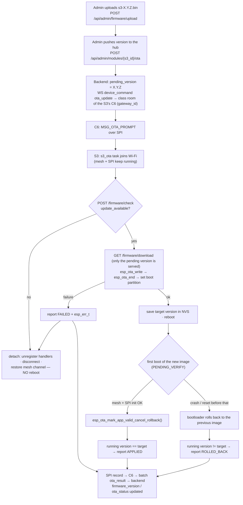
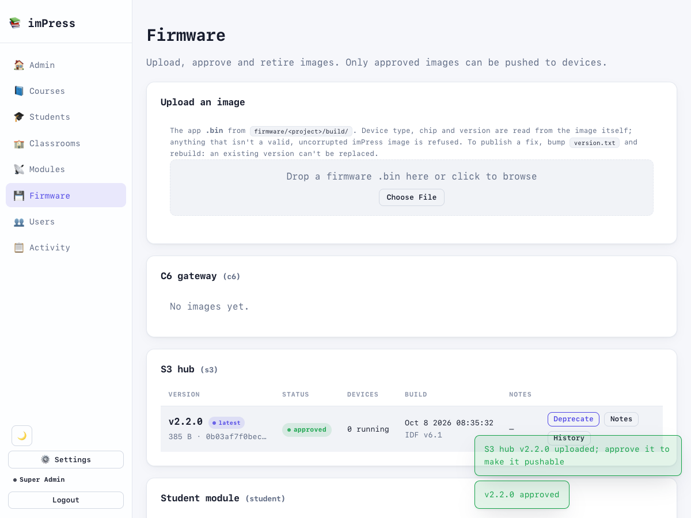
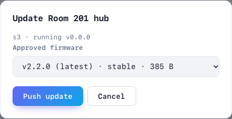
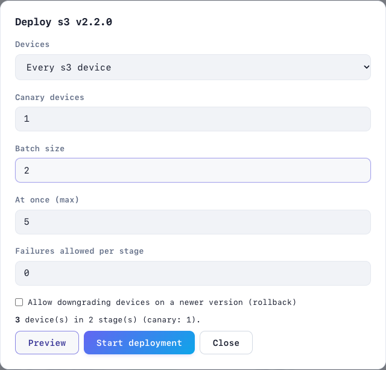
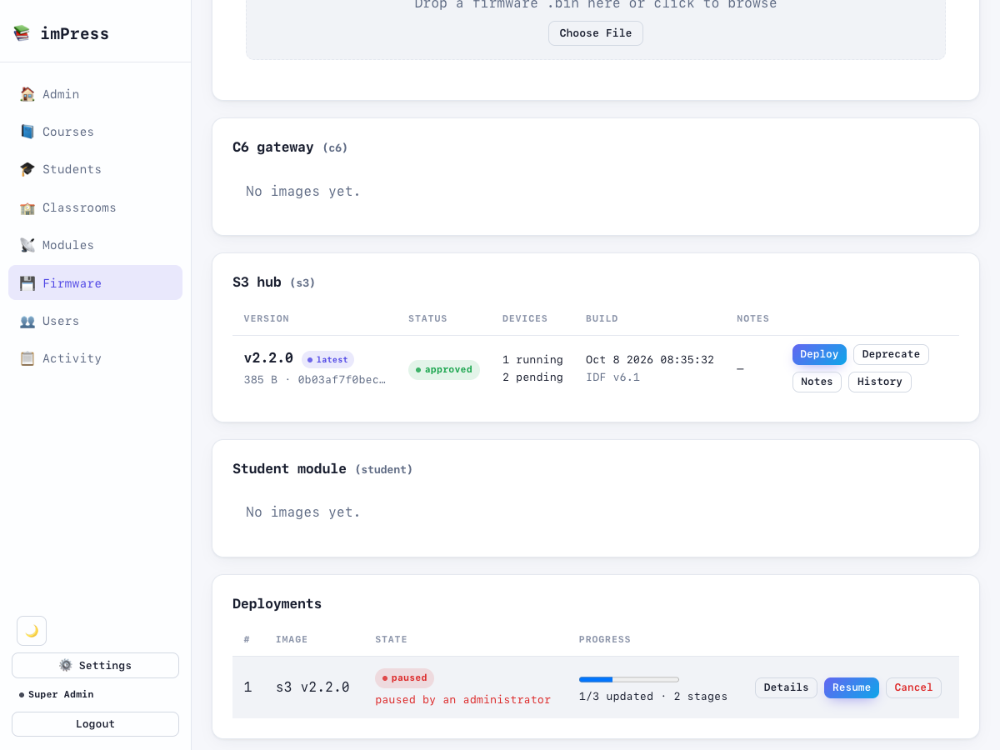

# OTA updates

Over-the-air updates are implemented for the **S3 hub** (Wi-Fi hop, #33) and the **C6 gateway** (direct, #34). Student modules have dual OTA partitions but no over-the-air transport (ESP-NOW frames are ≤ 250 bytes and they have no Wi-Fi credentials), so update them over serial; deployments exclude them. Design: [OTA architecture](../firmware/OTA_ARCHITECTURE.md).

> [!IMPORTANT]
> v2.1 enables **app rollback on the C6**, which changes its bootloader. Flash each C6 **once over serial** with this release; from then on it updates over the air.

## How it works



## Step by step

1. **Build** with the version bumped in **`firmware/class_s3/version.txt`** (all three projects use `2.1.0` for this release). The build writes it into the image's app descriptor, and the firmware reports exactly that (`FIRMWARE_VERSION` is `esp_app_get_description()->version`):
   ```bash
   docker run --rm -v "$PWD/firmware":/project -w /project/class_s3 espressif/idf:v6.1 idf.py build
   # image: firmware/class_s3/build/impress_class_s3.bin
   ```
2. **Upload** (admin): `POST /api/admin/firmware` with `file=@impress_class_s3.bin`. The backend reads the target (`s3`), chip and version from the image itself. It refuses anything that isn't a valid, uncorrupted imPress image for a known chip. It also refuses a different image under a version that already exists: bump `version.txt` instead. The image is stored as `firmware_bins/<sha256>.bin`.
3. **Approve** it (Admin → **Firmware** → *Approve*). Only approved images can be pushed. *Deprecate* retires an image for new pushes without affecting devices already running it or about to install it.
4. **Make sure the S3 has a gateway**: its `gateway_id` must point at the room's C6 (admin "link device"). Otherwise the prompt can't be delivered.
5. **Push**: Admin → Modules → *Push OTA* offers the approved images for that device's type. API: `POST /api/admin/modules/{s3_id}/ota {"version": "1.2.0"}`, which returns 404 if no such image exists and 409 if it isn't approved. The response shows `pending_version` and `ota_status: downloading`.
6. **Watch:** the S3 log shows the hop, the HTTP status, the download size and the reboot. After reboot: `New firmware verified — rollback cancelled`, then `Booted after OTA to 1.2.0: running 1.2.0 (applied)`.
7. **The result reaches the backend** through the C6 (batch `ota_result`):

   | Report | Device row afterwards |
   |---|---|
   | `applied` with the pushed version | `firmware_version` = it, `ota_status: applied`, pending cleared |
   | `applied` with another version | `firmware_version` = what runs, `ota_status: failed` |
   | `rolled_back` | `ota_status: rolled_back`, pending cleared (not offered again) |
   | `failed` (before any reboot) | `ota_status: failed`, pending kept for a retry; the `esp_err_t` is in the activity log (`module.ota_result`) |

   Before v2.1 the S3 reported "applied" *before* rebooting, and the report never reached the backend: the C6 dropped it. Its version was a hand-edited `#define`, so after an update the backend kept offering the same image (#33).

## Firmware page



Images are grouped by device type, newest first. For each image the page shows:
- its status (*uploaded*, *approved*, *deprecated*), channel, size and short SHA-256;
- how many devices run it or have it pending;
- the build date and IDF version.

**History** lists its upload, approval, pushes and the results devices reported. **Delete** is offered only for images that aren't approved, and the server still refuses it while any device runs the image or has it pending: that image is the way back.



### Deploying to many devices

**Deploy** on an approved image opens the rollout dialog. The rollout starts with a **canary**, then moves on in **batches**. It pauses on its own if a stage has more failures than allowed. **Preview** shows every device that will be included and every one that won't, with the reason.



The **Deployments** list shows progress and refreshes itself while a rollout runs. *Details* shows each device's state, attempts and error. *Pause*, *Resume* (accepting the failures that paused it) and *Cancel* (devices that haven't started installing) control the rollout. How it works: [OTA architecture](../firmware/OTA_ARCHITECTURE.md).



## Safety properties

| Property | Mechanism |
|---|---|
| A crashing image can't brick the hub | `CONFIG_BOOTLOADER_APP_ROLLBACK_ENABLE` + mark-valid only after mesh + SPI init |
| Only images an admin pushed can be fetched | `/firmware/download` requires `version == pending_version` of that device |
| No path traversal in the store | strict semver + a fixed device-type set |
| A no-op prompt doesn't disturb the class | no update → detach and continue, no reboot |
| Partial download | `esp_ota_end` validates the image; on error → abort and detach |

> The rollback-capable **bootloader** can't be delivered by OTA. Flash every S3 once over serial (`idf.py flash`) with the v2 `sdkconfig`.

## Signing images

Recommended for production (#66). Unsigned, a device installs any image that passes the integrity checks. That means anyone who can get a file accepted (an admin account, the shared key on an older backend, or a machine in the middle of the HTTP download) could ship code to hubs and gateways. Signed, each device checks every update against **your** public key in `esp_ota_end()`, and the backend refuses images that aren't signed with it before any device sees them.

The scheme is ESP-IDF's "signed app images without hardware Secure Boot" (RSA-3072, Secure Boot V2 format):
- **Bootloader and eFuses:** the bootloader is not changed and no eFuse is burned.
- **Rollout:** a fleet moves to signed images with one ordinary OTA update, and can be moved back the same way.
- **What it protects against:** network attackers, not someone with physical access and a serial cable. That requires hardware Secure Boot, which is irreversible: see the ESP-IDF Secure Boot V2 guide.

### 1. Create the site's key (once)
```bash
scripts/firmware_key.sh                     # → ~/.impress/firmware-signing/
```
| File | Keep it |
|---|---|
| `signing_key.pem` | **private**: offline, backed up, never in the repository. Losing it means devices that trust it can only be updated over serial. |
| `signing_key.pub` | public: give it to the backend |

The script prints the key's digest, the value `espsecure digest-sbv2-public-key` gives. The Firmware page shows the first 16 characters of each image's signer.

### 2. Tell the backend
```ini
# backend/.env
IMPRESS_FIRMWARE_SIGNING_KEY=/home/impress/.impress/firmware-signing/signing_key.pub
```
After a restart:
- Uploads must be signed with this key. An unsigned image, or one signed with another key, is refused (422) with the key's digest in the message.
- Images uploaded earlier without the signature stay in the registry but are **excluded from deployments** ("image is not signed with the site firmware key"), and the Firmware page marks them in red.
- An unreadable key file stops the server at startup.

### 3. Build signed images
```bash
IMPRESS_SIGNING_KEY=~/.impress/firmware-signing/signing_key.pem scripts/build_signed.sh class_c6
IMPRESS_SIGNING_KEY=~/.impress/firmware-signing/signing_key.pem scripts/build_signed.sh class_s3
scripts/verify_firmware.py firmware/class_c6/build/signed/impress_class_c6.bin --key ~/.impress/firmware-signing/signing_key.pub
```
`build_signed.sh` starts from the project's committed `sdkconfig`, so partitions, flash mode and size, rollback and the rest are unchanged. It adds `firmware/sdkconfig.defaults.signed` and the key path, and builds into `firmware/<project>/build/signed/`. The normal build is untouched. Student modules are not signed: they have no over-the-air updates.

### 4. Deploy
Upload `build/signed/impress_<project>.bin` and deploy it as usual. **From the moment a device runs a signed-profile image, it refuses unsigned images and images signed with any other key** (`esp_ota_end` fails, and the device reports `failed`). The device that installs the *first* signed-profile image doesn't check it yet. Only the images after it are checked, so this first deployment should come from a trusted machine.

### Key rotation and turning it off
- **Rotate:** a device checks updates against the key that signed the image it is running. ESP-IDF allows up to three signature blocks per image (`espsecure sign-data --version 2 --append-signatures`), so an image built with the new key can also carry the old key's signature:
  1. Deploy that doubly signed image.
  2. Switch `IMPRESS_FIRMWARE_SIGNING_KEY` to the new public key. The backend accepts an image if any of its signatures is from the site key.

  **This hasn't been tried with imPress hardware yet**: rehearse it on one bench device before a fleet.
- **Turn it off:** sign a normal (unsigned-profile) build with the current key (`espsecure sign-data --version 2 --keyfile signing_key.pem`), deploy it, then clear `IMPRESS_FIRMWARE_SIGNING_KEY`.
- **Key lost:** the devices can only be updated over serial ([recovery procedure](../firmware/RECOVERY_PROCEDURE.md#4-a-device-cant-update-at-all-reflash-over-serial)).

## Transport security

The hub and gateway can reach the backend over HTTPS and WSS (#66): **Backend over TLS** in `idf.py menuconfig` → the project's "Backend Server" menu. Every request then uses it: registration, heartbeats, batches, the WebSocket, firmware checks and downloads. See [deployment: TLS for devices](deployment.md#tls-for-devices).

Signing (above) protects firmware integrity even over plain HTTP. TLS adds confidentiality (answers, enrollment numbers, device keys) and authenticates the server.

## Troubleshooting OTA

| Symptom | Check |
|---|---|
| S3 never starts a hop | Does the S3 row have `gateway_id`? Is the C6 connected to the class WS? (C6 log: `Relayed OTA prompt`) |
| `OTA aborted — could not connect to WiFi` | the S3's `wifi_ssid`/`wifi_pass` NVS values |
| `No pending update` | `pending_version` empty, or equal to the current version |
| download 403 | requested version ≠ `pending_version` (re-push) |
| download 404 | no registered `s3` image with that version (upload it); 410: registered but its file was deleted from `IMPRESS_FIRMWARE_DIR` |
| boots the old version after the update | rollback happened: the new image crashed before mark-valid; read its boot log |
