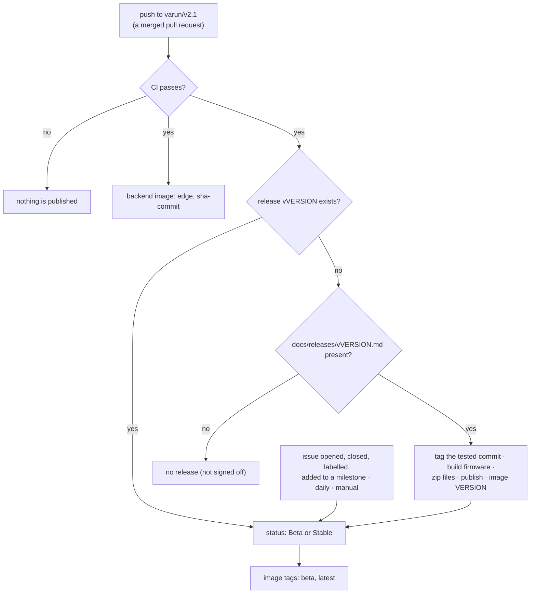

# Releases

How imPress releases are made, what a release contains, how its **Beta** or **Stable** status is decided, and how to use the published files. The policy (version numbers, sign-off, change history) is in [CONTRIBUTING §14–15](../../CONTRIBUTING.md#14-version-policy-and-change-history). This page describes the automation that carries it out (#96).

## Contents

- [Overview](#overview)
- [Creating a release](#creating-a-release)
- [Beta and Stable](#beta-and-stable)
- [What a release contains](#what-a-release-contains)
- [The backend container image](#the-backend-container-image)
- [Flash prebuilt images](#flash-prebuilt-images)
- [Troubleshooting the workflow](#troubleshooting-the-workflow)

## Overview



| Item | Rule |
|---|---|
| Version | The root `VERSION` file (`MAJOR.MINOR.PATCH`). The release is `v<VERSION>`. |
| Sign-off | `docs/releases/v<VERSION>.md`, the release notes, added through a reviewed pull request. Without this file, no release is created. |
| Source | The exact commit on the default branch (`varun/v2.1`) for which CI passed. |
| Status | **Beta** while an open issue labelled `testing` is in the milestone `v<VERSION>`; **Stable** otherwise. |
| Workflow | [`.github/workflows/release.yml`](../../.github/workflows/release.yml), helper [`scripts/release.py`](../../scripts/release.py), tests [`tests/test_release.py`](../../tests/test_release.py). |

## Creating a release

The release owner (CONTRIBUTING §15) does this through ordinary pull requests:

1. **Decide the version** and make sure that it is not used yet.
2. **Prepare the release in one pull request:**
   - set `VERSION` and the three `firmware/*/version.txt` files to the new version;
   - add `docs/releases/v<VERSION>.md`, the text of the release page (see the 2.1.0 notes for the structure);
   - move the *Unreleased* entries in `CONTRIBUTING.md` into a section for the new version.

   `tests/test_release.py` fails if `VERSION` has no release notes, so the two always change together.
3. **Create the milestone** `v<VERSION>` and add the test issues (label `testing`) that must pass before the release is Stable. Hardware checks are the usual case: see [hardware validation](../testing/HARDWARE_VALIDATION.md).
4. **Merge** the pull request after review and green CI.
5. **Wait for the workflow:**
   - CI runs on the merge commit; when it passes, *Release* runs;
   - it tags that commit `v<VERSION>`, builds the firmware with ESP-IDF v6.1, builds and smoke-tests the backend image, packages the zip files and publishes the release;
   - the status job then sets Beta or Stable.
6. **Check the result:** open the release page, compare the tag with the merge commit, download a zip and run `sha256sum -c SHA256SUMS.txt`. Then record the release in the version history in `CONTRIBUTING.md` (§14.2) with a small pull request.

To retry after a failure, run *Release* from the Actions tab (**Run workflow** on `varun/v2.1`). It never re-creates or changes a release that exists, and it never moves a tag.

A new release needs a new version. To change a published release, publish a patch version (CONTRIBUTING §15.4).

## Beta and Stable

| Status | Condition | Release page | GitHub flag | Image tag |
|---|---|---|---|---|
| **Beta** | at least one open issue labelled `testing` in milestone `v<VERSION>` | title ends with *(Beta)*; orange badge; the open test issues are listed | pre-release | `beta` (the newest beta) |
| **Stable** | no such issue (or no milestone) | plain title; green badge | latest release (the newest stable) | `latest` (the newest stable) |

The status is checked again:

- when an issue is opened, edited, closed, reopened, deleted or transferred, labelled or unlabelled, or added to or removed from a milestone;
- every day at 05:17 UTC;
- when someone runs the workflow manually.

So the status follows the issues in both directions:

- **Promotion:** closing the last open test issue makes the release Stable within about a minute.
- **Back to Beta:** adding a test issue to the milestone later (for example a regression found in the field) makes it Beta again.

The badge and the issue list sit between `<!-- release-status:start -->` and `<!-- release-status:end -->` at the top of the release text. The workflow replaces only that block. Edits to the rest of the release text are kept.

> **Labels and milestones are the interface.** To keep a release in Beta, put the blocking issue in its milestone with the `testing` label. To stop an issue from blocking, remove the label or move it to another milestone. Change `RELEASE_GATE_LABEL` in the workflow to gate on another label.

## What a release contains

| Asset | Contents |
|---|---|
| `impress-<VERSION>.zip` | `impress-<VERSION>/`: the source at the tagged commit (`git archive`), plus `release/firmware/` (the images below) and `release/RELEASE_NOTES.md` |
| `impress-<VERSION>-firmware.zip` | one folder per board (`class_c6`, `class_s3`, `student`): the application image, `bootloader/bootloader.bin`, `partition_table/partition-table.bin`, `ota_data_initial.bin`, `flash_args`, `flasher_args.json` and a `SHA256SUMS` file |
| `impress-<VERSION>-docs.zip` | `README.md`, `CONTRIBUTING.md`, `CODE_OF_CONDUCT.md`, `docs/`, the wiki pages (`wiki/`) and the release notes |
| `SHA256SUMS.txt` | checksums of the three zip files |
| *Source code* (zip, tar.gz) | added by GitHub for every tag |

The firmware is built by the workflow from the tagged commit with the committed `sdkconfig` files. It therefore contains the **default** Wi-Fi, server and key settings; see the next sections. Signed images (#66) are not published: a site signs its own images with its own key ([OTA updates → signing](ota-updates.md#signing-images)).

## The backend container image

`ghcr.io/kush-kelaiya22/impress-backend`, built from the [`Dockerfile`](../../Dockerfile) on every green push to the default branch.

| Tag | Meaning |
|---|---|
| `<VERSION>` (for example `2.1.0`) | the image of that release; never moved |
| `latest` | the newest **Stable** release |
| `beta` | the newest **Beta** release |
| `edge` | the newest commit on `varun/v2.1` that passed CI; not a release |
| `sha-<commit>` | one exact commit |

Properties:

- **Same dependencies as CI:** `backend/requirements-lock.txt`, hash-checked, on `python:3.12-slim` pinned by digest. `linux/amd64` only, because the lock is resolved for x86_64.
- **Unprivileged:** runs as user `impress` (UID 10001).
- **Data:** everything that persists is in the `/data` volume: `impress.db`, `firmware_bins/`, and `.env`. When `IMPRESS_JWT_SECRET` or `IMPRESS_DEVICE_API_KEY` is not set, the entrypoint generates them once into `/data/.env` (mode 600) and prints the device key on the first start.
- **Health check:** `GET /health` every 30 s (`docker inspect -f '{{.State.Health.Status}}' impress`).
- **Tested before it is pushed:** the workflow runs the image and passes `scripts/smoke_test.py` against it.

Run it:

```bash
docker run -d --name impress --restart unless-stopped \
  -p 8000:8000 -v impress-data:/data \
  ghcr.io/kush-kelaiya22/impress-backend:2.1.0
docker logs impress            # admin password (first start) and device key
```

Settings are the usual `IMPRESS_*` variables (`-e IMPRESS_DEVICE_KEYS_REQUIRED=true`, …; see [configuration](configuration.md)). Environment variables override `/data/.env`. For TLS without a proxy, mount the certificate and key and set `IMPRESS_SSL_CERTFILE` and `IMPRESS_SSL_KEYFILE`. Upgrade by starting the new tag with the same volume: migrations run at startup and back up the database first.

> A new package on GitHub Container Registry can start as private. If `docker pull` asks for credentials, the repository owner makes the package public once (package settings → *Change visibility*).

## Flash prebuilt images

The prebuilt images contain the default settings (`impress-hotspot` Wi-Fi, a default server address and the public default key). Use them in one of three ways:

1. **Over the air:** upload the gateway or hub image on the Firmware page and deploy it. The device keeps its own settings, which are in NVS.
2. **A board that already has its settings** (it ran imPress before and its flash was not erased): flash the images. NVS is not overwritten.
3. **A new board:** flash the images, then write a settings partition. The procedure follows.

### Write the settings of a new gateway or hub

Install the tools once: `pip install esptool esp-idf-nvs-partition-gen`.

1. Make a settings file. Use the key names exactly as shown. The first data row (`init_done` or `init`) stops the firmware from replacing your values with its defaults on the first start.

   Gateway (`c6-settings.csv`):
   ```csv
   key,type,encoding,value
   impress,namespace,,
   init_done,data,u8,1
   wifi_ssid,data,string,ClassroomWiFi
   wifi_pass,data,string,wifi-password
   backend_h,data,string,192.168.1.10
   backend_p,data,u16,8000
   api_key,data,string,<IMPRESS_DEVICE_API_KEY>
   class_id,data,i32,0
   ```
   Hub (`s3-settings.csv`). The namespace, the flag and two key names are different, and the port is `i32`:
   ```csv
   key,type,encoding,value
   s3_cfg,namespace,,
   init,data,u8,1
   wifi_ssid,data,string,ClassroomWiFi
   wifi_pass,data,string,wifi-password
   backend_host,data,string,192.168.1.10
   backend_port,data,i32,8000
   api_key,data,string,<IMPRESS_DEVICE_API_KEY>
   class_id,data,i32,0
   ```
2. Make the partition image (the NVS partition is 24 KB on both boards):
   ```bash
   python -m esp_idf_nvs_partition_gen generate c6-settings.csv c6-settings.bin 0x6000
   ```
3. Erase the board, flash the images, then flash the settings. From the board's folder in the firmware zip:
   ```bash
   cd class_c6
   python -m esptool --chip esp32c6 -p <port> erase_flash
   python -m esptool --chip esp32c6 -p <port> -b 460800 write_flash @flash_args
   python -m esptool --chip esp32c6 -p <port> write_flash 0x9000 ../c6-settings.bin
   ```
   For the hub, use `--chip esp32s3`, the `class_s3` folder and `s3-settings.bin`.
4. Open a serial monitor (`python -m serial.tools.miniterm <port> 115200`, or `idf.py monitor`). The log must **not** show `First boot — writing … defaults`. The gateway also prints `WiFi: <ssid>  backend: <host>:<port>`, then registers with the server.

Student modules need no settings partition: flash `student` with `write_flash @flash_args` (`--chip esp32`) and enter the enrollment number on the module.

Limits: the hub's server address is at most 63 characters and its key at most 64. The gateway allows 127 for both.

## Troubleshooting the workflow

| Symptom | Cause and action |
|---|---|
| No release after a merge | Check that `docs/releases/v<VERSION>.md` is on `varun/v2.1` and that CI passed on the merge commit. The *Plan* step summary shows `create=false` and the reason. |
| *Publish release* failed | The tag may not exist yet. Fix the cause and run the workflow manually. If the tag was created but the release wasn't, delete the tag only after checking that it points to the intended commit, then run the workflow again. |
| The status did not change | The issue must be in milestone `v<VERSION>` (the exact title) and labelled `testing`. Run the workflow manually to force a check. |
| `docker pull` asks for credentials | The package is private; see [the backend container image](#the-backend-container-image). |
