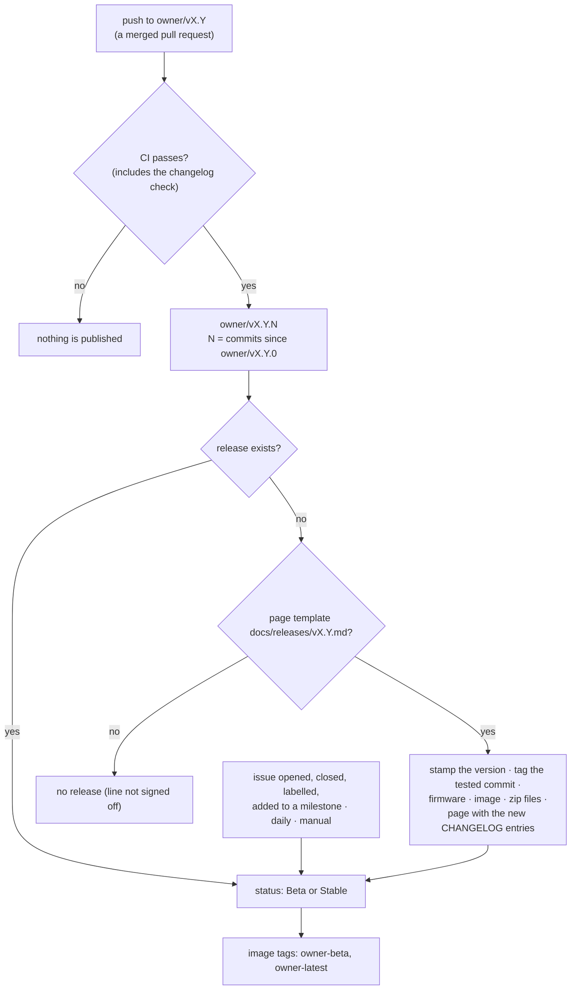

# Releases

How imPress releases are made, what a release contains, how its **Beta** or **Stable** status is decided, and how to use the published files. The policy (version numbers, sign-off, change history) is in [CONTRIBUTING §14–15](../../CONTRIBUTING.md#14-version-policy-and-change-history). This page describes the automation that carries it out (#96).

## Contents

- [Overview](#overview)
- [Release names](#release-names)
- [Every owner's line](#every-owners-line)
- [Version numbers](#version-numbers)
- [The changelog](#the-changelog)
- [Starting a new release line](#starting-a-new-release-line)
- [Beta and Stable](#beta-and-stable)
- [The release page](#the-release-page)
- [What a release contains](#what-a-release-contains)
- [The backend container image](#the-backend-container-image)
- [Flash prebuilt images](#flash-prebuilt-images)
- [Troubleshooting the workflow](#troubleshooting-the-workflow)

## Overview

Every push to an integration line that passes CI is published as the next patch release of that line. On `varun/v2.1`, the pushes after `varun/v2.1.0` become `varun/v2.1.2`, `varun/v2.1.3`, and so on.



| Item | Rule |
|---|---|
| Name | `<owner>/vMAJOR.MINOR.PATCH`, from the integration line `<owner>/vMAJOR.MINOR` ([release names](#release-names)) |
| Version | `MAJOR.MINOR` from the root `VERSION` file; `PATCH` computed from the git history ([version numbers](#version-numbers)) |
| Sign-off | the line's page template, `docs/releases/vMAJOR.MINOR.md`, added through a reviewed pull request. Without this file, no release of the line is created. |
| Changes | the `CHANGELOG.md` entries added since the previous release of the line ([the changelog](#the-changelog)) |
| Source | the exact commit on the integration line for which CI passed |
| Status | **Beta** while an open issue labelled `testing` is in the milestone `<owner>/vMAJOR.MINOR` (or `<owner>/vMAJOR.MINOR.PATCH`); **Stable** otherwise |
| Workflow | [`.github/workflows/release.yml`](../../.github/workflows/release.yml), helper [`scripts/release.py`](../../scripts/release.py), tests [`tests/test_release.py`](../../tests/test_release.py) |

## Release names

| Item | Format | Example |
|---|---|---|
| Integration line (branch) | `<owner>/vMAJOR.MINOR` | `varun/v2.1` |
| Release tag and title | `<owner>/vMAJOR.MINOR.PATCH`; the title ends with ` (Beta)` while Beta | `varun/v2.1.4` |
| Release files | `impress-<owner>-<version>.zip`, `…-firmware.zip`, `…-docs.zip` | `impress-varun-2.1.4.zip` |
| Container image tags | `<owner>-<version>`, `<owner>-<MAJOR.MINOR>`, `<owner>-beta`, `<owner>-latest` | `varun-2.1.4`, `varun-2.1` |
| Gating milestone | `<owner>/vMAJOR.MINOR` (that line and every line built on it), or `<owner>/vMAJOR.MINOR.PATCH` (one release) | `varun/v2.1` |

- **Owners:** `varun`, `kush`, `aamna` and `encrypted` (`RELEASE_OWNERS` in the workflow). CI and the release workflow run for pushes to `<owner>/**`; only branches named exactly `<owner>/vMAJOR.MINOR` are released. Issue branches (`fix/v2.1-…`) and variants (`varun/v2.1-experimental`) are not.
- **Each owner's line has its own numbering, milestone and image tags,** so two owners can release the same `MAJOR.MINOR` without collisions.
- **The software reports the plain version.** `/health`, the firmware and OTA all use `MAJOR.MINOR.PATCH`; the owner is part of the release name only.
- **Before #104,** releases were named `v2.1.0`, `v2.1.2` and `v2.1.3`. They were renamed to `varun/v2.1.0`, `varun/v2.1.2` and `varun/v2.1.3` (same commits and files). Their images keep the plain tags as well as the owner-prefixed ones.

## Every owner's line

The workflow is global: it lives on the default branch and serves every owner's integration line. For example, when Aamna pushes to `aamna/v2.4`:

1. CI runs on the push (`ci.yml` triggers on `aamna/**`).
2. When CI passes, *Release* computes `aamna/v2.4.<n>`. The line comes from the branch name. The first push is `aamna/v2.4.0`, and later pushes count up from it.
3. It builds the firmware and the image (`aamna-2.4.0`, `aamna-2.4`), creates the milestone `aamna/v2.4` if it does not exist, and publishes `aamna/v2.4.0`.
4. Its status follows the test issues of `aamna/v2.4` **and of every line it is built on** (see [Beta and Stable](#beta-and-stable)).

| Requirement on the owner's branch | Why |
|---|---|
| The branch is named exactly `<owner>/vMAJOR.MINOR`, and the owner is in `RELEASE_OWNERS` | Other branch names are never released. |
| Its `ci.yml` includes the owner's branches (any branch created from `varun/v2.1` after #104 has it) | CI on the push starts the release. A branch created earlier needs one merge from `varun/v2.1`. |

What it does **not** need:

- **Scripts:** the release script and the page templates always come from the default branch, so an old branch releases with the current rules.
- **Version files:** `VERSION` should say `MAJOR.MINOR.0`, but the branch name wins. A mismatch is shown as a warning in the run summary.
- **A template:** without `docs/releases/vMAJOR.MINOR.md` on the branch or the default branch, the newest template is used.

To add an owner, change `RELEASE_OWNERS` in `release.yml` and the branch lists in `release.yml` and `ci.yml` in one pull request (CONTRIBUTING §14.1).

## Version numbers

| Part | Source | Who changes it |
|---|---|---|
| `MAJOR.MINOR` | the root `VERSION` file (for example `2.1.0` means line 2.1). It must equal the branch name (`varun/v2.1`). | the release owner, in a pull request ([new line](#starting-a-new-release-line)) |
| `PATCH` | the number of **first-parent commits** on the integration line since the owner's first release of the line, tag `<owner>/vMAJOR.MINOR.0`. Without that tag, `PATCH` is 0. | nobody: computed by `scripts/release.py plan` |

- **One number per push.** A merged pull request adds one first-parent commit, however many commits the branch had.
- **Deterministic.** The same commit always gets the same version, so a re-run can't create a second release for it.
- **Gaps are possible.** A push that fails CI is not released, and the next green push takes its own, higher number. `varun/v2.1.1` does not exist: it was pushed before automatic releases.
- **Stamped into the build.** The workflow writes the version into `VERSION` and every `firmware/*/version.txt` in its workspace before building, so `/health`, the image, each firmware app descriptor and the bundle report it, and OTA "success needs proof" keeps working. The repository keeps `X.Y.0`.

## The changelog

[`CHANGELOG.md`](../../CHANGELOG.md) is kept by every pull request; the rules are in [CONTRIBUTING §14.4](../../CONTRIBUTING.md#144-recording-changes). In short:

- entries go under `## [Unreleased]`, in the categories **Added**, **Changed**, **Removed**, **Fixed** and **Security**;
- one `- ` bullet per change, written for users, ending with its issue link;
- CI (*Changelog entry*) fails a pull request that does not change `CHANGELOG.md`, unless it has the label `no-changelog`.

A release page's **What changed** section shows the `[Unreleased]` entries that are **new since the previous release of the line**: the workflow compares `CHANGELOG.md` at the release commit with `CHANGELOG.md` at the previous release tag. The merged pull requests are listed below it, folded.

## Starting a new release line

`MAJOR` and `MINOR` remain the release owner's decision (CONTRIBUTING §14). To start line 2.2 on `varun/v2.2`:

1. **Create the branch** `varun/v2.2` from the agreed source (CONTRIBUTING §8.2).
2. **Prepare one pull request into it:**
   - set `VERSION` and the three `firmware/*/version.txt` files to `2.2.0`;
   - add `docs/releases/v2.2.md`, the line's page template. Keep the headings of the [release page structure](../../CONTRIBUTING.md#153-release-page-structure) (a test checks them);
   - in `CHANGELOG.md`, rename `## [Unreleased]` to the old line's last release and start a new `## [Unreleased]`.
3. **Create the milestone** `varun/v2.2`, and add the test issues (label `testing`) that must pass before the line is Stable.
4. **Merge** after review and green CI. The merge becomes `varun/v2.2.0`, and every later push `varun/v2.2.<n>`.
5. **Check the first release:** compare the tag with the merge commit, download a zip, run `sha256sum -c SHA256SUMS.txt`, and record the line in CONTRIBUTING §14.2.

To retry after a failure, run *Release* from the Actions tab (**Run workflow** on the integration line). It never re-creates or changes a release that exists, and it never moves a tag. A published release is never edited apart from its status section: a fix ships as the next patch.

## Beta and Stable

| Status | Condition | Release page | GitHub flag | Image tag |
|---|---|---|---|---|
| **Beta** | at least one open issue labelled `testing` in milestone `<owner>/vMAJOR.MINOR` or `<owner>/vMAJOR.MINOR.PATCH` | title ends with *(Beta)*; orange badge; **Warning** box | pre-release | `<owner>-beta` |
| **Stable** | no such open issue (or no such milestone) | plain title; green badge; **Note** box | latest release (the newest stable) | `<owner>-latest` |

Which milestones gate a release:

| Milestone | Gates |
|---|---|
| `<owner>/vX.Y` (a line) | every release of that line, **and every release built on top of** `<owner>/vX.Y.0`: later lines of the same owner, and other owners' lines branched from it. Built on top means that `<owner>/vX.Y.0` is a git ancestor of the release commit. |
| `<owner>/vX.Y.Z` (one release) | that release only |

Example with three lines:

| Release | Built on `varun/v2.1.0`? | Gated by `varun/v2.1` |
|---|---|---|
| `varun/v2.1.6` | its own line | yes |
| `varun/v2.3.0` (created from `varun/v2.1`) | yes | yes |
| `aamna/v2.4.2` (branched from `varun/v2.1`) | yes | yes |
| `kush/v2.2.0` (separate history) | no | no |

So a test issue for 2.1 keeps 2.1 and everything built on it in Beta. When you close it, **every one of those releases is updated in the same run**. An issue in `varun/v2.3` gates only 2.3 and what is built on 2.3, never the older 2.1 releases. In the status table, an issue that comes from another line is marked *from varun/v2.1*.

**Adding gates in the Milestones tab:** open **Issues > Milestones**, and put the issue (label `testing`) in `<owner>/vX.Y` to gate the whole line, or create `<owner>/vX.Y.Z` to gate one specific release. A release that already exists changes status within a minute. A release published later starts in the right status.

The status is checked again when an issue is opened, edited, closed, reopened, deleted or transferred, labelled or unlabelled, or added to or removed from a milestone; every day at 05:17 UTC; and on a manual run. Closing the last open test issue makes the releases Stable within about a minute; adding a test issue later makes them Beta again.

> **Labels and milestones are the interface.** To keep a release in Beta, put the blocking issue in its milestone with the `testing` label. To stop an issue from blocking, remove the label or move it to another milestone.

## The release page

The page structure is fixed for every release: see [CONTRIBUTING §15.3](../../CONTRIBUTING.md#153-release-page-structure). It leads with what a reader needs to install and use imPress; detail is linked, not copied.

The **status section** at the top (between `<!-- release-status:start -->` and `<!-- release-status:end -->`) is written by the workflow:

| Part | Content |
|---|---|
| Badges | `release: beta` or `release: stable`, and `tests closed: N of M` |
| Box | **Warning** (Beta: how many test issues are open) or **Note** (Stable) |
| Table | every release test issue, open ones first: **No.** (link), **Issue** (title), **Assigned to**, **Status** (*open*, *closed: completed*, *closed: not planned*) |

It is redrawn within about a minute of any change to a test issue, and checked daily. The badges are static images drawn from the workflow's data, so they always load. The workflow replaces only this section; other edits to the page are kept.

## What a release contains

| Asset | Contents |
|---|---|
| `impress-<owner>-<version>.zip` | `impress-<owner>-<version>/`: the source at the tagged commit with the release version stamped in, plus `release/firmware/` and `release/RELEASE_NOTES.md` |
| `impress-<owner>-<version>-firmware.zip` | one folder per board (`class_c6`, `class_s3`, `student`): the application image, `bootloader/bootloader.bin`, `partition_table/partition-table.bin`, `ota_data_initial.bin`, `flash_args`, `flasher_args.json` and a `SHA256SUMS` file |
| `impress-<owner>-<version>-docs.zip` | `README.md`, `CHANGELOG.md`, `CONTRIBUTING.md`, `CODE_OF_CONDUCT.md`, `docs/`, the wiki pages (`wiki/`) and the release page |
| `SHA256SUMS.txt` | checksums of the three zip files |
| *Source code* (zip, tar.gz) | added by GitHub for every tag |

The firmware is built by the workflow from the tagged commit with the committed `sdkconfig` files. It therefore contains the **default** Wi-Fi, server and key settings; see [flash prebuilt images](#flash-prebuilt-images). Signed images (#66) are not published: a site signs its own images with its own key ([OTA updates → signing](ota-updates.md#signing-images)).

## The backend container image

`ghcr.io/kush-kelaiya22/impress-backend`, built from the [`Dockerfile`](../../Dockerfile) on every green push to an integration line.

| Tag | Meaning |
|---|---|
| `<owner>-<version>` (for example `varun-2.1.4`) | the image of that release; never moved |
| `<owner>-<MAJOR.MINOR>` (for example `varun-2.1`, `aamna-2.4`) | the newest release of that line |
| `<owner>-latest` | the owner's newest **Stable** release, across lines |
| `<owner>-beta` | the owner's newest **Beta** release, across lines |
| `sha-<commit>` | one exact commit |
| `2.1.0`, `2.1.2`, `2.1.3`, `varun-edge` | images published before #104 (the first three also as `varun-2.1.0`, …); not updated any more |

Properties:

- **Same dependencies as CI:** `backend/requirements-lock.txt`, hash-checked, on `python:3.12-slim` pinned by digest. `linux/amd64` only, because the lock is resolved for x86_64.
- **Unprivileged:** runs as user `impress` (UID 10001).
- **Data:** everything that persists is in the `/data` volume: `impress.db`, `firmware_bins/`, and `.env`. When `IMPRESS_JWT_SECRET` or `IMPRESS_DEVICE_API_KEY` is not set, the entrypoint generates them once into `/data/.env` (mode 600) and prints the device key on the first start.
- **Health check:** `GET /health` every 30 s (`docker inspect -f '{{.State.Health.Status}}' impress`).
- **Tested before it is pushed:** the workflow runs the image and passes `scripts/smoke_test.py` against it.

Run it:

```bash
docker run -d --name impress --restart unless-stopped \
  -p 8000:8000 -v impress-data:/data \
  ghcr.io/kush-kelaiya22/impress-backend:varun-latest
docker logs impress            # admin password (first start) and device key
```

Settings are the usual `IMPRESS_*` variables (`-e IMPRESS_DEVICE_KEYS_REQUIRED=true`, …; see [configuration](configuration.md)). Environment variables override `/data/.env`. For TLS without a proxy, mount the certificate and key and set `IMPRESS_SSL_CERTFILE` and `IMPRESS_SSL_KEYFILE`. Upgrade by starting the new tag with the same volume: migrations run at startup and back up the database first.

## Flash prebuilt images

The prebuilt images contain the default settings (`impress-hotspot` Wi-Fi, a default server address and the public default key). Use them in one of three ways:

1. **Over the air:** upload the gateway or hub image on the Firmware page and deploy it. The device keeps its own settings, which are in NVS.
2. **A board that already has its settings** (it ran imPress before and its flash was not erased): flash the images. NVS is not overwritten.
3. **A new board:** flash the images, then write a settings partition. The procedure follows.

### Write the settings of a new gateway or hub

Install the tools once: `pip install "esptool>=5" esp-idf-nvs-partition-gen` (the `flash_args` files use esptool 5 option names).

1. Make a settings file. Use the key names exactly as shown. The first data row (`init_done` or `init`) stops the firmware from replacing your values with its defaults on the first start.

   Gateway (`c6-settings.csv`):
   ```csv
   key,type,encoding,value
   impress,namespace,,
   init_done,data,u8,1
   wifi_ssid,data,string,ClassroomWiFi
   wifi_pass,data,string,wifi-password
   backend_h,data,string,192.168.1.10
   backend_p,data,u16,8000
   api_key,data,string,<IMPRESS_DEVICE_API_KEY>
   class_id,data,i32,0
   ```
   Hub (`s3-settings.csv`). The namespace, the flag and two key names are different, and the port is `i32`:
   ```csv
   key,type,encoding,value
   s3_cfg,namespace,,
   init,data,u8,1
   wifi_ssid,data,string,ClassroomWiFi
   wifi_pass,data,string,wifi-password
   backend_host,data,string,192.168.1.10
   backend_port,data,i32,8000
   api_key,data,string,<IMPRESS_DEVICE_API_KEY>
   class_id,data,i32,0
   ```
2. Make the partition image (the NVS partition is 24 KB on both boards):
   ```bash
   python -m esp_idf_nvs_partition_gen generate c6-settings.csv c6-settings.bin 0x6000
   ```
3. Erase the board, flash the images, then flash the settings. From the board's folder in the firmware zip:
   ```bash
   cd class_c6
   python -m esptool --chip esp32c6 -p <port> erase-flash
   python -m esptool --chip esp32c6 -p <port> -b 460800 write-flash @flash_args
   python -m esptool --chip esp32c6 -p <port> write-flash 0x9000 ../c6-settings.bin
   ```
   For the hub, use `--chip esp32s3`, the `class_s3` folder and `s3-settings.bin`.
4. Open a serial monitor (`python -m serial.tools.miniterm <port> 115200`, or `idf.py monitor`). The log must **not** show `First boot — writing … defaults`. The gateway also prints `WiFi: <ssid>  backend: <host>:<port>`, then registers with the server.

Student modules need no settings partition: flash `student` with `write-flash @flash_args` (`--chip esp32`) and enter the enrollment number on the module.

Limits: the hub's server address is at most 63 characters and its key at most 64. The gateway allows 127 for both.

## Troubleshooting the workflow

| Symptom | Cause and action |
|---|---|
| No release after a merge | Check that CI passed on the merge commit, that the branch is named exactly `<owner>/vMAJOR.MINOR` with a listed owner and the same line as `VERSION`, and that `docs/releases/vMAJOR.MINOR.md` exists. The *Plan* step summary shows the plan and the reason. |
| *Publish release* failed | The tag may not exist yet. Fix the cause and run the workflow manually. If the tag was created but the release wasn't, delete the tag only after checking that it points to the intended commit, then run the workflow again. |
| The status did not change | The issue must be in milestone `<owner>/vMAJOR.MINOR` or `<owner>/vMAJOR.MINOR.PATCH` (the exact title) and labelled `testing`. Run the workflow manually to force a check. |
| CI fails with *Add an entry under '## [Unreleased]'* | Add a `CHANGELOG.md` entry ([CONTRIBUTING §14.4](../../CONTRIBUTING.md#144-recording-changes)), or ask a maintainer for the `no-changelog` label. |
| A status badge is out of date | The workflow redraws the table on every issue change. Check the latest *Release* run under Actions, or run the workflow manually. |
| `docker pull` asks for credentials | The package is private; see [the backend container image](#the-backend-container-image). |
