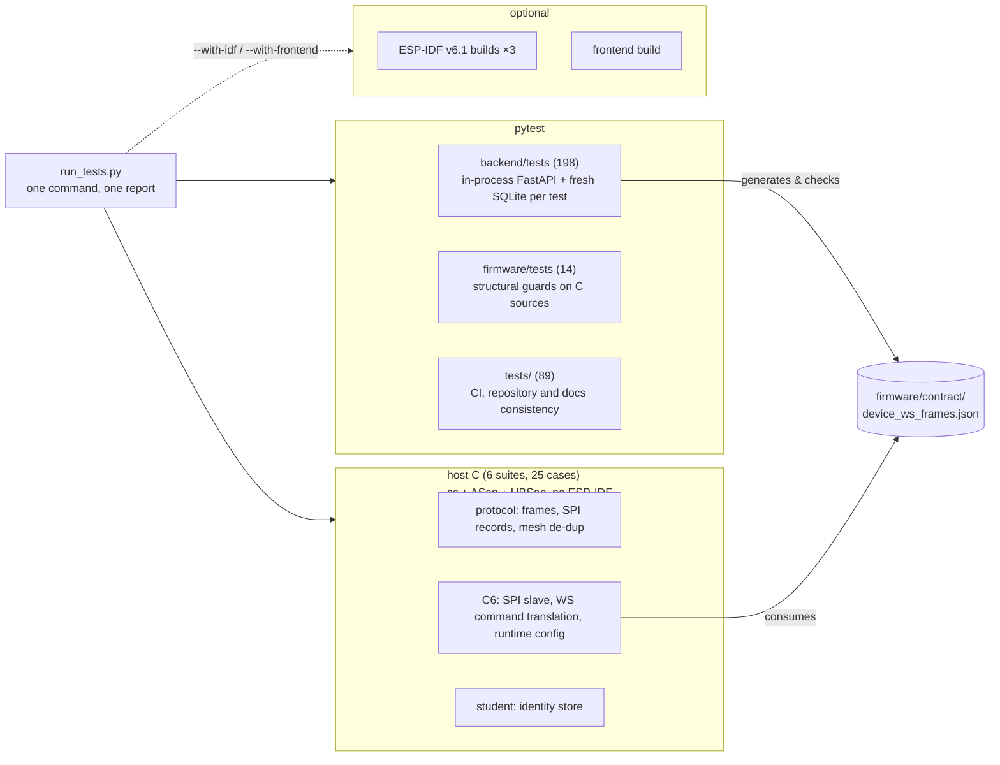
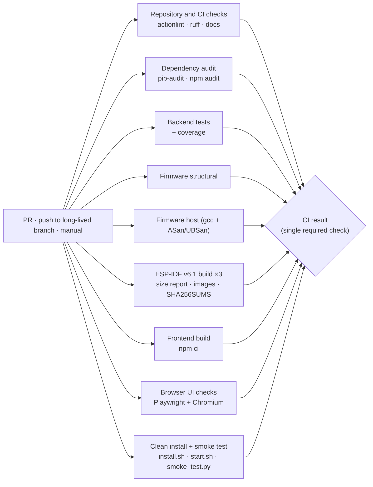

# Testing

The test suite exists so the system can change while its **core logic stays intact**. Every suite pins the contracts a module promises to the rest of the system, not its internals.

## Overview



## Running: `run_tests.py`

```bash
python3 -m venv .venv && . .venv/bin/activate   # once; any Python 3.12+ (3.14 tested)
pip install -r backend/requirements-dev.txt     # runtime deps + pytest, httpx, pyyaml
python run_tests.py                             # every default suite, ~35 s
```

Real output from the `v2` branch:
```
imPress test report
suite                      status    passed  failed  skipped      time
backend                     PASS       198       0        0     18.4s
firmware-static             PASS        14       0        0      0.5s
repo                        PASS        89       0        0      9.9s
host:class_c6               PASS         1       0        0      0.8s
host:class_c6:config        PASS         5       0        0      0.8s
host:class_c6:ws_command    PASS         2       0        0      1.0s
host:protocol               PASS         6       0        0      0.8s
host:protocol:mesh_dedup    PASS         4       0        0      0.8s
host:student                PASS         7       0        0      1.0s

Slowest 10 tests
     1.6s  tests.test_run_tests::test_end_to_end_json_report
     1.2s  backend.tests.test_device_ws_contract::test_device_socket_receives_firmware_contract
     …

 ALL PASSED   9 suites run, 0 skipped | 326 passed, 0 failed, 0 skipped | wall time 34.0s
```

With `--with-idf --with-frontend` the same run adds four builds: about 1.5 min per IDF project on a clean build, a few seconds when incremental.

| Option | Effect |
|---|---|
| `--list` | show every suite (default and optional) |
| `-s/--suite NAME` | run matching suites; prefixes work (`-s host`, `-s host:class_c6`), repeatable |
| `--with-idf` | also `idf.py build` all three projects (native IDF, else Docker `espressif/idf:v6.1`) |
| `--with-frontend` | also `npm ci && npm run build` |
| `--with-ui` | also run the browser UI checks (`ui_tests/`, Playwright) |
| `-x/--fail-fast` | stop after the first failing suite |
| `-v/--verbose` | stream each suite's full output |
| `--timeout SECONDS` | stop any suite that runs longer than this (default: no limit) |
| `--slowest N` | show the N slowest individual tests (default 10) |
| `--json FILE` | machine-readable report (per suite and per test case, with durations) |
| `--junit-dir DIR` | keep pytest JUnit XML files |
| `--coverage DIR` | measure backend line coverage (pytest-cov); Cobertura XML in `DIR`, total shown per suite and in the Markdown summary |
| `--markdown FILE` | Markdown report; written to `$GITHUB_STEP_SUMMARY` automatically in Actions |
| `--no-color` | plain output (`NO_COLOR` is honoured too) |

- **Statuses:**
  - **PASS**.
  - **FAIL:** a test failed, the suite timed out or was interrupted, or a **required Python package is missing**. Before starting a pytest suite, the runner checks that every package in its requirements file is installed in the interpreter running it. If not, the suite fails once with the exact install command instead of hundreds of import errors:
    ```
    ── backend: missing Python packages: aiosqlite, bcrypt, aiofiles
       │ /opt/homebrew/opt/python@3.14/bin/python3.14 has no aiosqlite, bcrypt, aiofiles.
       │ Install with:  /opt/homebrew/opt/python@3.14/bin/python3.14 -m pip install -r backend/requirements-dev.txt
    ```
  - **SKIP:** an optional tool is missing (no `cc`/`bash`, no `npm`, neither `idf.py` nor a reachable Docker daemon). A skip is reported with its reason and never counts as a failure.
- **Progress:** suite output is read as it is produced, so long suites never look frozen.
  - **On a terminal:** one live status line shows elapsed time and the suite's latest output, such as `... 1m02s  [609/1043] Building C object …` for an IDF build, pytest's `[ 45%]`, or npm.
  - **Off a terminal (CI, pipes):** a `... still running (1m30s): …` heartbeat every 30 s.
  - **`-v`:** streams everything.
- **First IDF run:** if the Docker image `espressif/idf:v6.1` (~12 GB) isn't present, the runner says it is pulling it before the build starts.
- **Ctrl-C:** stops the running suite and everything it started (process group; `docker run --init`, so the build container stops too), marks it *interrupted*, prints the report for the suites that ran, and exits 130.
- **Clean checkout:** running the suites leaves no untracked files. The frontend suite uses `npm install --no-package-lock`; build outputs are git-ignored.
- **Exit code:** 0 when nothing failed, 1 on any failure, 2 for an unknown suite name, 130 when interrupted.

Run a single test directly with pytest when iterating: `pytest backend/tests/test_device_api.py::test_attendance_paths -x`.

## Backend suites (`backend/tests`)

| File | Module(s) under test | What is pinned |
|---|---|---|
| `test_api_smoke.py` | app | boot on an empty DB, login, auth gates, SPA fallback |
| `test_class_join.py` | `POST /api/classes/join` | joining adds co-faculty, never replaces the owner; idempotent (#19) |
| `test_results_access.py` | quiz/poll read routes | details and results require class access (#20) |
| `test_cofaculty_access.py` | quizzes/polls | co-faculty run the full quiz and poll lifecycle; outsiders 403 (#21) |
| `test_quiz_correct_option.py` | quiz validation | `correct_option` bounds; an invalid question rejects the whole quiz (#22) |
| `test_auth_sessions.py` | `auth.py`, `routers/auth.py`, middleware, `services/sessions.py` | opaque tokens; bad/disabled logins; independent sessions; profile and password change; **idle vs hard expiry codes**; status endpoints don't extend sessions while real calls do; warning window; cleanup deletes only dead sessions |
| `test_ws_auth.py` | `ws/handler.py`, `ws/manager.py` | teacher session-token auth (valid, garbage, revoked, idle, inactive); device key; role-targeted broadcasts |
| `test_admin_users.py` | admin user routes | uniqueness, field limits, role filter, RBAC, deactivate/reset/delete guards, CSV import |
| `test_role_escalation.py` | role grants | closed role set; only super admins grant admin-level; no self role change |
| `test_classes_courses.py` | `routers/classes.py`, `courses.py`, `schedule.py` | course CRUD + unique codes; teacher visibility and cross-teacher 403; activate/deactivate; join errors; delete rights; schedule clash warnings |
| `test_class_create.py` | teacher class create | the 500 regression (#15) |
| `test_students.py` | `routers/students.py`, enrollment | enrollment-number format + upper-casing; duplicates; search/update; soft vs hard delete; enroll/unenroll; CSV row-level validation |
| `test_quiz_poll_lifecycle.py` | `routers/quizzes.py`, `polls.py` | state machines (draft/active/completed, live/planned/closed); access control; validation; result aggregation |
| `test_vote_answer_auth.py` | direct vote/answer routes | device key, registered device, option range, no ballot stuffing |
| `test_device_api.py` | `routers/device.py`, `services/presence.py` | register upsert/auto-link/classroom_code; heartbeat telemetry; status ping; attendance paths; firmware check/applied; offline sweep; presence tree |
| `test_device_batch_dedup.py` | `/api/device/batch` | validation and de-dup of mesh answers/votes; live-count broadcasts |
| `test_gateway_autolink.py` | gateway linking | non-gateways never steal a class's gateway (#17) |
| `test_device_ws_contract.py` | backend → C6 frames | the JSON contract fixture (shared with the firmware test) |
| `test_ota_download_gating.py` | firmware download | only the pushed version downloads |
| `test_firmware_upload.py` | admin firmware upload / OTA push | upload works, audit logs written, OTA prompt reaches the gateway socket |
| `test_secure_defaults.py` | `config.py`, `main.py` | DEBUG off; refuses default secrets; random first admin password; CORS allow-list; device key header |
| `test_session_token_storage.py` | `auth.py`, `database.py` | raw tokens never stored; legacy rows revoked; no DB files tracked by git |
| `test_core_utils.py` | `timeutil.py`, `schedule.py`, `firmware_store.py`, `ws/manager.py` | IST maths; time parsing and overlap (incl. overnight, symmetric); academic-window rules; semver/path safety; role routing and dead-socket pruning |

### How the backend fixtures work (`backend/tests/conftest.py`)

- Environment is set **before** the app is imported: a temp SQLite file, a non-default JWT secret and device key (`test-device-key`), and `IMPRESS_INITIAL_ADMIN_PASSWORD=admin123`.
- **bcrypt cost 4 in tests** (production keeps the default 12). Every test seeds an admin and logs users in, and at cost 12 bcrypt alone took over 3 minutes of the suite. `checkpw` reads the cost from the hash, so the code paths are identical.
- `client`: deletes the temp database file and recreates the schema (deleting the file sidesteps the `class_sessions`/`esp_devices`/`student_enrollments` foreign-key cycle that `drop_all` can't order), then starts the app with `TestClient` (lifespan runs, so the admin is seeded). At teardown it **drains the app's fire-and-forget DB tasks**, so no SQLite connection leaks into the next test.
- `db(fn)`: runs an async ORM function in the app's event loop and commits. Use it for setup the API doesn't offer (e.g. ageing a session).
- Helpers: `login()`, `auth()`, `make_user()`, `make_class(…, activate=True)`, `make_student()`, `DEVICE` (device-key headers).

### Writing a backend test

```python
from conftest import DEVICE, auth, login, make_class

def test_my_rule(client, db):
    h = auth(login(client))
    cid = make_class(client, h, activate=True)
    r = client.post("/api/device/register", headers=DEVICE, json={...})
    assert r.status_code == 200
```
- Assert **behaviour through the API**. Reach into the DB only to set up states the API can't produce, or to check stored rows.
- **WebSocket tests must never block forever.** After the action under test, broadcast a marker (`client.portal.call(manager.broadcast_to_class, cid, {"event": "marker"})`) and read until you see it.

## Firmware structural guards (`firmware/tests`)

Source-level checks (comments and strings stripped by `c_source.py`) for rules a unit test can't easily exercise on a host:

| File | Rule |
|---|---|
| `test_c6_batch_ownership.py` | only `spi_to_http_task`'s call tree touches the cJSON batch (#4) |
| `test_c6_ws_no_self_destroy.py` | nothing reachable from the WS event handler stops or destroys the WS client (#5) |
| `test_c6_ws_key_not_logged.py` | the API key goes in a header, never in the URI or a log line (#11) |
| `test_s3_config_before_mesh.py` | config loads before the mesh; `set_channel` results are checked (#7) |
| `test_s3_ota_safety.py` | rollback enabled; mark-valid after init; only a successful install reboots; the detach order (#13) |

## Host C suites (`firmware/*/test_host`)

Each suite compiles **real firmware sources** with `-Wall -Wextra -Werror -fsanitize=address,undefined`, against small fakes of the ESP-IDF APIs (`stubs/`, `firmware/test_support/nvs_fake.c`). `firmware/run_host_tests.sh` runs every `*/test_host/run*.sh`.

| Suite | Real code | Cases |
|---|---|---|
| `protocol/test_host/run.sh` | `protocol.c` | frame round-trip/CRC, limits, SPI record golden bytes, single + full-slot batch, truncation at every offset; **SPI slot codec and FIFO** (CRC check value, golden layout, empty/full/corrupt/short-buffer, FIFO order, overflow, wrap-around) (#29) |
| `protocol/test_host/run_mesh_dedup.sh` | `protocol.c` | message id ignores TTL/hops, window + wrap-around, ring eviction, **relay-storm simulation** (legacy vs new) |
| `class_c6/test_host/run.sh` | `spi_slave.c` + fake pointer-retaining SPI driver | idle polling never overfills the queue; descriptor survives stack reuse (ASan use-after-return); back-to-back frames delivered in order; corrupted S3 slot rejected and the link recovers; FIFO full; ready line (#29) |
| `class_c6/test_host/run_student_set.sh` | `student_set.c` | join/leave counts, heartbeats don't count students, S3 reboot clears the set, capacity, non-terminated radio input (#29) |
| `class_c6/test_host/run_ota_logic.sh` | `ota_logic.c` + vendored cJSON | firmware/check offers parsed; unverifiable offers refused (no/short hash, non-semver, zero size); SHA-256 comparison; prompts routed to this C6, the S3, or ignored (#34) |
| `class_c6/test_host/run_ws_command.sh` | `ws_command.c` + vendored cJSON | the backend contract fixture → frames → student structs; malformed and edge inputs |
| `class_c6/test_host/run_config.sh` | `config.c` + NVS fake | Kconfig defaults, NVS overlay, bad overrides fall back (#18), class id persistence, NVS recovery, boot counter persists across boots (#39) |
| `student/test_host/run.sh` | `config.c` + NVS fake | identity format, placeholder, set-once, reboot persistence, clear/re-provision, profile push rules, NVS recovery |

### Adding a host test
1. Create `firmware/<project>/test_host/test_<thing>.c` with a `main()` returning non-zero on failure.
2. Reuse `stubs/` (types and prototypes only) and `firmware/test_support/nvs_fake.c`.
3. Add `run_<thing>.sh` (copy an existing one). `run_host_tests.sh` picks it up automatically.

## Browser UI checks (`ui_tests/`)

These drive the real SPA in a headless browser against a real backend: `uvicorn` on a temporary database, one per test. They catch what API tests can't: JavaScript errors, wrong rendering, broken flows.

```bash
pip install -r ui_tests/requirements.txt
python -m playwright install chromium    # or use a local Google Chrome (picked up automatically)
python run_tests.py --with-ui            # or: pytest ui_tests
```

- **Fixtures** (`ui_tests/conftest.py`):
  - `server`: a fresh backend, giving `(base_url, api)`; `api` is an admin-authenticated JSON client for setting up data.
  - `page`: a browser page that **fails the test on any uncaught JavaScript error** and saves a full-page screenshot to `ui_tests/screenshots/<test>.png` (git-ignored, uploaded as a CI artifact).
  - `login()`: logs in through the real login form.

| File | Checks |
|---|---|
| `test_navigation.py` | a page the user left before it finished loading never paints over the page they moved to (#51); normal navigation and in-page re-renders still work |
| `test_deployments.py` | Deploy dialog preview (3 devices, 2 stages, canary 1), start, only the canary queued, a device report advances the rollout and the page refreshes itself, pause and resume (#38) |
| `test_firmware.py` | a random-bytes upload shows the parser's reason; a valid image uploads, is approved and becomes *latest*, history shows the approval, actions stay inside the table; *Push OTA* lists only approved images and queues the update; without approved images the dialog points to the Firmware page (#35/#36) |
| `test_csv_classes.py` | Classrooms import: an invalid plan shows the reasons (readable) and blocks; a valid file creates 3 sections in 2 courses, the list refreshes and shows the teacher as faculty; update mode re-plans as unchanged; export downloads them (#32) |
| `test_csv_questions.py` | template download; a file with invalid rows shows the reasons, readable without horizontal scrolling, and the add button is (visibly) disabled; a valid file fills the form and creates the quiz; an unusable file shows why (#31) |

## Repository and CI checks (`tests/`)

These protect the pipeline and the docs from silently drifting:

| File | Checks |
|---|---|
| `test_ci_workflow.py` | triggers (push on long-lived branches, every PR, manual); least-privilege permissions; concurrency cancellation; every job has a timeout; **actions pinned to commit SHAs with a release comment; Docker images pinned by digest**; **hash-locked Python install; frontend `npm ci` from its lockfile; ruff; pip-audit and npm audit; backend coverage; firmware SHA256SUMS**; **every runner suite is wired into CI**; **every firmware project is in the build matrix**; one IDF version everywhere; the result gate depends on every job; JUnit reports uploaded |
| `test_repo_hygiene.py` | no generated or compiled files tracked; no tracked file matches `.gitignore`; runtime paths ignored; first-party shell scripts are executable, have a shebang and are LF; `.gitattributes` rules; the runner finds every host suite |
| `test_docs_consistency.py` | every internal link and anchor resolves; code fences balanced and Mermaid types valid; **every API route appears in the API docs**; **every backend setting appears in the configuration guide**; the README has no emoji and keeps its core sections |
| `test_run_tests.py` | runner discovery and selection; JUnit and host-output parsing; SKIP on missing tools; **missing-package preflight** (requirements parsing with `-r` includes, one FAIL with the install command); failure reporting; Markdown report; **live status line, CI heartbeat, ANSI and partial-line handling, `--timeout`, Ctrl-C kills the whole process group, interrupted run prints the report and exits 130**; `docker run --init` and the daemon-down SKIP; frontend uses `npm ci` (never rewrites the lockfile); coverage parsing; an end-to-end JSON report; exit code 2 on an unknown suite |

## Continuous integration

`.github/workflows/ci.yml` runs on every pull request, on pushes to the long-lived branches (`main`, `v2`, `v3`, `varun/**`) and on demand (`workflow_dispatch`). Feature branches are built through their pull request, so a push isn't built twice.



| Job | Runs | Artifacts |
|---|---|---|
| Repository and CI checks | install the hash-locked set; actionlint; `ruff check` (pyflakes rules); byte-compile; `run_tests.py --suite repo` | JUnit XML |
| Dependency audit | `pip-audit --strict` on `backend/requirements-lock.txt`; `npm audit --audit-level=high` | – |
| Backend tests | `run_tests.py --suite backend --coverage reports` (Python 3.12) | JUnit XML, `coverage-backend.xml` |
| Firmware structural | `run_tests.py --suite firmware-static` | – |
| Firmware host | `run_tests.py --suite host` (gcc) | – |
| ESP-IDF v6.1 build | `idf.py build` + `idf.py size` for `class_c6`, `class_s3`, `student`; `sha256sum` of every image | `.bin` images + `SHA256SUMS` (7 days) |
| Frontend build | `run_tests.py --suite frontend`: `npm ci` + `vite build` (Node 20) | – |
| Browser UI checks | `playwright install --with-deps chromium`; `run_tests.py --suite ui` | screenshots + JUnit XML |
| Clean install + smoke test | `scripts/install.sh` into a fresh venv, `scripts/start.sh`, then `scripts/smoke_test.py` over HTTP (#42) | server log in the job output |
| **CI result** | fails unless every job above succeeded | – |

Pipeline properties:
- **`permissions: contents: read`**: least privilege.
- **Pinned supply chain:**
  - Every action is referenced by commit SHA, with the release in a trailing comment (`# v7.0.1`).
  - The IDF and actionlint images are referenced by digest.
  - `run_tests.py` uses the same IDF digest locally.
- **Deterministic dependencies:**
  - **CI** installs `backend/requirements-lock.txt` with `--require-hashes`.
  - **Frontend:** CI runs `npm ci` from `frontend/package-lock.json`.
  - **Developers** can keep installing the ranges in `requirements*.txt`.
- **`concurrency`**: a newer push cancels the running pipeline for the same ref.
- **Per-job `timeout-minutes`**: a hang can't hold a runner.
- **The runner's report appears in each job's summary page.** That includes the coverage table.

Mark **CI result** as the required status check in branch protection.

### Updating pinned dependencies

| What | How |
|---|---|
| Python packages | Edit `backend/requirements*.txt`, then regenerate the lock (`pip install uv`, then `uv pip compile --generate-hashes --python-version 3.12 --python-platform x86_64-unknown-linux-gnu --output-file backend/requirements-lock.txt backend/requirements-dev.txt`). Commit both. |
| Frontend packages | `cd frontend && npm install <pkg>@<ver>` with Node 20 (it updates `package-lock.json`). Commit both. |
| An action | Look up the release's commit (`gh api repos/<owner>/<action>/commits/<tag> --jq .sha`), replace the SHA, update the `# vX.Y.Z` comment. |
| The IDF image | `docker buildx imagetools inspect espressif/idf:<tag>` gives the index digest. Update `ci.yml` and `IDF_IMAGE` in `run_tests.py` together (a repository test checks they match). |

## What is *not* automatically tested

- On-device behaviour (radio, SPI timing, real flash): needs a hardware soak (see [troubleshooting](troubleshooting.md)).
- The React dev UI beyond "it builds". The vanilla SPA is covered by `ui_tests/` for the flows listed there.
- Firmware `main.c` orchestration on the C6/S3 (covered structurally, not executed).
