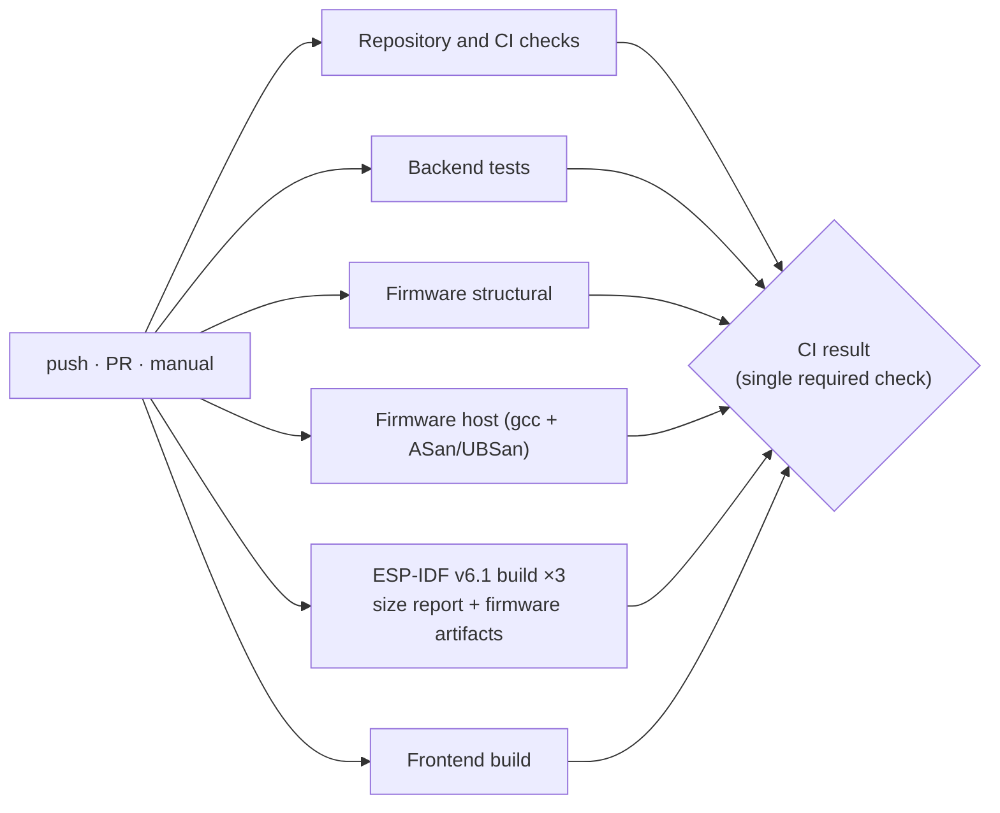

# Testing

The test suite exists so the system can change while its **core logic stays intact**. Every suite pins the contracts a module promises to the rest of the system, not its internals.

## Overview


## Running: `run_tests.py`

```bash
pip install -r backend/requirements-dev.txt   # pytest, httpx, pyyaml
python run_tests.py                           # every default suite, ~4 min
```

Real output from the `v2` branch (slowest list abridged):
```
imPress test report
suite                      status    passed  failed  skipped      time
backend                     PASS       198       0        0   3m19.4s
firmware-static             PASS        14       0        0      0.4s
repo                        PASS        76       0        0      3.0s
host:class_c6               PASS         1       0        0      0.7s
host:class_c6:config        PASS         5       0        0      0.6s
host:class_c6:ws_command    PASS         2       0        0      0.7s
host:protocol               PASS         6       0        0      0.5s
host:protocol:mesh_dedup    PASS         4       0        0      0.6s
host:student                PASS         7       0        0      0.6s

Slowest 10 tests
     3.0s  backend.tests.test_cofaculty_access::test_cofaculty_runs_quiz_end_to_end
     3.0s  backend.tests.test_cofaculty_access::test_cofaculty_runs_poll
     3.0s  backend.tests.test_cofaculty_access::test_outsider_still_forbidden_and_owner_and_admin_allowed
     …

 ALL PASSED   9 suites run, 0 skipped | 313 passed, 0 failed, 0 skipped | wall time 3m26.6s
```

| Option | Effect |
|---|---|
| `--list` | show every suite (default and optional) |
| `-s/--suite NAME` | run matching suites; prefixes work (`-s host`, `-s host:class_c6`), repeatable |
| `--with-idf` | also `idf.py build` all three projects (native IDF, else Docker `espressif/idf:v6.1`) |
| `--with-frontend` | also `npm install && npm run build` |
| `-x/--fail-fast` | stop after the first failing suite |
| `-v/--verbose` | stream each suite's full output |
| `--slowest N` | show the N slowest individual tests (default 10) |
| `--json FILE` | machine-readable report (per suite and per test case, with durations) |
| `--junit-dir DIR` | keep pytest JUnit XML files |
| `--markdown FILE` | Markdown report; written to `$GITHUB_STEP_SUMMARY` automatically in Actions |
| `--no-color` | plain output (`NO_COLOR` is honoured too) |

- **Statuses:** PASS, FAIL, or **SKIP** when a prerequisite is missing (no `cc`, no Docker, pytest not installed). A skip is reported with its reason and never counts as a failure.
- **Exit code:** 0 when nothing failed, 1 on any failure, 2 for an unknown suite name.

Run a single test directly with pytest when iterating: `pytest backend/tests/test_device_api.py::test_attendance_paths -x`.

## Backend suites (`backend/tests`)

| File | Module(s) under test | What is pinned |
|---|---|---|
| `test_api_smoke.py` | app | boot on an empty DB, login, auth gates, SPA fallback |
| `test_class_join.py` | `POST /api/classes/join` | joining adds co-faculty, never replaces the owner; idempotent (#19) |
| `test_results_access.py` | quiz/poll read routes | details and results require class access (#20) |
| `test_cofaculty_access.py` | quizzes/polls | co-faculty run the full quiz and poll lifecycle; outsiders 403 (#21) |
| `test_quiz_correct_option.py` | quiz validation | `correct_option` bounds; an invalid question rejects the whole quiz (#22) |
| `test_auth_sessions.py` | `auth.py`, `routers/auth.py`, middleware, `services/sessions.py` | opaque tokens; bad/disabled logins; independent sessions; profile and password change; **idle vs hard expiry codes**; status endpoints don't extend sessions while real calls do; warning window; cleanup deletes only dead sessions |
| `test_ws_auth.py` | `ws/handler.py`, `ws/manager.py` | teacher session-token auth (valid, garbage, revoked, idle, inactive); device key; role-targeted broadcasts |
| `test_admin_users.py` | admin user routes | uniqueness, field limits, role filter, RBAC, deactivate/reset/delete guards, CSV import |
| `test_role_escalation.py` | role grants | closed role set; only super admins grant admin-level; no self role change |
| `test_classes_courses.py` | `routers/classes.py`, `courses.py`, `schedule.py` | course CRUD + unique codes; teacher visibility and cross-teacher 403; activate/deactivate; join errors; delete rights; schedule clash warnings |
| `test_class_create.py` | teacher class create | the 500 regression (#15) |
| `test_students.py` | `routers/students.py`, enrollment | enrollment-number format + upper-casing; duplicates; search/update; soft vs hard delete; enroll/unenroll; CSV row-level validation |
| `test_quiz_poll_lifecycle.py` | `routers/quizzes.py`, `polls.py` | state machines (draft/active/completed, live/planned/closed); access control; validation; result aggregation |
| `test_vote_answer_auth.py` | direct vote/answer routes | device key, registered device, option range, no ballot stuffing |
| `test_device_api.py` | `routers/device.py`, `services/presence.py` | register upsert/auto-link/classroom_code; heartbeat telemetry; status ping; attendance paths; firmware check/applied; offline sweep; presence tree |
| `test_device_batch_dedup.py` | `/api/device/batch` | validation and de-dup of mesh answers/votes; live-count broadcasts |
| `test_gateway_autolink.py` | gateway linking | non-gateways never steal a class's gateway (#17) |
| `test_device_ws_contract.py` | backend → C6 frames | the JSON contract fixture (shared with the firmware test) |
| `test_ota_download_gating.py` | firmware download | only the pushed version downloads |
| `test_firmware_upload.py` | admin firmware upload / OTA push | upload works, audit logs written, OTA prompt reaches the gateway socket |
| `test_secure_defaults.py` | `config.py`, `main.py` | DEBUG off; refuses default secrets; random first admin password; CORS allow-list; device key header |
| `test_session_token_storage.py` | `auth.py`, `database.py` | raw tokens never stored; legacy rows revoked; no DB files tracked by git |
| `test_core_utils.py` | `timeutil.py`, `schedule.py`, `firmware_store.py`, `ws/manager.py` | IST maths; time parsing and overlap (incl. overnight, symmetric); academic-window rules; semver/path safety; role routing and dead-socket pruning |

### How the backend fixtures work (`backend/tests/conftest.py`)

- Environment is set **before** the app is imported: a temp SQLite file, a non-default JWT secret and device key (`test-device-key`), and `IMPRESS_INITIAL_ADMIN_PASSWORD=admin123`.
- `client`: drops and recreates all tables, then starts the app with `TestClient` (lifespan runs, so the admin is seeded). At teardown it **drains the app's fire-and-forget DB tasks**, so no SQLite connection leaks into the next test.
- `db(fn)`: runs an async ORM function in the app's event loop and commits. Use it for setup the API doesn't offer (e.g. ageing a session).
- Helpers: `login()`, `auth()`, `make_user()`, `make_class(…, activate=True)`, `make_student()`, `DEVICE` (device-key headers).

### Writing a backend test

```python
from conftest import DEVICE, auth, login, make_class

def test_my_rule(client, db):
    h = auth(login(client))
    cid = make_class(client, h, activate=True)
    r = client.post("/api/device/register", headers=DEVICE, json={...})
    assert r.status_code == 200
```
- Assert **behaviour through the API**. Reach into the DB only to set up states the API can't produce, or to check stored rows.
- **WebSocket tests must never block forever.** After the action under test, broadcast a marker (`client.portal.call(manager.broadcast_to_class, cid, {"event": "marker"})`) and read until you see it.

## Firmware structural guards (`firmware/tests`)

Source-level checks (comments and strings stripped by `c_source.py`) for rules a unit test can't easily exercise on a host:

| File | Rule |
|---|---|
| `test_c6_batch_ownership.py` | only `spi_to_http_task`'s call tree touches the cJSON batch (#4) |
| `test_c6_ws_no_self_destroy.py` | nothing reachable from the WS event handler stops or destroys the WS client (#5) |
| `test_c6_ws_key_not_logged.py` | the API key goes in a header, never in the URI or a log line (#11) |
| `test_s3_config_before_mesh.py` | config loads before the mesh; `set_channel` results are checked (#7) |
| `test_s3_ota_safety.py` | rollback enabled; mark-valid after init; only a successful install reboots; the detach order (#13) |

## Host C suites (`firmware/*/test_host`)

Each suite compiles **real firmware sources** with `-Wall -Wextra -Werror -fsanitize=address,undefined`, against small fakes of the ESP-IDF APIs (`stubs/`, `firmware/test_support/nvs_fake.c`). `firmware/run_host_tests.sh` runs every `*/test_host/run*.sh`.

| Suite | Real code | Cases |
|---|---|---|
| `protocol/test_host/run.sh` | `protocol.c` | frame round-trip/CRC, limits, SPI record golden bytes, single + full-slot batch, truncation at every offset |
| `protocol/test_host/run_mesh_dedup.sh` | `protocol.c` | message id ignores TTL/hops, window + wrap-around, ring eviction, **relay-storm simulation** (legacy vs new) |
| `class_c6/test_host/run.sh` | `spi_slave.c` + fake pointer-retaining SPI driver | idle polling never overfills the queue; descriptor survives stack reuse (ASan use-after-return) |
| `class_c6/test_host/run_ws_command.sh` | `ws_command.c` + vendored cJSON | the backend contract fixture → frames → student structs; malformed and edge inputs |
| `class_c6/test_host/run_config.sh` | `config.c` + NVS fake | Kconfig defaults, NVS overlay, bad overrides fall back (#18), class id persistence, NVS recovery |
| `student/test_host/run.sh` | `config.c` + NVS fake | identity format, placeholder, set-once, reboot persistence, clear/re-provision, profile push rules, NVS recovery |

### Adding a host test
1. Create `firmware/<project>/test_host/test_<thing>.c` with a `main()` returning non-zero on failure.
2. Reuse `stubs/` (types and prototypes only) and `firmware/test_support/nvs_fake.c`.
3. Add `run_<thing>.sh` (copy an existing one). `run_host_tests.sh` picks it up automatically.

## Repository and CI checks (`tests/`)

These protect the pipeline and the docs from silently drifting:

| File | Checks |
|---|---|
| `test_ci_workflow.py` | triggers (push, PR, manual); least-privilege permissions; concurrency cancellation; every job has a timeout; actions pinned to major versions; **every runner suite is wired into CI**; **every firmware project is in the build matrix**; one IDF version everywhere; the result gate depends on every job; JUnit reports uploaded |
| `test_repo_hygiene.py` | no generated or compiled files tracked; no tracked file matches `.gitignore`; runtime paths ignored; first-party shell scripts are executable, have a shebang and are LF; `.gitattributes` rules; the runner finds every host suite |
| `test_docs_consistency.py` | every internal link and anchor resolves; code fences balanced and Mermaid types valid; **every API route appears in the API docs**; **every backend setting appears in the configuration guide**; the README has no emoji and keeps its core sections |
| `test_run_tests.py` | runner discovery and selection; JUnit and host-output parsing; SKIP on missing tools; failure reporting; Markdown report; an end-to-end JSON report; exit code 2 on an unknown suite |

## Continuous integration

`.github/workflows/ci.yml` runs on every push, every pull request and on demand (`workflow_dispatch`).



| Job | Runs | Artifacts |
|---|---|---|
| Repository and CI checks | byte-compile sources; `run_tests.py --suite repo` | JUnit XML |
| Backend tests | `run_tests.py --suite backend` (Python 3.12) | JUnit XML |
| Firmware structural | `run_tests.py --suite firmware-static` | – |
| Firmware host | `run_tests.py --suite host` (gcc) | – |
| ESP-IDF v6.1 build | `idf.py build` + `idf.py size` for `class_c6`, `class_s3`, `student` | `.bin` images (7 days) |
| Frontend build | `run_tests.py --suite frontend` (Node 20) | – |
| **CI result** | fails unless every job above succeeded | – |

Pipeline properties:
- **`permissions: contents: read`**: least privilege.
- **`concurrency`**: a newer push cancels the running pipeline for the same ref.
- **Per-job `timeout-minutes`**: a hang can't hold a runner.
- **pip caching.**
- **The runner's report appears in each job's summary page.**

Mark **CI result** as the required status check in branch protection.

## What is *not* automatically tested

- On-device behaviour (radio, SPI timing, real flash): needs a hardware soak (see [troubleshooting](troubleshooting.md)).
- The vanilla SPA and the React UI beyond "it builds".
- Firmware `main.c` orchestration on the C6/S3 (covered structurally, not executed).
