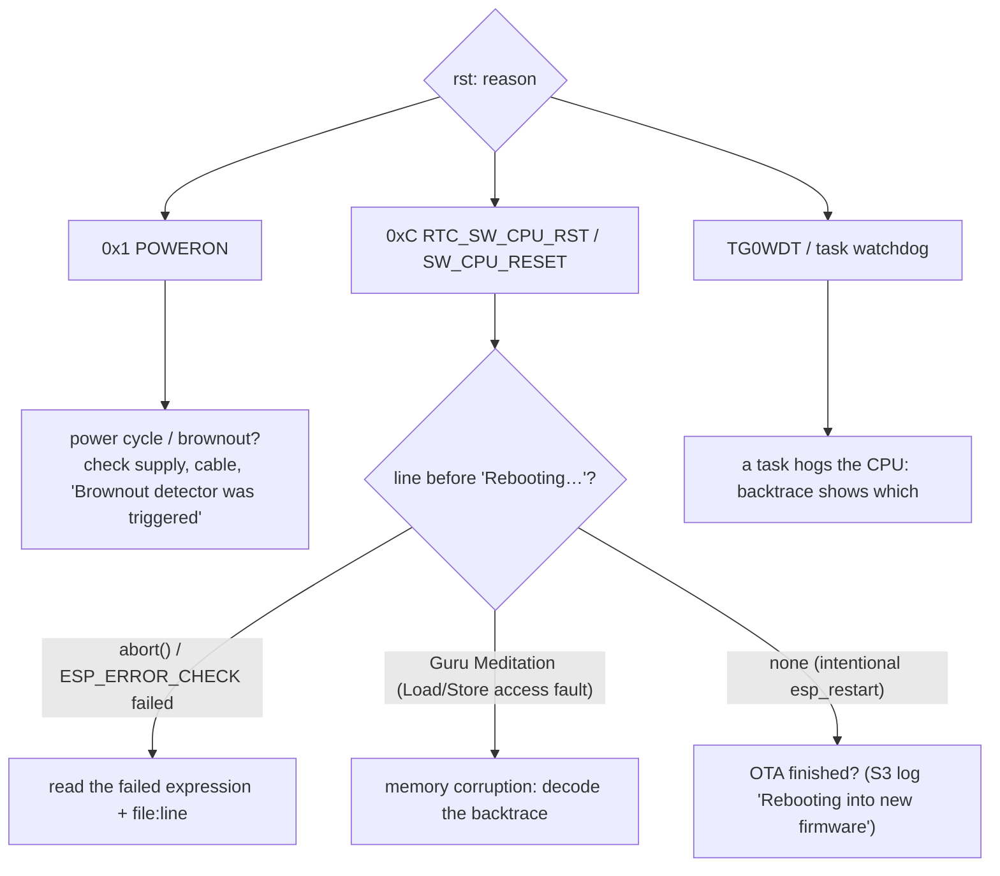

# Troubleshooting

## Start with the reset reason

Every ESP32 boot prints `rst:0x… (REASON)`. `idf.py monitor` decodes panic backtraces when it is given the matching `.elf`.

## Known reset causes (all fixed on `v2`)

| Log signature | Board | Cause | Fix |
|---|---|---|---|
| `ESP_ERROR_CHECK failed: … ESP_ERR_WIFI_NOT_STARTED … esp_wifi_set_channel`, repeating `RTC_SW_CPU_RST` | student | channel set before Wi-Fi start (536-reboot loop in the original logs) | fixed before v2; failures are now logged, not fatal (#7) |
| random `Load/Store access fault`, `CORRUPT HEAP`; `spi2http` stalls once the S3 link is busy | C6 | SPI slave ISR used a stack descriptor that was gone | #1 |
| `CORRUPT HEAP` around heartbeats | C6 | two tasks mutated one cJSON batch | #4 |
| crash right after a class reassignment | C6 | WS client destroyed from its own task | #5 |
| hub reboots after any OTA prompt | S3 | no-op OTA used to restart | #13 |

If resets persist on `v2`, log `esp_reset_reason()` at boot and run a soak with `CONFIG_HEAP_POISONING_COMPREHENSIVE=y` on the C6.

## Connectivity

| Symptom | Likely cause | Check / fix |
|---|---|---|
| C6: `WiFi disconnected — retrying` every ~2.4 s | wrong SSID/password; AP weaker than WPA2-PSK; 5 GHz-only AP | NVS `wifi_ssid`/`wifi_pass`; enable 2.4 GHz WPA2 |
| C6 online but `HTTP POST failed` | wrong `backend_h`/`backend_p`; backend bound to 127.0.0.1; firewall | `curl http://<host>:8000/health` from the same network |
| backend logs 403 for device calls | API key mismatch | NVS `api_key` = `IMPRESS_DEVICE_API_KEY` |
| C6 WS closed with 4401 | key mismatch, or an old firmware sending `?api_key=` with a wrong value | same as above |
| native USB port vanishes at C6 boot | GPIO12/13 are the SPI ready lines | use the UART port ([hardware](../reference/hardware.md)) |
| teacher dashboard never updates | WS rejected (4401) or the proxy doesn't upgrade `/ws/` | browser devtools → WS frames; [proxy config](deployment.md#tls-reverse-proxy-websockets-included) |
| backend won't start: *Refusing to start with default secrets* | production mode with public secrets | set the named variables or `IMPRESS_DEBUG=true` locally |

## Mesh and students

| Symptom | Check |
|---|---|
| student shows "NO ID" | provision an enrollment number (buttons/serial); CONFIRM + C at boot clears it |
| student stuck on "Connecting to mesh…" | S3 powered? Same `MESH_WIFI_CHANNEL`? The S3 log should print `Mesh master initialized, channel=N` and `New student: enroll=…` |
| students far from the hub never get questions | that was a pre-v2 bug (relayed root traffic not delivered); flash v2 student firmware |
| the same answer counted several times | pre-v2 relay storm (#6); v2 stores one answer per (quiz, question, student) |
| answers never reach the dashboard | C6 log `Batch flush N items`; the batch response `skipped` > 0 means unknown enrollment / inactive quiz / out-of-range option / duplicate |

## Backend data

| Symptom | Check |
|---|---|
| a gateway linked to the wrong class / presence shows the wrong root | fixed by #17 for new registrations; repair existing rows by re-registering the C6 with its `classroom_code` or admin re-link |
| sessions expire unexpectedly | 60 min idle / 6 h hard by default; polling doesn't count as activity (by design) |
| `database is locked` | multiple workers or external writers; run **one** uvicorn worker |
| timestamps look 5:30 off | the DB stores naive IST; legacy UTC rows → `backend/migrate_utc_to_ist.py` |

## Collecting evidence for a bug report

1. The full boot log from power-on through the failure (`idf.py monitor | tee log.txt`).
2. The firmware commit and `ELF file SHA256` from the boot banner.
3. The backend log around the time, plus the related request/response.
4. For data issues: `GET /api/admin/activity` around the time.
