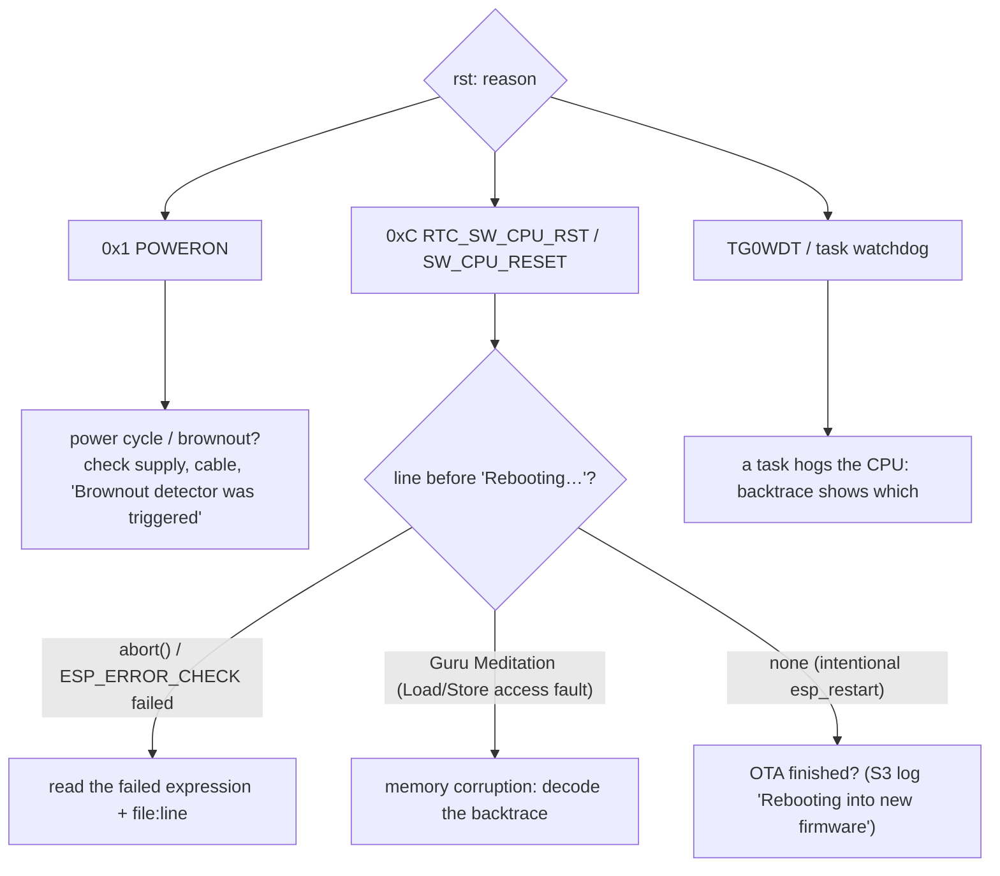

# Troubleshooting

## Contents

- [Setup problems](#setup-problems): the server, the container and the first boot of each board
- [Start with the reset reason](#start-with-the-reset-reason)
- [Connectivity](#connectivity)
- [Mesh and students](#mesh-and-students)
- [Backend data](#backend-data)
- [Collecting evidence for a bug report](#collecting-evidence-for-a-bug-report)

## Setup problems

The release page lists the most common of these. Check them in order: server, then gateway, then hub, then student modules.

### Server

| Symptom | Cause | Fix |
|---|---|---|
| `scripts/install.sh` stops with *imPress needs Python >= 3.12* | the default `python3` is older | install Python 3.12 or later, then `PYTHON=python3.12 scripts/install.sh` |
| `pip` fails to build a package (bcrypt, pydantic-core) | not Linux x86_64, and no prebuilt wheel for this platform | install a C compiler and Python headers, or use the container image |
| The server stops with *Refusing to start with default secrets* | `backend/.env` holds the public example secrets | run `scripts/install.sh` again (it generates new secrets), or set `IMPRESS_JWT_SECRET` and `IMPRESS_DEVICE_API_KEY` |
| The first admin password is lost | it is printed only on the first start, and only when the database has no users | another super admin resets it (**Users** page, **Reset pwd**). On a new installation with no data yet, you can instead stop the server, delete `backend/impress.db`, set `IMPRESS_INITIAL_ADMIN_PASSWORD` and start again |
| The web app opens on the server but not from other computers | the server listens on 127.0.0.1 | start with `IMPRESS_HOST=0.0.0.0`, and open port 8000 in the firewall |
| *Address already in use* | another process uses port 8000 | stop it, or start with `IMPRESS_PORT=8080` (and use that port on the gateways) |
| The upgrade stops and names two classes | two classes share a course and a section | give one of them another section label, then start again ([migrations](../engineering/DATABASE_MIGRATIONS.md)) |

### Container

| Symptom | Cause | Fix |
|---|---|---|
| `docker pull` asks for credentials | the package is private | the repository owner makes it public once (package settings) |
| *exec format error* or very slow start | the host is not x86_64 (for example a Raspberry Pi or an Apple silicon Mac without emulation) | use an x86_64 host, or install with `scripts/install.sh` |
| The data is gone after `docker run` | the container started without the volume | always pass `-v impress-data:/data`; the database and the secrets are in that volume |
| `docker logs` does not show the admin password | the volume already holds a database from an earlier start | use the password from that start, or see "The first admin password is lost" above |
| `docker inspect` shows `unhealthy` | the server did not answer `/health` | `docker logs impress` shows the reason (often the TLS variables) |

### Gateway and hub (first boot)

| Symptom | Cause | Fix |
|---|---|---|
| The native USB port disappears after flashing the gateway | GPIO12/13 are the SPI ready lines | flash and monitor through the UART port ([hardware](../reference/hardware.md)) |
| `WiFi disconnected — retrying` | wrong Wi-Fi name or password, or a 5 GHz-only network | set them in `idf.py menuconfig` (or the settings partition) and erase the flash before flashing |
| The gateway connects to Wi-Fi but never shows `ONLINE` | wrong server address or port, or the server listens on 127.0.0.1 | `curl http://<server>:8000/health` from the same network; check `BACKEND_HOST` and `BACKEND_PORT` |
| The server log shows 401 or 403 for device calls | the device API key does not match | set `CONFIG_DEVICE_API_KEY` to the server's `IMPRESS_DEVICE_API_KEY` |
| The log shows `First boot — writing … defaults` after you wrote a settings partition | the partition has no `init_done` (gateway) or `init` (hub) flag | rebuild it with the flag ([releases: flash prebuilt images](releases.md#flash-prebuilt-images)) |
| `s3_link_ok` stays false | SPI wiring, or no common ground | check the six signals and GND ([wiring](../reference/hardware.md#s3--c6-wiring)) |
| `Brownout detector was triggered` | weak USB cable or supply | use a short cable and a 5 V supply that gives at least 500 mA |

### Student modules

| Symptom | Cause | Fix |
|---|---|---|
| The display shows `NO ID` | no enrollment number yet | enter the 10-character number with the buttons (A next, B previous, C delete, CONFIRM save) |
| `No mesh found` | the hub is off, or a different Wi-Fi channel | power the hub first; use the same `MESH_WIFI_CHANNEL` on both |
| Answers do not count | the enrollment number is not registered, or the class is not active | add the student on the Students page; activate the class |

## Start with the reset reason

Every ESP32 boot prints `rst:0x… (REASON)`. `idf.py monitor` decodes panic backtraces when it is given the matching `.elf`.

## Known reset causes (all fixed on `v2`)

| Log signature | Board | Cause | Fix |
|---|---|---|---|
| `ESP_ERROR_CHECK failed: … ESP_ERR_WIFI_NOT_STARTED … esp_wifi_set_channel`, repeating `RTC_SW_CPU_RST` | student | channel set before Wi-Fi start (536-reboot loop in the original logs) | fixed before v2; failures are now logged, not fatal (#7) |
| random `Load/Store access fault`, `CORRUPT HEAP`; `spi2http` stalls once the S3 link is busy | C6 | SPI slave ISR used a stack descriptor that was gone | #1 |
| `CORRUPT HEAP` around heartbeats | C6 | two tasks mutated one cJSON batch | #4 |
| crash right after a class reassignment | C6 | WS client destroyed from its own task | #5 |
| hub reboots after any OTA prompt | S3 | no-op OTA used to restart | #13 |

If resets persist on `v2`, log `esp_reset_reason()` at boot and run a soak with `CONFIG_HEAP_POISONING_COMPREHENSIVE=y` on the C6.

## Connectivity

| Symptom | Likely cause | Check / fix |
|---|---|---|
| C6: `WiFi disconnected — retrying` every ~2.4 s | wrong SSID/password; AP weaker than WPA2-PSK; 5 GHz-only AP | NVS `wifi_ssid`/`wifi_pass`; enable 2.4 GHz WPA2 |
| C6 online but `HTTP POST failed` | wrong `backend_h`/`backend_p`; backend bound to 127.0.0.1; firewall | `curl http://<host>:8000/health` from the same network |
| backend logs 403 for device calls | API key mismatch | NVS `api_key` = `IMPRESS_DEVICE_API_KEY` |
| C6 WS closed with 4401 | key mismatch, or an old firmware sending `?api_key=` with a wrong value | same as above |
| native USB port vanishes at C6 boot | GPIO12/13 are the SPI ready lines | use the UART port ([hardware](../reference/hardware.md)) |
| teacher dashboard never updates | WS rejected (4401) or the proxy doesn't upgrade `/ws/` | browser devtools → WS frames; [proxy config](deployment.md#tls-reverse-proxy-websockets-included) |
| backend won't start: *Refusing to start with default secrets* | production mode with public secrets | set the named variables or `IMPRESS_DEBUG=true` locally |

## Mesh and students

| Symptom | Check |
|---|---|
| student shows "NO ID" | provision an enrollment number (buttons/serial); CONFIRM + C at boot clears it |
| student stuck on "Connecting to mesh…" | S3 powered? Same `MESH_WIFI_CHANNEL`? The S3 log should print `Mesh master initialized, channel=N` and `New student: enroll=…` |
| students far from the hub never get questions | that was a pre-v2 bug (relayed root traffic not delivered); flash v2 student firmware |
| the same answer counted several times | pre-v2 relay storm (#6); v2 stores one answer per (quiz, question, student) |
| answers never reach the dashboard | C6 log `Batch flush N items`; the batch response `skipped` > 0 means unknown enrollment / inactive quiz / out-of-range option / duplicate |

## Backend data

| Symptom | Check |
|---|---|
| a gateway linked to the wrong class / presence shows the wrong root | fixed by #17 for new registrations; repair existing rows by re-registering the C6 with its `classroom_code` or admin re-link |
| sessions expire unexpectedly | 60 min idle / 6 h hard by default; polling doesn't count as activity (by design) |
| `database is locked` | multiple workers or external writers; run **one** uvicorn worker |
| timestamps look 5:30 off | the DB stores naive IST; legacy UTC rows → `backend/migrate_utc_to_ist.py` |

## Collecting evidence for a bug report

1. The full boot log from power-on through the failure (`idf.py monitor | tee log.txt`).
2. The firmware commit and `ELF file SHA256` from the boot banner.
3. The backend log around the time, plus the related request/response.
4. For data issues: `GET /api/admin/activity` around the time.
