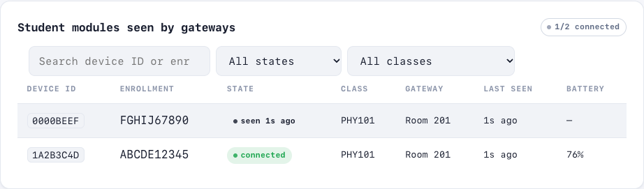
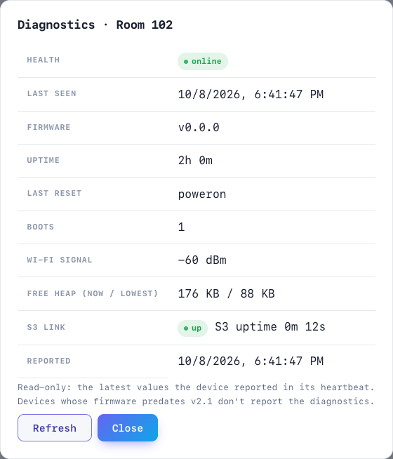

# Changelog: v2.1

`varun/v2.1` = `v2` (`4fce7f7`) + the v2.1 backlog (#26–#44). Each change lands through its own branch and pull request into `varun/v2.1`. `main`, `v2` and `v3` are not modified. Evidence for the plan: [system audit](../engineering/SYSTEM_AUDIT.md) and [v2/v3 comparison](../engineering/V2_V3_COMPARISON.md).

| Issue | Area | Branch / PR | Change | Tests |
|---|---|---|---|---|
| [#27](https://github.com/Kush-Kelaiya22/imPress/issues/27) | docs | `docs/v2.1-engineering-audit` / [#45](https://github.com/Kush-Kelaiya22/imPress/pull/45) | System audit and v2/v3 comparison | docs consistency suite |
| [#29](https://github.com/Kush-Kelaiya22/imPress/issues/29) | firmware | `fix/v2.1-v3-firmware-link` | `v3`'s S3↔C6 link fixes ported, with its regressions removed. **Adopted:** standard full-duplex SPI on both ends (v2's quad half-duplex master never matched the slave driver), 10 MHz default clock (Kconfig `SPI_CLOCK_MHZ`), 8-slot TX FIFOs on both sides (v2 overwrote queued frames), C6 services SPI every 2 ms regardless of Wi-Fi, online-student set from JOIN/LEAVE, single-encoded mesh heartbeats, C6 DIO flash. **Adapted:** shared slot codec/FIFO/CRC in `protocol` instead of two driver copies; C6 RX CRC check restored; S3 removes a payload only after a successful transfer; student set cleared when the S3 reboots; offline batch bounded to 200 items and flushed in `batch_max` chunks (it was truncated past 4 KB) with retry on network/5xx; batch JSON logged at DEBUG only; compile-time guard on the tick rate the 2 ms poll needs. **Rejected:** overlapping `memcpy` in the S3 heartbeat, real-looking `DEFAULT_ENROLLMENT`, `docs.zip`. | `host:protocol` (+4), `host:class_c6` (FIFO order, CRC reject, FIFO full, ready line), `host:class_c6:student_set` (new, 4), `firmware/tests/test_spi_link.py` (new, 13; 11 fail on `v2`, 11 on `v3`), IDF builds |
| [#26](https://github.com/Kush-Kelaiya22/imPress/issues/26) | CI/CD | `fix/v2.1-ci-cd-recovery` | Pipeline hardening. **Pinning:** actions by commit SHA (Node 24 v7 releases), IDF and actionlint images by digest (the runner uses the same IDF digest). **Deterministic dependencies:** hash-locked `backend/requirements-lock.txt` installed with `--require-hashes`; `frontend/package-lock.json` with `npm ci`. **New jobs:** `ruff` (pyflakes rules; 13 unused imports removed) and a dependency audit job (`pip-audit`, `npm audit --audit-level=high`). **Fixed findings:** vite 5→8 (high: `server.fs.deny` bypass) and react-router-dom 6→7 (open redirect). **Reporting:** backend coverage (79.1%) in the job summary; firmware `SHA256SUMS` artifact. **Triggers:** push builds only long-lived branches, so a PR isn't built twice. | `tests/test_ci_workflow.py` (+9), `tests/test_run_tests.py` (+1) |
| [#41](https://github.com/Kush-Kelaiya22/imPress/issues/41) | database | `fix/v2.1-database-consistency` | **Versioned migrations** (`migrations.py`, `schema_migrations`). Each step is atomic (explicit `BEGIN IMMEDIATE`), startup stops on failure (was: errors swallowed), and an automatic backup is taken before migrating an existing file. **Foreign keys enforced** on every connection. **Unique indexes** for answers and votes (per student and per device), enrollments, and course sections; duplicates in old data resolved first-one-wins, duplicate sections block with instructions. **Dangling references repaired** (`PRAGMA foreign_key_check`). **Fixed:** the teacher class delete failed (`NOT NULL constraint failed: polls.class_session_id`); a hard-deleted student's answers and votes pointed at a deleted row (now anonymised); deletes left student modules linked to removed enrollments. **Races** give clean 400/409/503 instead of 500 (`commit_or_conflict`). `/health` reports `schema_version`. | `test_db_integrity.py` (12, 11 failed before), `test_migrations.py` (5) |
| [#49](https://github.com/Kush-Kelaiya22/imPress/issues/49) | backend + UI | `fix/v2.1-device-option-limits` | Quizzes and polls accept **2–4 options** (was 2–6): student modules have four buttons and the frame carries `options[4]`, so options E/F were dropped on the device and such questions were unanswerable. Text longer than a module can show (question 139, option 14, poll title 63 bytes of UTF-8) is accepted with `warnings` in the response, shown as toasts in the SPA. Answer/vote `selected_option` ≤ 3. Limits are checked against `protocol.h` by a test. | `test_device_limits.py` (9; 6 failed before) |
| [#51](https://github.com/Kush-Kelaiya22/imPress/issues/51) | UI | `fix/v2.1-spa-stale-render` | A page the user left before it finished loading painted over the page they moved to (URL `#/quiz…`, screen showed the admin dashboard). The router now sequences navigations; a superseded page's write throws `StaleRender` before it paints or wires listeners. New **browser UI check suite** (`ui_tests/`, Playwright against a real server; optional `--with-ui`, CI job with screenshots). | `ui_tests/test_navigation.py` (2; the race test failed before) |
| [#31](https://github.com/Kush-Kelaiya22/imPress/issues/31) | backend + UI | `feat/v2.1-csv-question-import` | **CSV question import.** The create-quiz page has an import card (drag-and-drop, template download, upload progress, per-row preview with errors, duplicates and display warnings); valid rows load into the form for review before the quiz is created. API: `questions/parse` (validate only) and `{id}/questions/import` (draft quizzes, `dry_run` default true, all-or-nothing, duplicates skipped, re-sending is idempotent). Strict file rules: UTF-8, 1 MB, 500 rows, no unknown columns. Rows are validated with the same schema as the form. New migration 4: unique `(quiz_id, order_num)` so concurrent imports can't interleave. Shared `services/csv_import.py` (also for #32). Disabled buttons now look disabled app-wide (there was no style for them). User guide: `docs/guides/csv-imports.md`. | `test_question_import.py` (33), `test_migrations.py` (+1), `ui_tests/test_csv_questions.py` |
| [#32](https://github.com/Kush-Kelaiya22/imPress/issues/32) | backend + UI | `feat/v2.1-csv-class-import` | **CSV course/section import and export** (Admin → Classrooms). One row per section; courses created when new, matched by code otherwise (a different name is a conflict, never a silent rename). Modes: *create* (existing sections skipped, re-import is idempotent) and *update* (only listed, non-empty fields change; the plan shows which). All-or-nothing, dry-run plan first, DB error leaves nothing. Conflicts checked against the DB and within the file: course name, section, join code, room, teacher. Export in the same layout, formula-safe. The brief's column names are accepted. | `test_class_import.py` (23), `ui_tests/test_csv_classes.py` (2) |
| [#33](https://github.com/Kush-Kelaiya22/imPress/issues/33) | firmware + backend | `fix/v2.1-ota-root-causes` | **OTA root causes.** (1) Each image's embedded version was `"1"` and devices reported a hand-edited `#define`, so after an update the backend offered the same image again; now `version.txt` (2.1.0) sets the descriptor and `FIRMWARE_VERSION` reads it. (2) The S3 reported "applied" before rebooting; now it saves the target in NVS and the booted image reports `applied` or `rolled_back`. (3) That report never reached the backend (sent as a bare frame, and the C6 had no case for it); now it is an SPI record the C6 relays as batch `ota_result`. (4) The download's HTTP status was ignored and an error body was streamed into flash; it is now checked, with image size and completeness, before `esp_ota_begin`, and failures are reported. (5) Pushing a version that was never uploaded showed `downloading`; it is now 404. | `test_ota_results.py` (9; all failed before), `firmware/tests/test_ota_versioning.py` (5), IDF builds (images now carry 2.1.0) |
| [#35](https://github.com/Kush-Kelaiya22/imPress/issues/35) | backend (security) | `feat/v2.1-firmware-registry` | **Validated firmware uploads and an immutable registry.** Uploads are parsed as ESP-IDF app images: magic, chip id, app descriptor, imPress project built for its chip, semver version, appended SHA-256, size ≤ OTA slot. Target and version come **from the image**, not the form (random bytes were accepted before). New `firmware_artifacts` table; files stored as `<sha256>.bin`; one set of bytes per target+version (409 on a different image, idempotent re-upload). Downloads and pushes resolve through the registry, with `X-Firmware-SHA256`. Valid pre-v2.1 files are adopted at startup; invalid ones are no longer served. | `test_firmware_registry.py` (22, incl. parsing the real build output), existing OTA tests moved to valid images |
| [#36](https://github.com/Kush-Kelaiya22/imPress/issues/36) | backend + UI | `feat/v2.1-firmware-manager` | **Firmware version manager.** New Admin → **Firmware** page: drag-and-drop upload with progress, images per device type (status, channel, size, SHA-256, devices running and pending, *latest approved*), approve / deprecate / notes / history / delete. Lifecycle uploaded → approved → deprecated; **only approved images can be pushed**. Deprecated images stay downloadable for updates already pushed. Deletion is refused for approved images and for anything a device runs or has pending (retention of the recovery path). The binary is immutable; only channel and notes can be edited. *Push OTA* on the Modules page picks from approved versions instead of free text. Routes moved to `routers/firmware.py`. | `test_firmware_manager.py` (7), `ui_tests/test_firmware.py` (3) |
| [#38](https://github.com/Kush-Kelaiya22/imPress/issues/38), [#34](https://github.com/Kush-Kelaiya22/imPress/issues/34) (backend), [#37](https://github.com/Kush-Kelaiya22/imPress/issues/37) (operator rollback) | backend + UI | `feat/v2.1-ota-deployments` | **OTA deployments.** A durable per-device state machine (waiting → queued → precheck → downloading → verifying → installing → rebooting → health_check → success / rolled_back / failed / timed_out / unreachable / cancelled): forward only, duplicates harmless, success only with the expected version, bounded retries, timeouts. **Staged rollout:** canary, batches, a concurrency limit, auto-pause on failures, resume / cancel, idempotency keys. **Selection:** devices, all of a type, by running version, by classroom; incompatible, busy, disabled, already-updated and unconfirmed-downgrade devices are excluded with reasons. Rollback = a confirmed downgrade deployment. The scheduler survives restarts. `POST /api/device/ota/status`; `firmware/check` returns SHA-256 and size; the per-device push is a one-device deployment. **UI:** Deploy dialog with preview, Deployments list with progress and details. **Fixed:** `register` dropped the device's firmware version. | `test_deployments.py` (18), `test_device_api.py` (+1), `ui_tests/test_deployments.py` |
| [#34](https://github.com/Kush-Kelaiya22/imPress/issues/34) | firmware (C6) | `feat/v2.1-c6-ota-client` | **C6 OTA client** (`class_c6/main/ota.c`, `ota_logic.c`). Prompt for its own MAC (WS) or a check at boot, then download while hashing (PSA SHA-256), compare with the backend's hash, `esp_ota_end`, set the boot partition and reboot. The new image passes a health check (SPI, Wi-Fi, backend) and marks itself valid, or a 120 s watchdog reboots into the old image, which reports `rolled_back`. Every step is reported to `/api/device/ota/status`. **App rollback enabled on the C6.** The C6 stopped relaying every `ota_update` to its S3 (prompts for other devices sent the S3 on a needless Wi-Fi hop). | `test_ota_logic.c` (5), `firmware/tests/test_c6_ota.py` (6), IDF build |
| [#40](https://github.com/Kush-Kelaiya22/imPress/issues/40) | backend, SPA | `feat/v2.1-student-inventory` | **Student module inventory.** New `student_modules` table (unique on the firmware `device_id`). Joins, leaves and relayed heartbeats upsert one row per module: no history. A 90 s sweep (three missed heartbeats) marks a module *seen previously*. Exposed through `GET /api/admin/student-modules` (class, gateway, state and search filters), the class devices view and the presence snapshot / WS push. Erasing a student or deleting a class unlinks the row. **Fixes:** a relayed student heartbeat overwrote the gateway's battery and RSSI; the class page's live devices panel never started polling (stuck on "Loading devices…" since the first commit) and ignored the WS `presence` push.  | `test_student_modules.py` (10), `ui_tests/test_student_modules.py` |
| [#39](https://github.com/Kush-Kelaiya22/imPress/issues/39) | firmware (C6), backend, SPA | `feat/v2.1-diagnostics` | **Device health and diagnostics.** • **C6 heartbeat:** adds uptime, reset reason, a boot counter persisted in NVS, lowest free heap, and S3 link state and uptime (taken from the S3's own heartbeat over SPI). All optional, so older firmware still works. • **Backend:** stores the latest values (migration step 5, seven nullable `esp_devices` columns) and computes `UNKNOWN` / `OFFLINE` / `UPDATING` / `ERROR` / `DEGRADED` / `ONLINE` from documented rules, with reasons. • **Modules page:** a health column, a *Need attention* count, and a read-only diagnostics dialog with Refresh. • **Fix:** *OTA pending* counted only `downloading`, though since #38 an update goes through several engine states.  | `test_health.py` (21), `firmware/tests/test_c6_diagnostics.py` (4), `test_c6_config.c` boot counter, `ui_tests/test_diagnostics.py`, IDF build |
| [#30](https://github.com/Kush-Kelaiya22/imPress/issues/30) | firmware (S3), docs | `feat/v2.1-hardware-spec` | **Classroom node minimum spec.** • **PSRAM is optional on the hub** (`CONFIG_SPIRAM_IGNORE_NOTFOUND=y`). Before, a module without PSRAM aborted at boot, though no code uses PSRAM. • **New `docs/hardware/`:** `CLASSROOM_NODE_REQUIREMENTS.md` and `DEVICE_COMPATIBILITY.md`. They cover footprints re-measured on v2.1, the flash each build needs, minimum and high-capacity configurations, and a reduced-flash hub profile for 8 MB quad-flash modules (built, not booted). Each value is labelled measured, configured, computed or estimate; runtime figures are listed as pending. • **Data model doc:** now covers `student_modules` (#40) and the diagnostics columns (#39). | `firmware/tests/test_hardware_requirements.py`, IDF builds |
| [#42](https://github.com/Kush-Kelaiya22/imPress/issues/42) | packaging, CI | `feat/v2.1-packaging` | **One tested install path.** • **`scripts/install.sh`:** sets up the venv and dependencies (hash-locked on Linux x86_64), creates `backend/.env` with generated secrets via `scripts/init_env.py` (never the public defaults; existing values kept; `chmod 600`) and checks that the app imports. • **`scripts/start.sh`:** starts the server with one uvicorn worker. • **`scripts/smoke_test.py`:** an HTTP check of a live server that ports the audit's smoke test. • **Versioning:** a `VERSION` file; `/health` and the new `/api/health` report `version`, and OpenAPI reports it too. • **CI:** a new `install-smoke` job runs the install path on a fresh runner. | `tests/test_install_scripts.py` (6), `test_api_smoke.py::test_health`, CI `install-smoke` |
| [#43](https://github.com/Kush-Kelaiya22/imPress/issues/43) | tests, docs | `feat/v2.1-test-infra` | **End-to-end and fault-injection tests.** • **`gateway_sim.Gateway`:** a simulated C6 with the firmware's batch retry rules and OTA steps. • **`test_e2e_quiz.py`:** CSV questions → gateway → joins → device frames → relayed answers → live counts → results. • **`test_e2e_ota.py`:** a staged rollout to three rooms, plus a corrupt download, power loss mid-install and an unhealthy image. • **`test_fault_injection.py`:** a failed commit, a lost response, racing copies, an offline gateway, a malformed chunk. • **Fix found by fault injection:** a database error on commit (locked, I/O) was an unhandled 500. `commit_or_conflict` now returns 503 (nothing saved, retry) for every caller. • **Docs:** `docs/testing/TEST_STRATEGY.md` (backend coverage 88.0 %) and `HARDWARE_VALIDATION.md` (19 bench checks, all *not run*); the testing guide lists every v2.1 backend test file. | `test_e2e_quiz.py` (1), `test_e2e_ota.py` (4), `test_fault_injection.py` (5) |
| [#44](https://github.com/Kush-Kelaiya22/imPress/issues/44) | docs | `docs/v2.1-readme` | **README and documentation for v2.1.** The README has the required structure, from overview through license. **Badges use real data only:** the `ci.yml` workflow for `varun/v2.1` and `v2`, last commit, open issues. There is no release, license or coverage badge because none exists, and the README says so. New `docs/firmware/FIRMWARE_VERSIONING.md`, `RECOVERY_PROCEDURE.md` and a `docs/deployment/` index of the existing guides. | `tests/test_docs_consistency.py`: required README sections; badges point at real workflows and claim no hand-written status |

## Upgrade notes

- **C6 rollback (#34):** the C6 bootloader changes (app rollback). Flash every C6 **once over serial** with this release; after that it updates over the air.

- **OTA (#33):** flash C6 and S3 builds of this release together. The C6 must relay `ota_result` before the S3 can report through it.
- **Database (#41):** the first start of v2.1 backs up `impress.db` to `impress.db.bak-0-to-3-<time>`, repairs dangling references, de-duplicates answers, votes and enrollments (keeping the earliest), and adds the unique indexes. If two classes share a course section, startup stops with their keys: rename one section, then restart. See [database migrations](../engineering/DATABASE_MIGRATIONS.md).
- **S3 and C6 must be flashed together** for #29: the SPI wire mode changed on both ends. The former WP/HD wires (S3 GPIO14/9 ↔ C6 GPIO3/4) are no longer used.
- Static RAM after #29 (measured, `idf.py size`): C6 DIRAM 41.5% (was 33.5%), S3 DIRAM 59.9% (was 50.4%).
