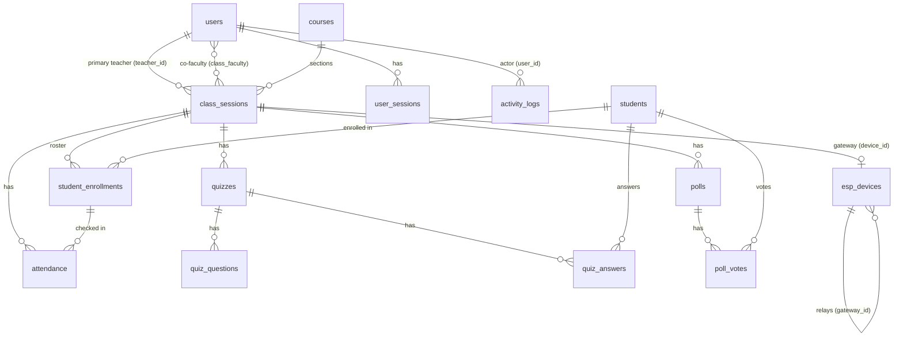

# Data model

Source: `backend/app/models.py` (SQLAlchemy). Tables are created on startup and existing files are upgraded by versioned migrations (`schema_migrations` table, see [database migrations](../engineering/DATABASE_MIGRATIONS.md)). **Foreign keys are enforced** (`PRAGMA foreign_keys=ON` on every connection). All `DateTime` values are **naive IST**.

## Entity-relationship diagram

## Tables

### `users`
| Column | Type | Notes |
|---|---|---|
| id | int PK | |
| username | str(64) unique, indexed | 3–64 characters at the API |
| email | str(128) unique | |
| hashed_password | str(256) | bcrypt |
| full_name | str(128) | |
| role | str(16) | `teacher` \| `admin` \| `super_admin` (API enforces the closed set) |
| is_active | bool | false = cannot log in; sessions rejected |
| created_at, created_by | datetime, FK users | |

### `user_sessions`
| Column | Type | Notes |
|---|---|---|
| id | int PK | |
| user_id | FK users, indexed | |
| token_hash | str(64) unique, indexed | `sha256(raw token)`, the lookup key |
| session_token | str(64) unique | **legacy**; holds the hash too, never the raw token (#12) |
| created_at, last_activity_at, expires_at | datetime | `expires_at = created_at + SESSION_HARD_MINUTES` |
| ip, user_agent | str | captured at login |
| revoked | bool | logout / scrub |

### `courses`
`id, code (16, unique), name, description, credits, department, is_active, created_at, exam_date, exam_start_time "HH:MM", exam_end_time "HH:MM"`

### `class_sessions`
| Column | Type | Notes |
|---|---|---|
| id | int PK | |
| name, subject | str(128) | |
| code | str(32) unique | the join code teachers and devices use |
| teacher_id | FK users, not null | primary teacher |
| created_by | FK users | |
| device_id | FK esp_devices | the room's **gateway** (one per class) |
| is_active | bool, default **false** | gateways auto-link only to active classes |
| course_id, course_section, term (Monsoon/Winter/Summer), year | | `(course_id, course_section)` unique when both are set (`uq_class_sessions_course_section`, API returns 409) |
| start_date, end_date, exam_start_date, exam_end_date | date | |
| meeting_schedule | JSON `[{day, start, end}]` | clash checks in `schedule.py` |
| location, capacity | | |
| classroom_code | str(32) unique, nullable | physical room label (e.g. `RM-201`) for device linking |
| created_at | datetime | |

`class_faculty(class_session_id, user_id)` is the many-to-many co-faculty table.

### `esp_devices`
| Column | Type | Notes |
|---|---|---|
| id | int PK | `device_id` in API responses |
| mac_address | str(17) unique | identity of gateways/hubs |
| device_name, device_type | str | `c6` \| `s3` \| `student` |
| student_name | str | legacy |
| battery_pct, rssi, last_seen, registered_at | | telemetry and presence |
| is_connected | bool | presence state (transitions logged) |
| gateway_id | FK esp_devices | the parent that relays this device (S3 → C6, …) |
| is_active | bool | admin access control |
| student_enrollment_id, device_id | | legacy / diagnostics |
| firmware_version, pending_version, ota_status, ota_requested_at, verified_at | | OTA state: `idle` \| `downloading` \| `applied` \| `failed` |
| student_count, free_heap, total_flash | int | gateway telemetry |

### `students`
`id, roll_number (32, unique; API enforces 10 alphanumerics, upper-cased), student_name, email, phone, program, enrollment_year, graduation_year, device_mac, is_active (soft delete), registered_at, registered_by`

### `student_enrollments`
One per (class, student): unique index `uq_student_enrollments_class_student`.
`id, class_session_id, student_id, enrolled_by, enrolled_at, is_active`

### `quizzes` / `quiz_questions` / `quiz_answers`
| Table | Columns |
|---|---|
| quizzes | `id, class_session_id, title, status (draft/active/completed), quiz_mode (planned/impromptu), timing_mode (per_question/total/manual), question_time_limit, total_time_limit, current_question, is_live, created_at, started_at, ended_at` |
| quiz_questions | `id, quiz_id, order_num (0-based), question_text, options JSON, correct_option` |
| quiz_answers | `id, quiz_id, question_order, device_id (direct route), student_id (mesh route), selected_option, response_time_ms, submitted_at` |

**Uniqueness is enforced by the database** (unique indexes `uq_quiz_answers_quiz_question_student` and `uq_quiz_answers_quiz_question_device`) as well as by the routes: one answer per (quiz, question, student) for mesh answers and per (quiz, question, device) for the direct route.

### `polls` / `poll_votes`
| Table | Columns |
|---|---|
| polls | `id, class_session_id, title (256), options JSON (2–6), poll_mode (live/planned), status (draft/active/closed), is_live, created_at, started_at, ended_at` |
| poll_votes | `id, poll_id, device_id, student_id, selected_option, submitted_at`; one per (poll, student) and per (poll, device), enforced by unique indexes |

### `attendance`
`id, class_session_id, device_id, student_enrollment_id, check_in_time, is_present`. Upserted per (class, enrollment).

### `activity_logs`
`id, user_id (nullable for device/system events), action, entity_type, entity_id, details JSON, timestamp`

Common `action` values: `auth.login`, `auth.change_password`, `user.create|update|deactivate|reset_password`, `class.create|activate|deactivate|delete|device_auto_linked|status_update`, `quiz.create|start|stop`, `poll.create|start|end`, `student.connect|disconnect|csv_import`, `esp_device.online|offline`, `module.ota`, `module.ota.prompt`, `firmware.upload`.

### `firmware_artifacts`
One uploaded firmware image (#35). `id, sha256 (unique), size, target (c6|s3|student), chip, project, version, idf_version, build_date, elf_sha256, status (uploaded|approved|deprecated), channel (stable|beta), release_notes, legacy, uploaded_by, uploaded_at, approved_by, approved_at, deprecated_at`. Unique `(target, version)` (`uq_firmware_artifacts_target_version`): one set of bytes per version. Every fact except notes and channel is read from the image itself. The file is `<FIRMWARE_DIR>/<sha256>.bin`.

### `schema_migrations`
`version` (PK), `name`, `applied_at`: one row per applied migration step. `GET /health` reports the highest version as `schema_version`.

## Lifecycle rules worth knowing

- **Deleting a user** is soft (`is_active = false`).
- **Deleting a student** is soft by default. *Hard-delete* (admin) removes the student, their enrollments and attendance, and **anonymises** their answers and votes (`student_id = NULL`) so finished results keep their totals.
- **Deleting a class** (teacher or admin) removes its quizzes, questions, answers, polls, votes, attendance, enrollments and co-faculty links, and unlinks student modules tied to those enrollments. The gateway node row is kept.
- **Expired or revoked sessions** are deleted every 5 minutes.
- **Presence history** is not stored, only transitions (`esp_device.online/offline` in the activity log).
