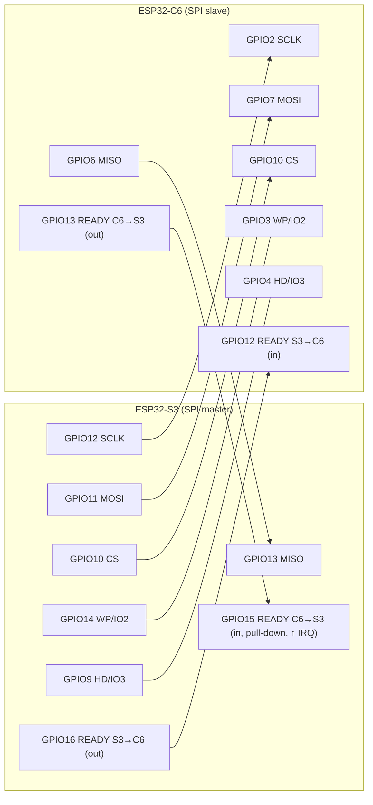

# Hardware reference

## Boards

| Role | SoC | Flash / partition table | Notes |
|---|---|---|---|
| Gateway (`class_c6`) | ESP32-C6, single-core RISC-V @ 160 MHz, Wi-Fi 6 2.4 GHz | 8 MB: `nvs` 24 K @0x9000 · `otadata` @0xF000 · `phy_init` @0x11000 · `ota_0` 3.875 MB @0x20000 · `ota_1` 3.875 MB @0x400000 | console on UART GPIO16/17 |
| Hub (`class_s3`) | ESP32-S3, dual-core Xtensa | 32 MB: `ota_0` 4 MB @0x20000 · `ota_1` 4 MB @0x420000 | app rollback enabled |
| Student (`student`) | ESP32 (classic), target `esp32` | 4 MB: `ota_0` 1.75 MB @0x20000 · `ota_1` 1.75 MB @0x1E0000 | brownout level 0, power management on |

All boards: brownout detector enabled, FreeRTOS stack canary checks enabled, debug-level compiler optimisation (`-Og`).

## S3 ↔ C6 wiring

| Signal | S3 GPIO | C6 GPIO | Direction |
|---|---|---|---|
| SCLK | 12 | 2 | S3 → C6 |
| MOSI | 11 | 7 | S3 → C6 |
| MISO | 13 | 6 | C6 → S3 |
| CS | 10 | 10 | S3 → C6 |
| WP / IO2 | 14 | 3 | – |
| HD / IO3 | 9 | 4 | – |
| READY S3→C6 | 16 (out) | 12 (in) | S3 → C6 |
| READY C6→S3 | 15 (in, pull-down) | 13 (out) | C6 → S3 |
| GND | GND | GND | common ground is required |

- **Clock:** 80 MHz (`SPI_CLOCK_HZ`). Keep wires short (< 10 cm) and paired with ground; lower the clock if CRC mismatches appear in the S3 log (`C6 slot CRC mismatch`).
- ⚠️ **ESP32-C6 GPIO12/13 are its USB-Serial-JTAG D-/D+.** Using them as ready lines disables the native USB port. Flash and monitor through the UART bridge, or move the ready lines in **both** `class_c6/main/config.h` and `class_s3/main/config.h`.
- Pin definitions live in `firmware/class_c6/main/config.h` and `firmware/class_s3/main/config.h`. The comment block at the top of `spi_slave.c` / `spi_master.c` describes the protocol; the **config headers are authoritative** for pins.

## Student module

| Function | GPIO | Notes |
|---|---|---|
| Button A / B / C / D | 4 / 16 / 18 / 22 | active-low, internal pull-ups, falling-edge IRQ, 50 ms debounce |
| CONFIRM | 23 | |
| Status LED | 2 | only if `STUDENT_HAS_LED 1` |
| OLED SDA / SCL | 8 / 9 | SSD1306 128×64 at I²C 0x3C, 400 kHz; only if `STUDENT_HAS_DISPLAY 1` |

Button roles in **provisioning**: A = next character, B = previous, C = backspace, D = clear, CONFIRM = commit (the 10th saves). Hold **CONFIRM + C for 2 s at boot** to clear the identity.

> The map targets the classic ESP32. GPIO22–25 don't exist on the ESP32-S3; adjust `config.h` (and `CONFIG_IDF_TARGET`) if you build student modules on another chip. Pins the flash bus owns are detected at boot and skipped (`Button N (GPIOx) unavailable — skipping`).

## Power

- The C6 and S3 are mains-powered (5 V USB or a regulated supply). Wi-Fi TX bursts draw ~300+ mA peaks; a weak cable causes brownout resets (`Brownout detector was triggered`).
- Student modules: the battery percentage is currently a constant (`battery_pct = 100`, `TODO: read ADC`). The C6 has an optional supply ADC (`BATTERY_ADC_EN`).
